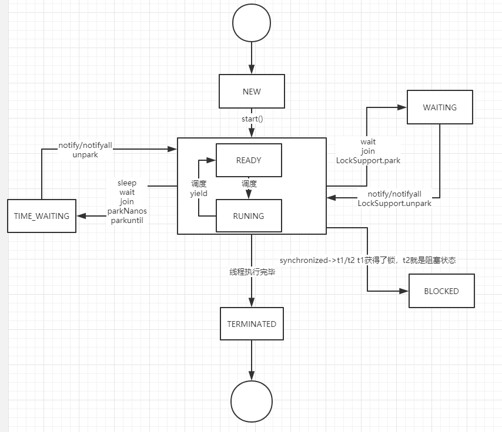

### 线程的生命周期

java线程生命周期一共有六种状态

1. NEW：初始状态，线程被构建，但是还没有调用start方法
2. RUNNABLED：运行状态，JAVA线程把操作系统中的就绪和运行两种状态统一称为"运行中"
3. BLOCKED：阻塞状态，表示线程进入等待状态，也就是线程因为某种原因放弃了CPU使用权，阻塞也分为几种情况
   - 等待阻塞：运行的线程执行wait方法，jvm会把当前线程放入等待队列
   - 同步阻塞：运行的线程在获取对象的同步锁时，若该同步锁被其他线程锁占用了，那么jvm会把当前的线程放入到锁池中
   - 其他阻塞：运行的线程执行 Tread.sleep 或者 t.join 方法，或者发出了I/O请求时，jvm会把当前线程设置为阻塞状态，当sleep结束、join线程终止、IO处理完毕则线程恢复
4. WAITING：一个线程在等待另一个线程执行一个（唤醒）动作时，该线程进入Waiting状态。进入这个状态后不能自动唤醒，必须等待另一个线程调用notify方法或者notifyAll方法时才能够被唤醒
5. TIME_WAITING：超时等待状态，超时以后自动返回
6. TERMINATED：终止状态，表示当前线程执行完毕



通过代码演示线程的状态

```java
public class ThreadStatus {
   public static void main(String[] args) {
 	//TIME_WAITING
     new Thread(()->{
        while(true){
           try {
              TimeUnit.SECONDS.sleep(100);
           } catch (InterruptedException e) {
              e.printStackTrace();
           }
         }
    },"timewaiting").start();
 //WAITING，线程在 ThreadStatus 类锁上通过 wait 进行等待
    new Thread(()->{
       while(true){
          synchronized (ThreadStatus.class){
             try {
               ThreadStatus.class.wait();
             } catch (InterruptedException e) {
                e.printStackTrace();
              }
           }
       }
     },"Waiting").start();
   //线程在 ThreadStatus 加锁后，不会释放锁
   new Thread(new BlockedDemo(),"BlockDemo01").start();
   new Thread(new BlockedDemo(),"BlockDemo02").start();
  }
 static class BlockedDemo extends Thread{
    public void run(){
      synchronized (BlockedDemo.class){
         while(true){
            try {
               TimeUnit.SECONDS.sleep(100);
            } catch (InterruptedException e) {
               e.printStackTrace();
            }
         }
      }
    }
 }
}
```

启动一个线程前，最好为这个线程设置线程名称，因为这 样在使用 jstack 分析程序或者进行问题排查时，就会给开发人员提供一些提示。