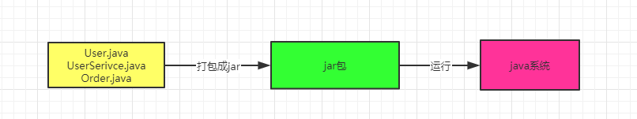

### 我们平时写的java代码是怎么运行起来的

首先，我们写好了一份java代码，在这份java代码中，肯定是包含了很多.java结尾的文件，比如
User.java，UserService.java，Order.java ...... 当我们写好这些.java 后缀的代码文件之后，接下来肯定会部署到线上的机器上去运行，一般情况下，我们会把代码打包成".jar"后缀的jar包，或者是".war"后缀的war包。然后就是把打包好的jar包或者是war包部署到线上机器上。这个部署就有很多途径了，但是最基本的就是通过tomcat这类容器来部署代码，当然也可以时自己手动通过"java"命令来运行一个jar包中的代码。

用图表示下关系就是

在上图中其实还有一个非常重要的步骤就是“编译”阶段，也就是说我们在写好".java"的代码打包过程中，一般会把代码编译成".class"后缀的字节码文件，比如"User.class，UserSerivce.class，Order.class"。

然后这个".class"后缀的字节码文件，它才是可以被运行起来的！

所以我们还是要熟悉下jvm机制，那画图来回顾下这个编译过程把，以及".class"字节码文件的概念。图总结如下

对于编译好的这些".class"字节码，是怎么让他们运行起来的，这时候就需要用我们的命令
"java - jar" 之类的命令来运行我们写好的代码了。

此时一旦你采用"java"命令，实际上此时就会启动一个jvm进程。

这个jvm 就会负责运行这些".class"字节码文件，也就是相当于负责运行着我们写好的系统

所以呢，我们平时写好的某个系统在一台机器上部署的时候，你一旦启动这个系统，其实就是启动了一个JVM，由它来负责运行这台机器上的这个系统。

用图来总结下就是

接着，jvm要运行这些".class"字节码文件中的代码，那首先得把这些".class"文件中包含的各种类给加载进来？

此时就会有一个”类加载器“的概念。类加载器会把编译好的那些".class"字节码文件给加载到JVM中，然后供后续的代码运行来使用。

最后一步，JVM就会基于自己的**字节码执行引擎**，来执行加载到内存里的我们写好的那些类了，比如你的代码中有一个”main()"方法，那么jvm就会从这个"main()"方法开始执行里面的代码。当它需要哪个类的时候，就会使用类加载器来加载对应的类，反正对应的类就在".class"文件中。

流程如下图

