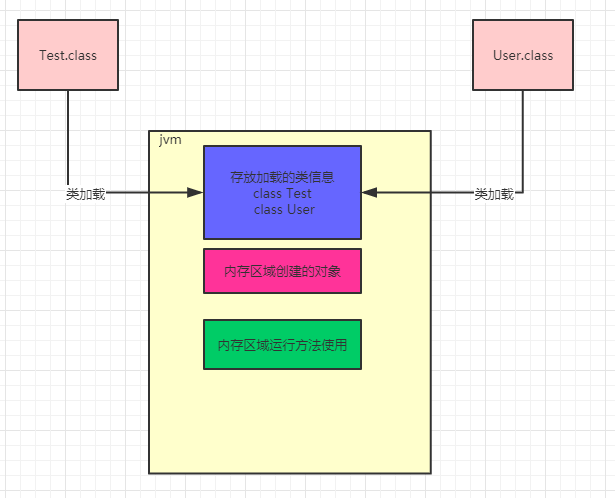
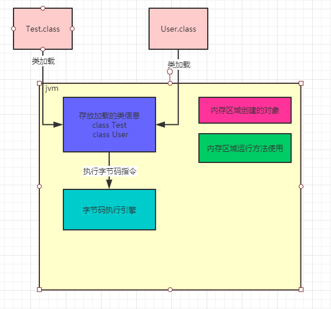
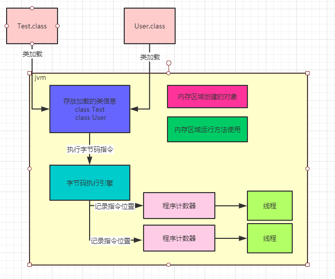

### 到底什么是JVM的内存区域划分

其实这个问题非常简单，JVM在运行我们写好的代码时，他是必须使用多块内存空间的，不同的内存空间用来存放不同的数据，然后配合我们写的代码流程，才能让我们的系统运行起来。

举个简单的例子，比如咱们现在知道了JVM会加载类到内存里来供后续运行，那么我问问大家，这些类加载到内存之后，放到哪儿去了呢？想过这个问题吗？

所以呢，JVM里就必须有一块内存区域，用来存放我们写的那些类。

如下图所示：


继续来看，我们的代码运行起来时，是不是需要执行我们写的一个一个方法？

那么运行方法的时候，方法里面有很多变量之类的东西，是不是需要放在某个内存区域里？

接着如果我们写的代码里创建一些对象，这些对象是不是也需要内存空间来存放？

同样的，大家看下图：


这就是为什么JVM中必须划分出来不同的内存区域，它是为了我们写好的代码在运行过程中根据需要来使用的。

### 存放类的方法区

这个方法区是在JDK1.8以前的版本里，代表JVM中的一块区域。

主要是放从 ".class" 文件加载进来的类，还会有一些类似常量池的东西放在这个区域里。

但是在JDK1.8之后，这块区域的名字就改了，叫做 "Metaspace" ，可以认为是 "元数据空间" 这样的意思。当然这里主要还是存放我们写的各种类相关信息。

举个例子，还是更我们之前说的那样，假如我们有一个 "Test.class" 类和 "User.class" 类，类似于下面的代码。

```
public class Test {
   public static void main() {
       User user = new User();
   }
}
```

这两哥类加载到JVM后，就会放在这个方法区中，如下图所示：



### 执行代码指令用的程序计数器

继续假设我们的代码是如下所示

```
public class Test {
   public static void main() {
       User user = new User();
       user.loadReplicasFromDisk();
   }
}
```

之前给大家普及过，实际上上面那段代码首先会存在于 ".java" 后缀的文件里，这个文件就是java源代码文件。

但是这个文件是面向我们程序员的，计算机他是看不懂我们写的这段代码的

所以此时就通过编译器，把 ".java" 后缀的源代码文件编译成 ".class" 后缀的字节码文件。

字节码才是计算器可以理解的一种语言，而不是我们写出来的那一堆代码。

字节码看起来大概是下面这样的，跟以上的代码无关，只是一个示例：

```
public java.lang.String getName();
      descriptor: ()Ljava/lang/String;
      flags: ACC_PUBLIC
      Code:
           stack=1,locals=1,args_size=1
               0: aload_0
               1: get_field  #2
               4: areturn
```

这段字节码就是让大家知道 ".java" 翻译成 ".class" 是大概什么样子的。

比如 "0:aload_0" 这样的，就是 "字节码指令" ，他对应了一条一条的机器指令，计算机只有读到这种机器码指令，才知道具体应该感谢什么。

比如字节码指令可能会让计算机从内存里读取某个数据，或者把某个数据写入到内存里去，都有可能，各种各样的指令就会指示计算机去干各种各样的事情。

所以现在大家首先明白一点：**我们写好的Java代码会被翻译成字节码，对应各种字节码的指令**

现在Java代码通过JVM跑起来的第一件事情就明确了，首先Java代码被编译成字节码指令，然后字节码指令一定会被一条一条执行，这样才能实现我们写好的代码执行的效果。

所以当JVM加载类信息到内存之后，实际就会使用自己的**字节码执行引擎**，去执行我们写的代码编译出来的代码指令，如下图：



那么在执行字节码指令的时候，JVM里就需要一个特殊的内存区域了，那就是 "程序计数器"

这个程序计数器就是用来**记录当前执行的字节码指令的位置**，也就是记录目前执行到了哪一条字节码指令。

我们通过一张图来说明


大家都知道JVM是支持多个线程的，所以其实你写好的代码可能会开启多个线程并发执行不同的代码，所以就会有多个线程来并发执行不同的代码指令

因此每个线程都会有自己的一个程序计数器，专门记录当前这个线程目前执行到了哪一条字节码指令了

下图更加清晰的展示除了它们之间的关系。

