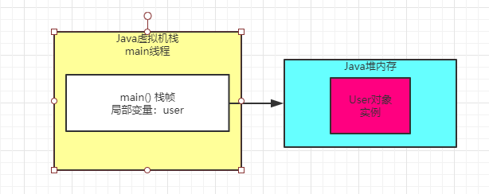

### 一个方法执行完毕之后会怎么样

回顾下以下代码

```
public class Test {
   public static void main(String[] args) {
      loadReplicasFromDisk();
   }
   
   private static void loadReplicasFromDisk() {
       User user  = new User();
       user.load();
   }
}
```

其实目前的图我们已经表述到了 "replicaManager.load()" 这行代码里

那么现在有个问题，如果这行代码执行结束了，此时会怎么样？

之前文章说过，一旦方法里的代码执行完毕，那么方法就执行完毕了，也就是说loadReplicasFromDisk()方法就执行完毕了。

一旦你的loadReplicasFromDisk()方法执行完毕，此时就会把loadReplicasFromDisk()方法对应的栈帧从main线程的Java虚拟栈里出栈

如下图所示：

