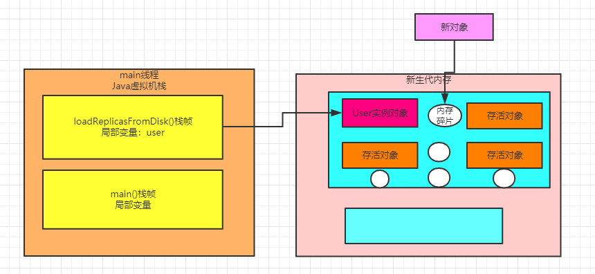
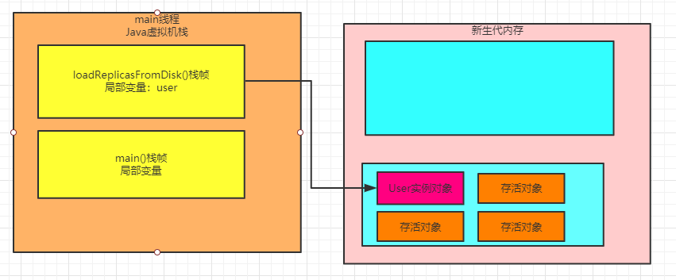

### 复制算法的背景引入

针对新生代的垃圾回收算法，也叫做复制算法。

简单来说，就是如下图所示，首先把新生代的内存分为两块。


接着假设有如下代码，在 "loadReplicasFromDisk()" 方法中创建了对象，此时对象就会分配在新生代其中一块内存空间里。

而且是由 "main线程" 的栈内存中的 "loadReplicasFromDisk()" 方法的栈帧内的局部变量来引用的，如下图所示：

```java
public class Test {
     public static void main(String[] args) { 
         loadReplicasFromDisk();
     }
    public static loadReplicasFromDisk() {
        User user = new User();
    }
}
```


接着我们想象一下，假设与此同时，代码在不停的运行，然后大量的对象都分配在了新生代内存的其中一块内存区域里

而且分配过后，很快就失去了局部变量或者类静态变量的引用，成为了垃圾对象

如下图所示:

****

接着这个时候，新生代内存那块被分配对象的内存区域基本都快满了，再次要分配对象的时候，发现里面内存空间不足了。

那么此时就会触发Minor GC去回收掉新生代那块被使用的内存空间的垃圾对象。

那么回收时候是怎么做的呢？

#### 一种不太好的垃圾回收思路

假设现在采用的垃圾回收思路，就是直接对上图中被使用的那块区域中的垃圾对象进行标记

也就是根据上文讲的那套思路，标记处哪些对象时可以被垃圾回收的，然后就直接对那块内存区域中的对象进行垃圾回收，把内存空出来。

我们想一想，这种思路好吗？

这种思路去垃圾回收，可能会在回收完毕之后造成那块区域看起来跟下图一样。


看上面的图，不知道我们发现什么没有，在那块被使用的内存区域里，回收掉了大量的垃圾对象，但是保留了一些被人引用的存活对象。

但是呢，存活对象在内存区域里东一个西一个，非常的凌乱，而且造成了**大量的内存碎片**

那么**什么是内存碎片呢？**

我们再看下面的图我用红线标记出来的区域，那些就是所谓的内存碎片。


看到了吗？在各种凌乱的存活对象的空间，出现了大量的红圈圈出来的内存碎片

这些内存碎片的大小不一样，有的可能很大，有的可能很小。

那么内存碎片太多会造成什么问题呢？

**内存浪费**

啥意思？比如现在打算分配一个新的对象，尝试在上图那块被使用的内存区域里去分配

此时如下图所示，可能因为内存碎片太多的缘故，虽然所有的内存碎片加起来其实有很大的一块内存，但是因为这些内存都是碎片式分散的，所以导致没有一块完整的足够的内存空间来分配新的对象。



所以这种直接对一块内存空间回收掉垃圾对象，保留存活对象的方法，绝对是不可取的

因为内存碎片太多，就是他最大的问题，会造成大量的内存浪费，很多内存碎片压根儿是没法使用的。

### 一个合理的垃圾回收思路

那么能不能用一种合理的思路来进行垃圾回收呢？

**可以** 这个时候上图中一直没派上用场的另外一块空白的内存区域就出现了。

首先，并不是按照上述思路直接对已经使用的那块内存把垃圾对象全部回收掉，然后保留全部存活对象。

而是先对那块在使用的内存空间标记出里面**哪些对象是不能进行垃圾回收的**，就是要存活的对象

然后先把那些存活的对象转移到另外一块空白的内存中，如下图


不知道我们发现这里的玄机没有？

没错，通过把存活对象转移到另外一块空白区域，我们可以把这些对象都比较紧凑的排列在内存里

这样就可以让被转移的那块区域几乎没有什么内存碎片，对象都是按顺序排列在这块内存里的。

然后那块被转移的内存区域，是不是多出来一大块连续的可用的内存空间？

此时就可以把新对象分配在那快连续内存空间里了，如下图。


这个时候，再一次性把原来使用的那快区域中的垃圾对象全部一扫而空，全部给回收掉，空出来一块内存区域，如下图



这就是所谓的"复制算法"，把新生代内存划分为两块内存区域，然后只使用其中一块内存

待那快内存快满的时候，就把里面的存活对象一次性转移到另外一块内存区域，保证没有内存碎片

接着一次性回收原来那快内存区域的垃圾对象，再次空出来一块内存区域，**两块内存区域就这么重复着循环使用**

### 复制算法有什么缺点

复制算法的缺点其实非常的明显，如果按照上述的思路，大家会发现，假设我们给新生代1G的内存空间，那么只有512MB的内存空间是可以使用的

另外512MB的内存空间是一直要放在那里空着的，然后512MB内存空间满了，就把存活对象转移到另外一块512MB的内存空间去

从始至终，就只有一半的内存可以用，这样的算法显然**对内存的使用效率太低了**

### 复制算法的优化：Eden区和Survivor区

之前我们分析过，系统运行时，对JVM内存的使用模型，大体上就是我们的代码不停的创建对象然后分配在新生代里，但是一般很快那个对象就没人引用了，成了垃圾对象。

接着一段时间过后，新生代就满了，此时就会回收掉那些垃圾对象，空出来内存空间，给后续其他的对象来使用。

但是我们之前分析过，其实绝大多数的对象都是存活周期非常短的对象，可能被创建出来1毫秒之后就没人引用了，他就是垃圾对象了

所以大家可以想象一下，可能一次新生代垃圾回收后，99%的对象其实都被垃圾回收了，就1%的对象存活了下来，可能就是一些长期存活的对象，或者还没使用完的对象。

所以实际上真正的复制算法会做如下优化，**把新生代内存区域划分为三块**

1个Eden区，2个Survivor区，其中Eden区占80%内存空间，每一块Survivor区各占10%内存空间，比如说Eden区有800MB内存，每一块Suivivor区就100MB内存，如下图


平时可以使用的，就是Eden区和其中一块Survivor区，那么相当于就是有900MB的内存可以使用的，如下所示。


但是刚开始对象都时分配在Eden区内的，如果Eden区快满了，此时就会触发垃圾回收

此时就会把Eden区中的存活对象都一次性转移到一块空着的Survivor区，接着Eden区就会被清空，然后在次分配新对象到Eden区里，然后就会如下图所示，Eden区和一块Survivor区里是有对象的，其中Survivor区里放的是上一次Minor GC后存活的对象。

如果下次再次Eden区满，那么再次触发Minor GC，就会把Eden区和放着上一次Minor GC后存活对象的Survivor区内的存活对象，转移到另外一块Survivor区去。

所以这里大家就能体会到，为啥是这么分配内存空间了。

因为之前分析了，每次垃圾回收可能存活下来的对象就1%，所以在设计的时候就留了一块100MB的内存空间来存放垃圾回收后转移过来的存放对象

比如Eden区+一块Survivor区有900MB的内存空间都占满了，但是垃圾回收之后，可能就10MB对象是存活的。

此时就把那10MB的存活对象转移到另外一块Survivor区域就可以，然后在一次性把Eden区和之前使用的Survivor区里的垃圾对象全部回收掉，如下图：


接着新对象继续分配在Eden区和另外那快开始被使用的Survivor区，然后**始终保持一块Survivor区是空着的**，就这样一直**循环使用这三块内存区域**

这么做**最大的好处**，就是只有10%的内存空间是被闲置的，90%的内存都被使用上了

无论是垃圾回收的性能，内存碎片的控制，还是说内存使用的效率，都非常的好。

### 新生代垃圾回收的各种  "万一"  怎么处理？

这个时候很多人看完了本文之后，一定对这里有可能发生的各种“万一”情况有疑惑了 

比如： 万一垃圾回收过后，存活下来的对象超过了10%的内存空间，在另外一块Survivor区域中放不下咋整？ 

万一我们突然分配了一个超级大的对象，大到啥程度？新生代找不到连续内存空间来存放，此时咋整？ 到底一个存活对象要在新生代里这么来回倒腾多少次之后才会被转移都老年代去？

 别着急，后面我们再来分析这些新生代的各种“万一”情况，以及新生代的对象是如何转移到老年代的，然后老年代是如何触发垃圾回收 的，垃圾回收的算法又是什么样的。 看完这些，我相信我们就会对新生代和老年代的对象分配、垃圾回收、对象转移等各种原理，都非常的熟悉了。

