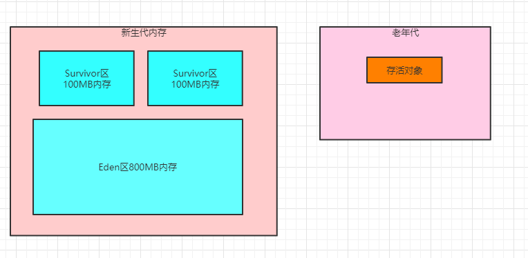

### 躲过15次GC之后进入老年代

按照之前文章的整个过程，其实我们可以理解为我们写的系统刚启动的时候，创建的各种各样的对象，都是分配在新生代里的。

然后慢慢系统跑着跑着，新生代就满了，此时就会触发Minor GC，可能就1%的少量存活对象转移到空着的Survicvor区中。

然后系统继续运行，继续在Eden区里分配各种对象，大概就是这个过程。

那么之前我们讲过，我们写的系统中有些对象时长期存在的对象，他是不会轻易的被回收掉的，比如下面的代码

```java
public class Test {
      private static User user  = new User();
}
```

只要这个 "Test" 类还存在，那么他的静态变量 "user" 就会长期引用 "User" 对象，所以你无论新生代怎么垃圾回收，类似这种对象都不会被回收掉的。

此时这类对象每次在新生代里躲过一次GC被转移到一块Survivor区域中，此时他的年龄就会增长一岁

默认的设置下，当对象的年龄达到15岁的时候，也就是躲过15次GC的时候，他就会转移到老年代里去。

这个具体是多少岁进入老年代，可以通过JVM参数 "-XX:MaxTenuringThreshold" 来设置，默认是15岁，大家看下图：



### 动态对象年龄判断

这里跟这个对象年龄有另外一个规则可以让对象进入老年代，不用等待15次GC过后也可以。

大致规则就是，假如说当前放对象的Survivor区域里，一批对象的总大小大于这块Survivor区域的内存大小的50%，那么此时大于的呢关于这批对象年龄的对象，就可以直接进入老年代了。

说着有点抽象，具体还是看图。


假设这个图里的Survivor2区有两个对象，这俩对象的年龄一样，都是2岁

然后俩对象加起来对象超过了50MB，超过了Survivor区的100MB内存大小的一半了，这个时候，Survivor区里的大于等于2岁的对象，就要全部进入老年代里去。

这就是所谓的**动态年龄判断**的规则，这条规则也会让一些新生代的对象进入老年代。

另外这里要理清楚一个概念，就是实际这个规则运行的时候是如下的逻辑：年龄1+年龄2+年龄n的多个年龄对象总和超过了Survivor区域的50%，此时就会把年龄n以上的对象都放入老年代。

其实说白了，无论是15岁的那个规则，还是动态年龄判断的规则，都是希望那些可能是长期存活的对象，尽早进入老年代

既然你是长期存活的，那么老年代才是属于你的地盘，别赖在新生代里占地方了。

### 大对象直接进入老年代

 有一个JVM参数，就是 "-XX：PretenureSizeThreshold"，可以把他的值设置为字节数，比如 "1048576" 字节，就是1MB。

他的意思就是，如果你要创建一个大于这个大小的对象，比如一个超大的数组，或者是别的啥东西，此时就直接把这个对象放到老年代里去。压根儿不会经过新生代。

之所以这么做，就是要避免新生代里出现那种大对象，然后屡次躲过GC，还得把他在两个Survivor区域里来回复制多次之后才能进入老年代

那么大的一个对象在内存里来回复制，不是很耗费内存吗？

所以说，这也是一个对象进入老年代的规则。

### Minor GC后的对象太多无法放入Survivor区怎么办？

现在有一个比较大的问题，就是如果在Minor GC之后发现剩余的存活对象太多了，没办法放入另外一块Survivor区怎么办？如下图。


比如上面这个图，假设在发生GC的时候，发现Eden区里超过150MB的存活对象，此时没办法放入Survivor区中，此时该怎么办呢？ 

**这个时候就必须得把这些对象直接转移到老年代去**，如下图所示。


### 老年代空间分配担保规则

这个时候大家又想提一个问题了，如果新生代里有大量对象存活下来，确实是自己的Survivor区放不下了，必须转移到老年代去 那么如果老年代里空间也不够放这些对象呢？这该咋整呢？ 

首先，在执行任何一次Minor GC之前，JVM会先检查一下老年代可用的可用内存空间，是否大于新生代所有对象的总大小。 

为啥检查这个呢？因为最极端的情况下，可能新生代Minor GC过后，所有对象都存活下来了，那岂不是新生代所有对象全部要进入老 年代？如下图。


如果说发现老年代的内存大小是大于新生代所有对象的，此时就可以放心大胆的对新生代发起一次Minor GC了，因为即使Minor GC之 后所有对象都存活，Survivor区放不下了，也可以转移到老年代去。 

但是假如执行Minor GC之前，发现老年代的可用内存已经小于了新生代的全部对象大小了 那么这个时候是不是有可能在Minor GC之后新生代的对象全部存活下来，然后全部需要转移到老年代去，但是老年代空间又不够？ 

理论上，是有这种可能的。

所以假如Minor GC之前，发现老年代的可用内存已经小于了新生代的全部对象大小了，就会看一个“-XX:- HandlePromotionFailure”的参数是否设置了 如果有这个参数，那么就会继续尝试进行下一步判断。

下一步判断，就是看看老年代的内存大小，是否大于之前每一次Minor GC后进入老年代的对象的平均大小。 举个例子，之前每次Minor GC后，平均都有10MB左右的对象会进入老年代，那么此时老年代可用内存大于10MB。 

这就说明，很可能这次Minor GC过后也是差不多10MB左右的对象会进入老年代，此时老年代空间是够的，看下图。


如果上面那个步骤判断失败了，或者是“-XX:-HandlePromotionFailure”参数没设置，此时就会直接触发一次“Full GC”，就是对老年代进行垃圾回收，尽量腾出来一些内存空间，然后再执行Minor GC。

如果上面两个步骤都判断成功了，那么就是说可以冒点风险尝试一下Minor GC。此时进行Minor GC有几种可能。

第一种可能，Minor GC过后，剩余的存活对象的大小，是小于Survivor区的大小的，那么此时存活对象进入Survivor 区域即可。

第二种可能，Minor GC过后，剩余的存活对象的大小，是大于 Survivor区域的大小，但是是小于老年代可用内存大小 的，此时就直接进入老年代即可。

第三种可能，很不幸，Minor GC过后，剩余的存活对象的大小，大于了Survivor区域的大小，也大于了老年代可用内存的大小。此时老年代都放不下这些存活对象了，就会发生“Handle Promotion Failure”的情况，这个时候就会触 发一次“Full GC”。

Full GC就是对老年代进行垃圾回收，同时也一般会对新生代进行垃圾回收。

因为这个时候必须得把老年代里的没人引用的对象给回收掉，然后才可能让Minor GC过后剩余的存活对象进入老年代里面。

如果要是Full GC过后，老年代还是没有足够的空间存放Minor GC过后的剩余存活对象，那么此时就会导致所谓的 “OOM” 内存溢出了

因为内存实在是不够了，你还是要不停的往里面放对象，当然就崩溃了。

### 老年代垃圾回收算法

其实把上面的内容都看懂之后，大家现在基本就知道了Minor GC的触发时机，然后就是Minor GC之前要对老年代空间大小做的检查

包括检查失败的时候要提前触发Full GC给老年代腾一些空间出来，或者是Minor GC过后剩余对象太多放入老年代内 存都不够，也要触发Full GC。包括这套规则，还有触发老年代垃圾回收的Full GC时机，上面都讲清楚了。

简单来说，一句话总结，对老年代触发垃圾回收的时机，一般就是两个：

（1）要不然是在Minor GC之前，一通检查发现很可能Minor GC之后要进入老年代的对象太多了，老年代放不下，此时需要提前触发Full GC然后再带着进行Minor GC；

（2）要不然是在Minor GC之后，发现剩余对象太多放入老年代都放不下了。

**那么对老年代进行垃圾回收采用的是什么算法呢？**

简单来说，老年代采取的是**标记整理算法**，这个过程说起来比较简单

大家看下图，首先标记出来老年代当前存活的对象，这些对象可能是东一个西一个的


接着会让这些存活对象在内存里进行移动，把存活对象尽量都挪动到一边去，让存活对象紧凑的靠在一起，避免垃圾回收过后出现过多的内存碎片

然后再一次性把垃圾对象都回收掉，大家看下图。


我们一定要注意一点，这个老年代的垃圾回收算法的速度至少比新生代的垃圾回收算法的速度慢10倍

如果系统频繁出现老年代的Full GC垃圾回收，会导致系统性能被严重影响，出现频繁卡顿的情况。

所以后面用各种案例实际展现出来的，就是在各种业务系统的生产故障下，怎么去一步一步分析到底为什么频繁的 Full GC，然后怎么来调整JVM的各种参数进行优化。

其实我们如果透彻理解了最近的几篇文章涵盖的JVM的运行原理，就会知道，所谓JVM优化，就是尽可能让对象都在新生代里分配和回收，尽量别让太多对象频繁进入老年代，避免频繁对老年代进行垃圾回收，同时给系统充足的内存大小，避免新生代频繁的进行垃圾回收。

关于如何优化JVM，后续文章会有大量的案例带着去实战，而且会给出模拟生产的代码，让我们行起来看到模拟出来的案发现场是如何导致JVM频繁GC的，对性能是如何影响的，然后再一步一步来优化JVM参数解决性能问题。

