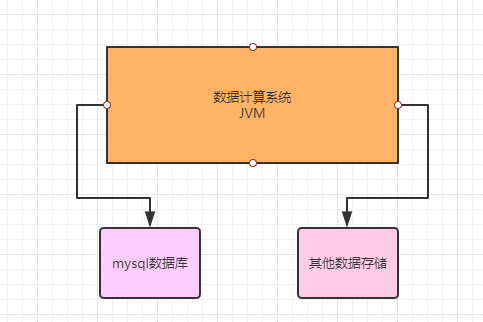
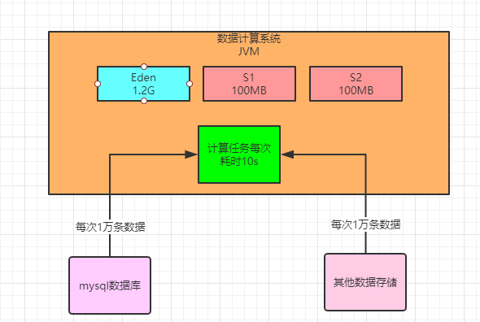
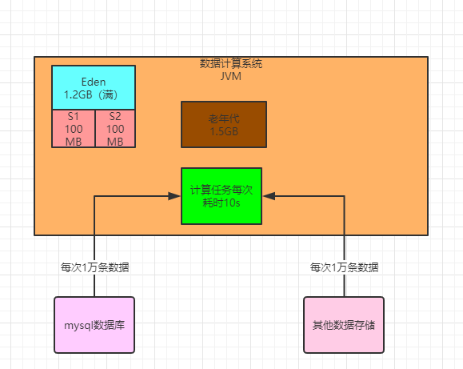
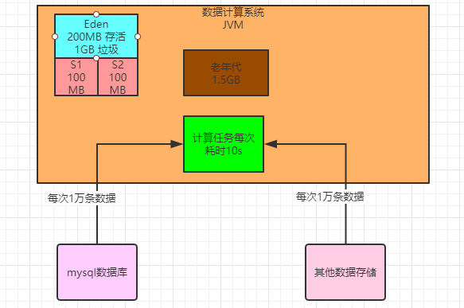
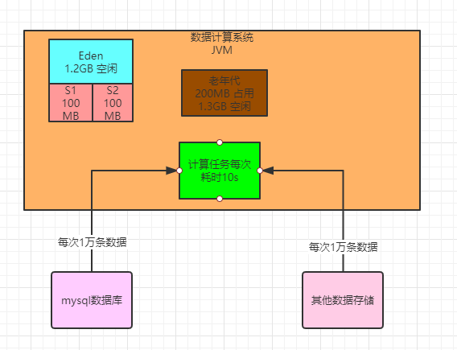
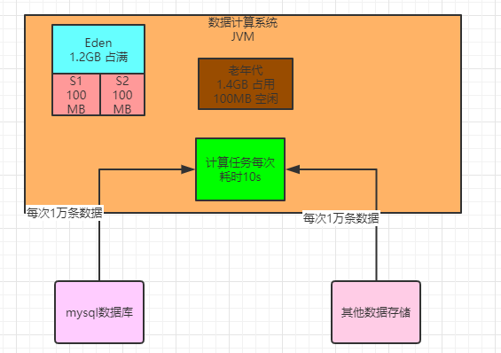
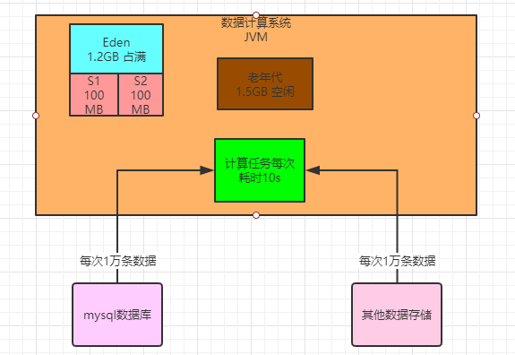
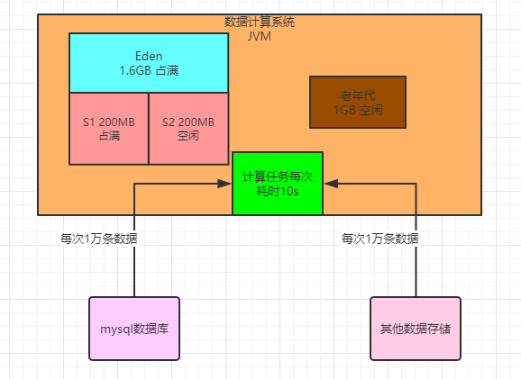
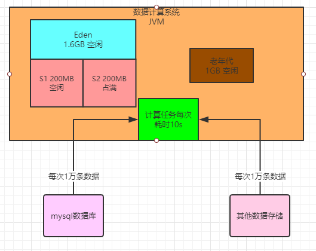

### 一个日处理上亿数据的计算系统

先说一下这个系统的案例背景，大概来说是当时我们团队里研发的一个数据计算系统，日处理数据量在上亿的规模。

为了方便我们集中注意力理解这个系统的生产环境的JVM相关的东西，所以对系统本身就简化说明了。

简单来说，这个系统就是会不停的从MySQL数据库以及其他数据源里提取大量的数据，加载到自己的JVM内存里来进行计算处理，如下图所示。

这个数据计算系统会不停的通过SQL语句和其他方式从各种数据存储中提取数据到内存中来进行计算，大致当时的生产负载是每分钟大概需要执行500次数据提取和计算的任务

但是这是一套分布式运行的系统，所以生产环境部署了多台机器，每台机器大概每分钟负责执行100次数据提取和计算的任务。

每次会提取大概1万条左右的数据到内存里来计算，平均每次计算大概需要耗费10秒左右的时间

然后每台机器是4核8G的配置，JVM内存给了4G，其中新生代和老年代分别是1.5G的内存空间，大家看下图。

### 这个系统到底多块会塞满新生代？

现在明确了一些核心数据，接着我们来看看这个系统到底多快会塞满新生代的内存空间？

既然这个系统每台机器上部署的实例，每分钟会执行100次数据计算任务，每次是1万条数据需要计算10秒的时间，那么我们来看看每次1万条数据大概会占用多大的内存空间？

这里每条数据都是比较大的，大概每条数据包含了平均20个字段，可以认为平均每条数据在1KB左右的大小。那么每次计算任务的1万条数据就对应了10MB的大小。

所以我们此时可以思考一下，如果新生代是按照8:1:1的比例来分配Eden和两块Survivor的区域，那么大体上来说，Eden区就是 1.2GB，每块Survivor区域在100MB左右，如下图。

基本上按照这个内存大小而言，大家会发现，每次执行一个计算任务，就会在Eden区里分配10MB左右的对象，那么一分钟大概对应100次计算任务

其实基本上一分钟过后，Eden区里就全是对象，基本就全满了。

所以说，回答这个小节的问题，新生代里的Eden区，基本上1分钟左右就迅速填满了。

### 触发Minor GC的时候会有多少对象进入老年代？

此时假设新生代的Eden区在1分钟过后都塞满对象了，然后在接着继续执行计算任务的时候，势必会导致需要进行Minor GC回收一部分的垃圾对象。

 那么上篇文章讲过这里在执行Minor GC之前会先进行的检查。

首先**第一步**，先看看老年代的可用内存空间是否大于新生代全部对象？

看下图，此时老年代是空的，大概有1.5G的可用内存空间，新生代的Eden区大概算他有1.2G的对象好了。

此时会发现老年代的可用内存空间有1.5GB，新生代的对象总共有1.2GB，即使一次Minor GC过后，全部对象都存活，老年代也能放的下的，那么**此时就会直接执行Minor GC**了。

那么此时Eden区里有多少对象还是存活的，无法被垃圾回收呢？

我们可以考虑一下之前说的那个点，每个计算任务1万条数据需要计算10秒钟，假设此时80个计算任务都执行结束了，但是还有20个计算任务共计200MB的数据还在计算中，此时就是200MB的对象是存活的，不能被垃圾回收掉，然后有1GB的对象是可以垃圾回收的

看下图

此时一次Minor GC就会回收掉1GB的对象，然后200MB的对象能放入Survivor区吗？

不能！因为任何一块Survivor区实际上就100MB的空间，此时就会通过空间担保机制，让这200MB对象直接进入老年代去，占用里面 200MB内存空间，然后Eden区就清空了

### 系统运行多久，老年代大概就会填满？

那么我们在想一下，这个系统大概运行多久，老年代会填满呢？

按照上述计算，每分钟都是一个轮回，大概算下来是每分钟都会把新生代的Eden区填满，然后触发一次Minor GC，然后大概都会有200MB左右的数据进入老年代。

可以想一下，假设现在2分钟运行过去了，此时老年代已经有400MB内存被占用了，只有1.1GB的内存可用，此时如果第3分钟运行完毕，又要进行Minor GC，会做什么检查呢？如下图。

此时会先检查老年代可用空间是否大于新生代全部对象？

此时老年代可用空间1.1GB，新生代对象有1.2GB，那么此时假设一次Minor GC过后新生代对象全部存活，老年代是放不下的，那么此时就得看看一个参数是否打开了 。

如果“-XX:-HandlePromotionFailure”参数被打开了，当然一般都会打开，此时会进入第二步检查，就是看看老年代可用空间是否大于历次Minor GC过后进入老年代的对象的平均大小。

我们已经计算过了，大概每分钟会执行一次Minor GC，每次大概200MB对象会进入老年代。

那么此时发现老年代的1.1GB空间，是大于每次Minor GC后平均200MB对象进入老年代的大小的

所以基本可以推测，本次Minor GC后大概率还是有200MB对象进入老年代，1.1G可用空间是足够的。

所以此时就会放心执行一次Minor GC，然后又是200MB对象进入老年代。

转折点大概在运行了**7分钟**过后，7次Minor GC执行过后，大概1.4G对象进入老年代，老年代剩余空间就不到100MB 了，几乎快满了

### 这个系统运行多久，老年代会触发1次Full GC？

大概在第8分钟运行结束的时候，新生代又满了，执行Minor GC之前进行检查，此时发现老年代只有100MB内存空间了，比之前每次Minor GC后进入老年代的200MB对象要小，此时就会直接触发一次Full GC。

Full GC会把老年代的垃圾对象都给回收了，假设此时老年代被占据的1.4G空间里，全部都是可以回收的对象，那么此时一次性就会把这些对象都给回收了，如下图。

然后接着就会执行Minor GC，此时Eden区情况，200MB对象再次进入老年代，之前的Full GC就是为这些新生代本次Minor GC要进入老年代的对象准备的，如下图。

按照这个运行模型，基本上平均就是七八分钟一次Full GC，这个频率就相当高了。因为每次Full GC速度都是很慢的， 性能很差，而且下一文章我们研究为什么Full GC的时候会严重影响系统性能。

### 该案例应该如何进行JVM优化？

相信通过这个案例，我们结合图一路看下来，对新生代和老年代如何配合使用，然后什么情况下触发Minor GC和Full GC，什么情况下会导致频繁的Minor GC和Full GC，我们都有了更加深层次和透彻的理解了。

对这个系统，其实要优化也是很简单的，因为这个系统是数据计算系统，每次Minor GC的时候，必然会有一批数据没计算完毕

但是按照现有的内存模型，最大的问题，其实就是每次Survivor区域放不下存活对象。

所以当时我们就是对生产系统进行了调整，增加了新生代的内存比例，3GB左右的堆内存，其中2GB分配给新生代， 1GB留给老年代

这样Survivor区大概就是200MB，每次刚好能放得下Minor GC过后存活的对象了，如下图所示。

只要每次Minor GC过后200MB存活对象可以放Survivor区域，那么等下一次Minor GC的时候，这个Survivor区的对象对应的计算任务早就结束了，都是可以回收的了

此时比如Eden区里1.6GB空间被占满了，然后Survivor1区里有200MB上一轮Minor GC后存活的对象，如下图

然后此时执行Minor GC，就会把Eden区里1.6GB对象回收掉，Survivor1区里的200MB对象也会回收掉，然后Eden 区里剩余的200MB存活对象会放入Survivor2区里，如下图。

以此类推，基本上就很少对象会进入老年代中，老年代里的对象也不会太多的。

通过这个分析和优化，定时我们成功的把生产系统的老年代Full GC的频率从几分钟一次降低到了几个小时一次，大幅度提升了系统的性能，避免了频繁Full GC对系统运行的影响。

但是大家在这里肯定注意到一点，就是之前说过一个动态年龄判定升入老年代的规则，就是如果Survivor区中的同龄对象大小超过 Survivor区内存的一半，就要直接升入老年代。所以这里优化的方式仅仅是做一个示例说明，意思是要增加Survivor区的大小，让 Minor GC后的对象进入Survivor区中，避免进入老年代

实际上为了避免动态年龄判定规则把Survivor区中的对象直接升入老年代，在这里如果新生代内存有限，那么可以调整"- XX:SurvivorRatio=8"这个参数，默认是说Eden区比例为80%，也可以降低Eden区的比例，给两块Survivor区更多的内存空间，然后让每次Minor GC后的对象进入Survivor区中，还可以避免动态年龄判定规则直接把他们升入老年代

### 垃圾回收器简介

在新生代和老年代进行垃圾回收的时候，都是要用垃圾回收器进行回收的，不同的区域用不同的垃圾回收器。

垃圾回收器是后面文章的重点内容，到时候会深入分析我们常用的ParNew、CMS和G1三种垃圾回收器的工作原理和优缺点。

这篇文章先简单介绍一下：

**Serial和Serial Old垃圾回收器**：分别用来回收新生代和老年代的垃圾对象

工作原理就是单线程运行，垃圾回收的时候会停止我们自己写的系统的其他工作线程，让我们系统直接卡死不动，然后让他们垃圾回收，这个现在一般写后台Java系统几乎不用。

**ParNew和CMS垃圾回收器**：ParNew现在一般都是用在新生代的垃圾回收器，CMS是用在老年代的垃圾回收器，他们都是多线程并发的机制，性能更好，现在一般是线上生产系统的标配组合。后面会着重分析这两个垃圾回收器。

**G1垃圾回收器**：统一收集新生代和老年代，采用了更加优秀的算法和设计机制，是重点的重点，大量文章都会来分析 G1垃圾回收器的工作原理和优缺点。

### 面试问题

 到底什么时候会尝试触发Minor GC？

 触发Minor GC之前会如何检查老年代大小，涉及哪几个步骤和条件？

 什么时候在Minor GC之前就会提前触发一次Full GC？

 Full GC的算法是什么？