### 先来回顾一个新生代GC的场景

新生代的内存大家都知道是分为Eden和两个Survivor的。

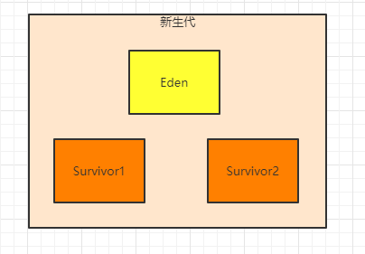

那么此时如果系统不停的运行，然后把Eden给塞满了呢？如下图所示。

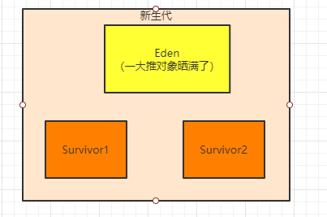

这个时候势必就会触发Minor GC了，好，那么之前我们说过，进行垃圾回收是有专门的垃圾回收线程的，而且对不同的内存区域会有不同的垃圾回收器

相当于垃圾回收线程和垃圾回收器配合起来，使用自己的垃圾回收算法，对指定的内存区域进行垃圾回收，看看下图。

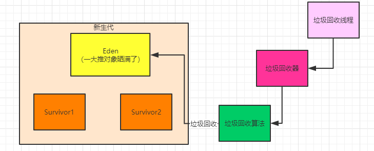

通过上面这个图，我们对垃圾回收线程、垃圾回收器以及垃圾回收算法是不是就有了一个非常清晰的关系的认识了？

没错，垃圾回收一定会通过一个后台运行的垃圾回收线程来执行他具体的一个逻辑，比如针对新生代我们会用ParNew垃圾回收器来进行回收

然后ParNew垃圾回收器针对新生代采用的就是复制算法来垃圾回收。

这个时候垃圾回收器，就会把Eden区中的存活对象都标记出来，然后全部转移到Survivor1去，接着一次性清空掉Eden中的垃圾对象， 如下图。

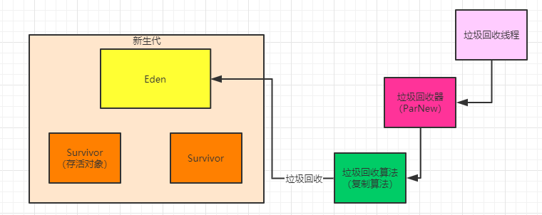

接着系统继续运行，新的对象继续分配在Eden中，如下图所示。

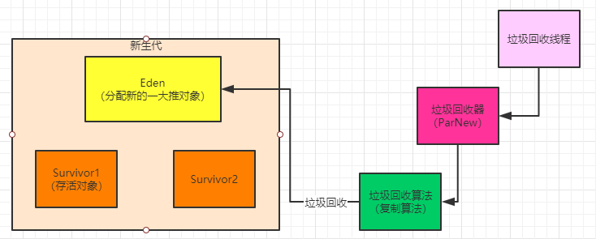

当Eden再次塞满的时候，就又要触发Minor GC了，此时已然是垃圾回收线程运行垃圾回收器中的算法逻辑，也就是采用复制算法逻辑，去标记出来Eden和Survivor1中的存活对象

然后一次性把存活对象转移到Survivor2中去，接着把Eden和Survivor1中的垃圾对象都回收掉，如下图。

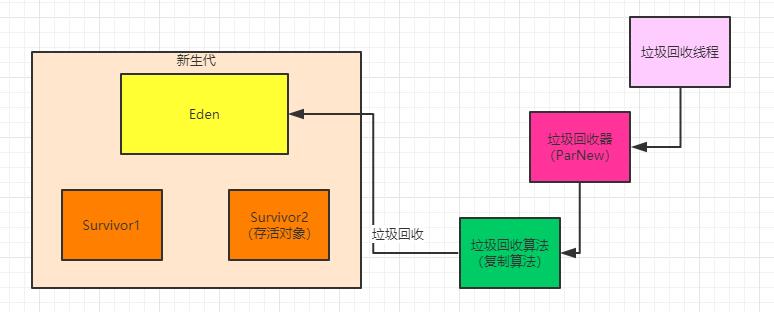

### GC的时候还能继续创建新的对象吗？

不知道我们有没有考虑过一个问题，之前我们一直都是说GC的原理和JVM整体运行的机制

但是从来没说过在GC的时候，到底我们写好的Java系统在运行期间还能不能继续在新生代里创建新的对象了？

我们可以自己思考一下，假设允许在GC期间，然后还可以继续让系统在新生代的Eden区里创建新的对象，会是一个什么样的场景？

看下图。

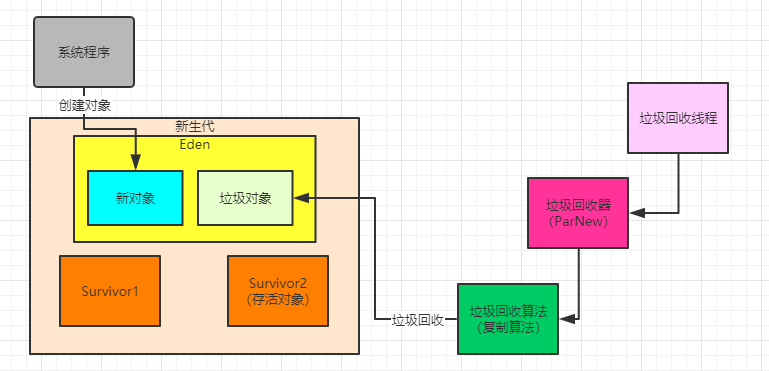

根据上图所示，如果一边垃圾回收器在想办法把Eden和Survivor2里的存活对象标记出来转移到Survivor1去，然后还在想办法把Eden 和Survivor2里的垃圾对象都清理掉，结果这个时候系统程序还在不停的在Eden里创建新的对象。

这些新的对象有的很快就成了垃圾对象，有的还有人引用是存活对象，那现在咋办？

全部乱套了，对于程序新创建的这些对象，你怎么让垃圾回收器去持续追踪这些新对象的状态？

怎么想办法在这次垃圾回收的过程中把新对象中的那些存活对象转移到Survivor2中去？

怎么想办法把新创建的对象中的垃圾都给回收了？

有的人可能会想当然的说，那就想办法让垃圾回收器来做到啊！

我只能说，我们可以去搞清楚JVM的运行原理，但是不要随意去质疑人家JVM的垃圾回收机制为什么不去那么设计。

因为有些事情想着很简单，但是一旦你要在JVM中去实现的时候，会发现务必的复杂，成本极高，而且很难做到。

所以说，在垃圾回收的过程中，同时还允许我们写的Java系统继续不停的运行在Eden里持续创建新的对象，目前来看是非常不合适的 一个事情。

### JVM的痛点：Stop the World

所以现在就好理解了，我们平时使用JVM最大的痛点，其实就是在垃圾回收的这个过程

因为在垃圾回收的时候，尽可能要让垃圾回收器专心致志的干工作，不能随便让我们写的Java系统继续创建对象了，所以此时JVM会在后台 直接进入“Stop the World”状态。

也就是说，他会直接停止我们写的Java系统的所有工作线程，让我们写的代码不再运行！

然后让垃圾回收线程可以专心致志的进行垃圾回收的工作，如下图所示

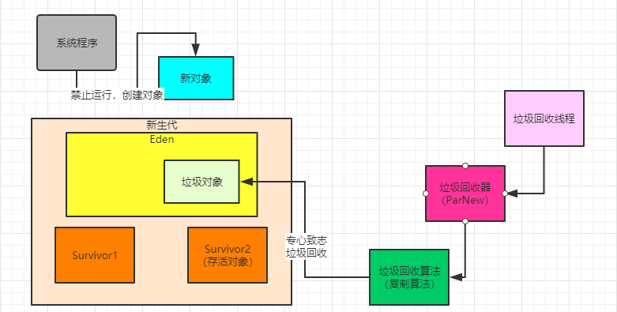

这样的话，就可以让我们的系统暂停运行，然后不再创建新的对象，同时让垃圾回收线程尽快完成垃圾回收的工作，就是标记和转移 Eden以及Survivor2的存活对象到Survivor1中去，然后尽快一次性回收掉Eden和Survivor2中的垃圾对象，如下图。

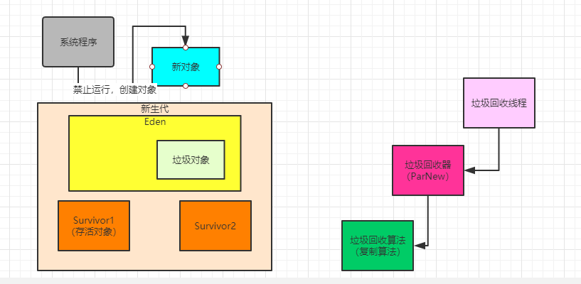

接着一旦垃圾回收完毕，就可以继续恢复我们写的Java系统的工作线程的运行了，然后我们的那些代码就可以继续运行，继续在Eden 中创建新的对象，如下图。

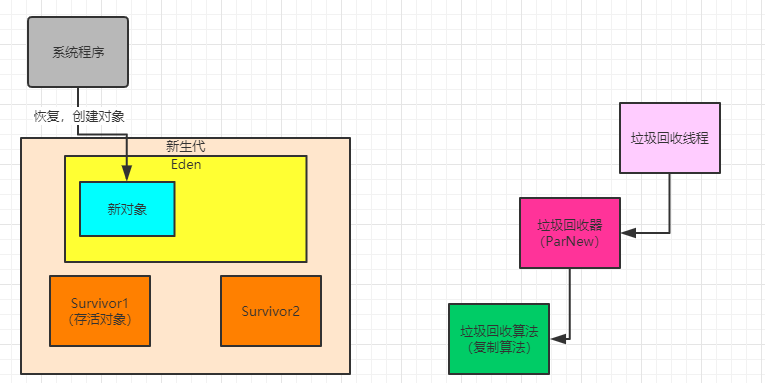

### Stop the World造成的系统停顿

现在我们就很清晰“Stop the World”会对系统造成的影响了， 假设我们的Minor GC要运行100ms，那么可能就会导致我们的系统直接停顿100ms不能处理任何请求

在这100ms期间用户发起的所有请求都会出现短暂的卡顿，因为系统的工作线程不在运行，不能处理请求

假设你开发的是一个Web系统，那么可能导致你的用户从网页或者APP上点击一个按钮，然后平时只要几十ms就可以返回响应了

现在因为你的Web系统的JVM正在执行Minor GC，暂停了所有的工作线程，导致你的请求过来到响应返回，这次需要等待几百毫秒。

那么我们可以思考一下，回忆一下上篇文章讲到的案例，因为内存分配不合理，导致对象频繁进入老年代，平均七八分钟一次Full GC，而Full GC是最慢的，有的时候弄不好一次回收要进行几秒钟，甚至几十秒，有的极端场景几分钟都是有可能的

那么此时一旦你频繁的Full GC，难道你希望你的系统每隔七八分钟就卡死个30秒吗？

所以说，无论是新生代GC还是老年代GC，都尽量不要让频率过高，也避免持续时间过长，避免影响系统正常运行，这也是使用JVM过程中一个最需要优化的地方，也是最大的一个痛点。

### 不同的垃圾回收器的不同的影响

再来延伸说一下昨天提到的那些垃圾回收器

比如对新生代的回收，Serial垃圾回收器就是用一个线程进行垃圾回收，然后此时暂停系统工作线程，所以一般我们在服务器程序中很 少用这种方式。

但是我们平时常用的新生代垃圾回收器是**ParNew**，他针对服务器一般都是多核CPU做了优化，他是支持多线程个垃圾回收的，可以大幅度提升回收的性能，缩短回收的时间

所以下周我们深入分析这块的时候，会说明他的很多参数该如何优化

大致原理图如下

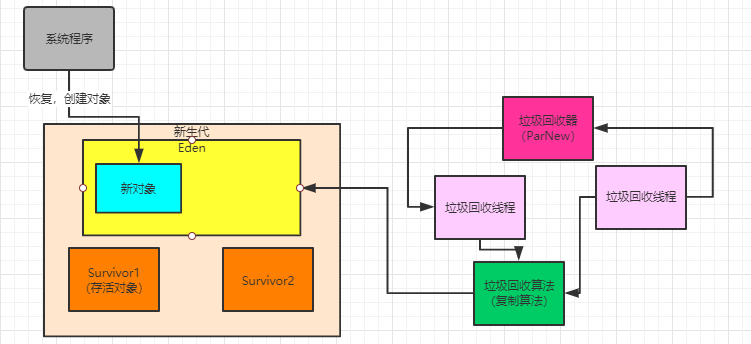

可以看到，不同的垃圾回收器他会有不同的机制和原理，使用多线程或者单线程，都是有区别的。

然后包括之前给大家提到的**CMS垃圾回收器，专门负责老年代的垃圾回收**，他也有自己特殊的一套机制和原理，非常的复杂