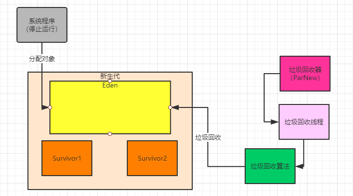
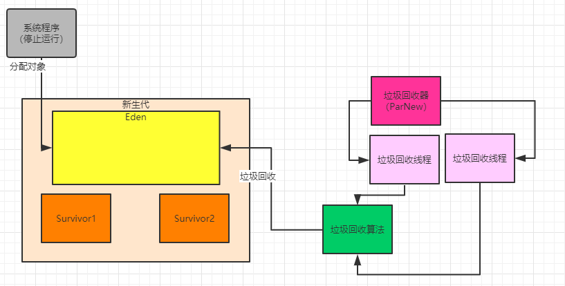
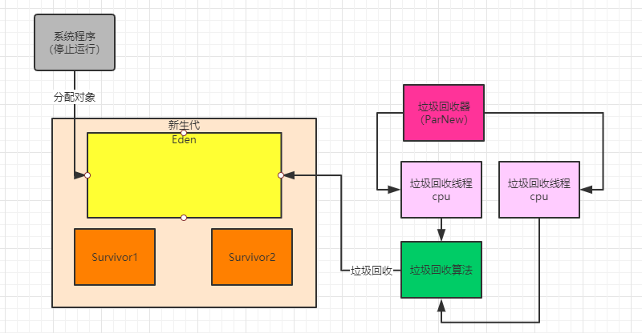

### 最常用的新生代垃圾回收器：ParNew

一般来说，在之前多年里，假设没有最新的G1垃圾回收器的话，通常大家线上系统都是ParNew垃圾回收器作为新生代的垃圾回收器

当然现在即使有了G1，其实很多线上系统还是用的ParNew。

通常运行在服务器上的Java系统，都可以充分利用服务器的多核CPU的优势，所以大家可以想一下，假设你的服务器是4核CPU，如果对新生代垃圾回收的时候，仅仅使用单线程进行垃圾回收，是不是会导致没法充分利用CPU资源

如下图：

比如上图，现在你在垃圾回收的时候，都把系统程序所有的工作线程全部停掉了，就一个垃圾回收线程在运行

那么此时4核CPU的资源根本没法充分利用，理论上4核CPU就可以支持4个垃圾回收线程并行执行，可以提升4倍的性 能！

所以说，新生代的ParNew垃圾回收器主打的就是多线程垃圾回收机制，另外一种Serial垃圾回收器主打的是单线程垃圾回收，他们俩都是回收新生代的，唯一的区别就是单线程和多线程的区别，但是垃圾回收算法是完全一样的。

我们看下图，ParNew垃圾回收器如果一旦在合适的时机执行Minor GC的时候，就会把系统程序的工作线程全部停掉，禁止程序继续运行创建新的对象，然后自己就用多个垃圾回收线程去进行垃圾回收，回收的机制和算法就跟之前说的是一样的。

### 如何为线上系统指定使用ParNew垃圾回收器？

一般来说，对于线上系统部署启动的时候，我们之前都看过多种方式来设置JVM参数了，在Eclipse/IntelliJ IDEA中可以设置Debug JVM Arguments，使用“java -jar”命令启动时直接在后面跟上JVM参数即可

部署到Tomcat时可以在Tomcat的catalina.sh中设置Tomcat的JVM参数，使用Spring Boot也可以在启动时指定JVM 参数。

**那么在启动系统的时候如果要指定使用ParNew垃圾回收器，是用什么参数呢？**

很简单，使用“-XX:+UseParNewGC”选项，只要加入这个选项，JVM启动之后对新生代进行垃圾回收的，就是 ParNew垃圾回收器了。

那么Minor GC的时机，检查机制，包括垃圾回收的具体过程，以及对象升入老年代的机制，都是我们之前说过的那套原理了，只不过我们要知道，ParNew会使用多个线程来进行垃圾回收。

### ParNew垃圾回收器默认情况下的线程数量

因为现在一般我们部署系统的服务器都是多核CPU的，所以为了在垃圾回收的时候充分利用多核CPU的资源，一旦我们指定了使用ParNew垃圾回收器之后，他默认给自己设置的垃圾回收线程的数量就是跟CPU的核数是一样的

比如我们线上机器假设用的是4核CPU，或者8核CPU，或者16核CPU，那么此时ParNew的垃圾回收线程数就会分别是4个线程、8个线程、16个线程

这个东西一般不用我们手动去调节，因为跟CPU核数一样的线程数量，是可以充分进行并行处理的。

比如下图，大家可以看到，每个线程都通过一个CPU在运行。

但是如果你一定要自己调节ParNew的垃圾回收线程数量，也是可以的，使用“-XX:ParallelGCThreads”参数即可， 通过他可以设置线程的数量

但是建议一般不要随意动这个参数，如果要优化，具体结合后续的案例我们给大家展开。

### 本文总结

这篇文章篇幅不长，主要介绍一下ParNew垃圾回收器，其实垃圾回收器的工作原理之前就全部介绍过了

这篇文章，主要就是对ParNew垃圾回收器本身的多线程原理和相关的参数做一些说明。

到底是用单线程垃圾回收好，还是多线程垃圾回收好？ 
到底是Serial垃圾回收器好还是ParNew垃圾回收器好？

这个问题没有绝对的好坏，如果是单CPU运行多线程会导致频繁的线上上下文切换，有效率开销。反之多核cpu运行单线程垃圾回收，浪费了资源。

