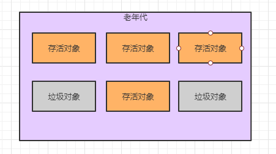
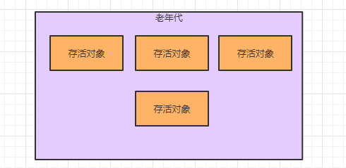
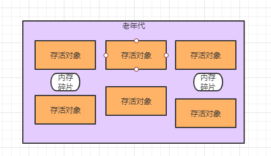
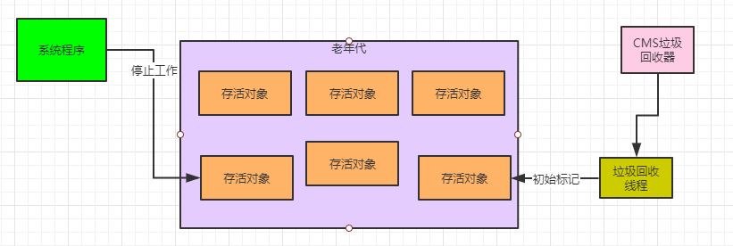
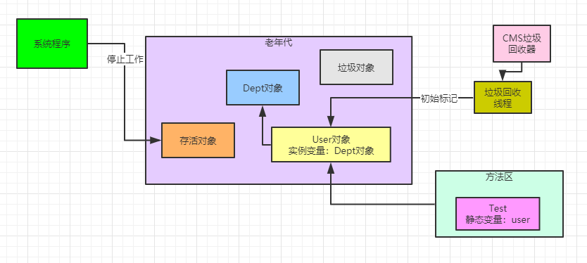
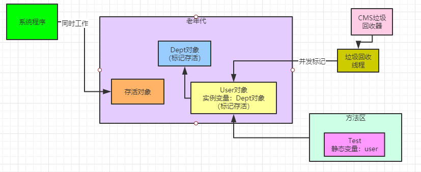
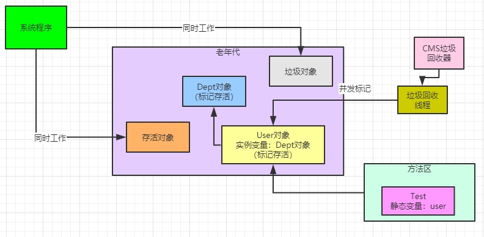
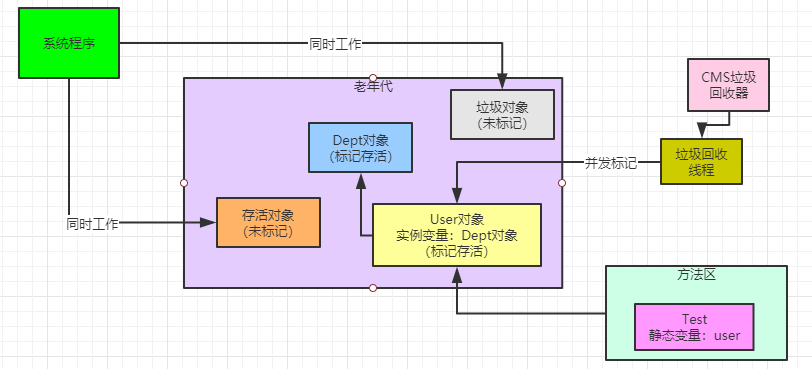

### CMS垃圾回收的基本原理

一般老年代我们选择的**垃圾回收器是CMS**，他采用的是**标记清理算法**，其实非常简单，就是先用之前讲过的标记方法去标记出哪些对象是垃圾对象，然后就把这些垃圾对象清理掉，如下图所示。



上面图里是一个老年代内存区域的对象分布情况，现在假设因为老年代内存空间小于了历次Minor GC后升入老年代对象的平均大小， 判断Minor GC有风险，可能就会提前触发Full GC回收老年代的垃圾对象。

或者是一次Minor GC后的对象太多了，都要升入老年代，发现空间不足，出发了一次老年代的Full GC

总之就是要进行Full GC了，此时所谓的标记-清理算法，其实就是我们之前讲过的一个算法，先通过追踪GC Roots的方法，看看各个对象是否被GC Roots给引用了，如果是的话，那就是存活对象，否则就是垃圾对象。

先将垃圾对象都标记出来，然后一次性把垃圾对象都回收掉，如下图。



这种方法其实**最大的问题**，就是会造成很多内存碎片

我们看下图的黑圈处就是所谓的内存碎片，这种碎片不大不小的，可能放不小 任何一个对象，那么这个内存就被浪费了，之前我们聊 过这个问题。



这就是CMS采取的“标记-清理”算法。

### 如果Stop the World然后垃圾回收会如何？

现在我们**思考一个问题**，假设要先“Stop the World”，然后再采用“标记-清理”算法去回收垃圾，那么会有什么问题？

之前说过了，如果停止一切工作线程，然后慢慢的去执行“标记-清理”算法，会导致系统卡死时间过长，很多响应无法处理。

所以CMS垃圾回收器采取的是**垃圾回收线程和系统工作线程尽量同时执行的模式来处理的。**

### CMS如何实现系统一边工作的同时进行垃圾回收？

CMS在执行一次垃圾回收的过程一共分为4个阶段：
           初始标记 
           并发标记 
           重新标记 
           并发清理

我们一点一点来看。

首先，CMS要进行垃圾回收时，会先执行初始标记阶段，这个阶段会让系统的工作线程全部停止，进入“Stop the World”状态，如下图。



所谓的“初始标记”，他是说标记出来所有GC Roots直接引用的对象，这是啥意思呢？

比如下面的代码。

```java
public class Test {
    private static User user = new User();
}
public class User {
    private  Dept dept = new Dept();
}
```

在初始标记阶段，仅仅会通过 “user” 这个类的静态变量代表的GC Roots，去标记出来他直接引用的Dept对象，这就是初始标记的过程。

他不会去管Dept这种对象，因为Dept对象是被User类的 “dept” 实例变量引用的

之前说过，方法的局部变量和类的静态变量是GC Roots。但是类的实例变量不是GC Roots。

如下图所示.



所以第一个阶段，初始标记，虽然说要造成“Stop the World”暂停一切工作线程，但是其实影响不大，因为他的速度很快，仅仅标记GC Roots直接引用的那些对象罢了。

接着第二个阶段，是并发标记，这个阶段会让系统线程可以随意创建各种新对象，继续运行

在运行期间可能会创建新的存活对象，也可能会让部分存活对象失去引用，变成垃圾对象。在这个过程中，垃圾回收线程，会尽可能的对已有的对象进行GC Roots追踪

所谓进行GC Roots追踪，意思就是对类似 “Dept” 之类的全部老年代里的对象，他会去看他被谁引用了？

比如这里是被 “User” 对象的实例变量引用了，接着会看，“User”对象被谁引用了？会发现被 “Test”类的静态变量引用了。

那么此时可以认定 “Dept” 对象是被GC Roots间接引用的，所以此时就不需要回收他。如下图所示。



但是这个过程中，在进行并发标记的时候，系统程序会不停的工作，他可能会各种创建出来新的对象，部分对象可能成为垃圾，如下图所示。



第二个阶段，就是对**老年代所有对象进行GC Roots追踪，其实是最耗时的**

他需要追踪所有对象是否从根源上被GC Roots引用了，但是这个最耗时的阶段，是跟系统程序并发运行的，所以其实这个阶段不会对系统运行造成影响的。

接着会进入第三个阶段，**重新标记阶段**

因为第二阶段里，你一边标记存活对象和垃圾对象，一边系统在不停运行创建新对象，让老对象变成垃圾

所以第二阶段结束之后，绝对会有很多存活对象和垃圾对象，是之前第二阶段没标记出来的，如下图。



所以此时进入第三阶段，要继续让系统程序停下来，再次进入“Stop the World”阶段。

然后重新标记下在第二阶段里新创建的一些对象，还有一些已有对象可能失去引用变成垃圾的情况，如下图。


这个重新标记的阶段，是速度很快的，他其实就是对在第二阶段中被系统程序运行变动过的少数对象进行标记，所以运行速度很快

接着重新恢复系统程序的运行，进入第四阶段：并发清理

这个阶段就是让系统程序随意运行，然后他来清理掉之前标记为垃圾的对象即可。

这个阶段其实是很耗时的，因为需要进行对象的清理，但是他也是跟系统程序并发运行的，所以其实也不影响系统程序的执行，如下图。


### 对CMS的垃圾回收机制进行性能分析

其实我们看完CMS的垃圾回收机制之后，就会发现，他已经尽可能的进行了性能优化了

因为最耗时的，其实就是对老年代全部对相关进行GC Roots追踪，标记出来到底哪些可以回收，然后就是对各种垃圾对象从内存里清理掉，这是最耗时的。

但是他的第二阶段和第四阶段，都是和系统程序并发执行的，所以基本这两个最耗时的阶段对性能影响不大

只有 第一个阶段和第三个阶段是需要“Stop the World”的，但是这两个阶段都是简单的标记而已，速度非常的快，所以基本上对系 统运行响应也不大。