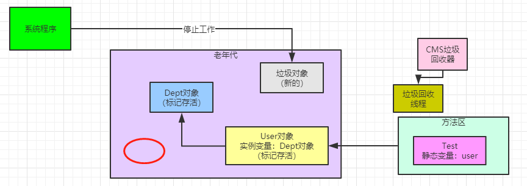

### 并发回收垃圾导致CPU资源紧张

首先回顾一下这个图。

CMS垃圾回收器有一个最大的问题，虽然能在垃圾回收的同时让系统同时工作，但是大家发现没有，在并发标记和并发清理两个最耗时的阶段，垃圾回收线程和系统工作线程同时工作，会导致有限的CPU资源被垃圾回收线程占用了一部分。 

并发标记的时候，需要对GC Roots进行深度追踪，看所有对象里面到底有多少对象是存活的

但是因为老年代里存活对象是比较多的，这个过程会追踪大量的对象，所以耗时较高。并发清理，又需要把垃圾对象从各种随机的内存位置清理掉，也是比较耗时的。

所以在这两个阶段，CMS的垃圾回收线程是比较耗费CPU资源的。CMS默认启动的垃圾回收线程的数量是（CPU核数 + 3）/ 4。

我们用最普通的2核4G机器和4核8G机器来计算一下，假设是2核CPU，本来CPU资源就有限，结果此时CMS还会有个“(2 + 3) / 4” = 1个垃圾回收线程，去占用宝贵的一个CPU。

所以其实CMS这个并发垃圾回收的机制，**第一个问题就是会消耗CPU资源。**

### Concurrent Mode Failure问题

第二个问题，是很多人都很关注的一个问题，就是如下图

在并发清理阶段，CMS只不过是回收之前标记好的垃圾对象

但是这个阶段系统一直在运行，可能会随着系统运行让一些对象进入老年代，同时还变成垃圾对象，这种垃圾对象是“浮动垃圾”。

我们看上图那个红圈画的地方，那个对象就是在并发清理期间，系统程序可能先把某些对象分配在新生代，然后可能触发了一次Minor GC，一些对象进入了老年代，然后短时间内又没人引用这些对象了。

这种对象，就是老年代的 **“浮动垃圾”**。

因为他虽然成为了垃圾，但是CMS只能回收之前标记出来的垃圾对象，不会回收他们，需要等到下一次GC的时候才会回收他们。

所以为了保证在CMS垃圾回收期间，还有一定的内存空间让一些对象可以进入老年代，一般会预留一些空间。

CMS垃圾回收的触发时机，其中有一个就是当老年代内存占用达到一定比例了，就自动执行GC。

“-XX:CMSInitiatingOccupancyFaction”参数可以用来设置老年代占用多少比例的时候触发CMS垃圾回收，JDK 1.6里面默认的值是 92%。

也就是说，老年代占用了92%空间了，就自动进行CMS垃圾回收，预留8%的空间给并发回收期间，系统程序把一些新对象放入老年代中。

那么如果CMS垃圾回收期间，系统程序要放入老年代的对象大于了可用内存空间，此时会如何？

这个时候，会发生Concurrent Mode Failure，就是说并发垃圾回收失败了，我一边回收，你一边把对象放入老年代，内存都不够了。

此时就会自动用“Serial Old”垃圾回收器替代CMS，就是直接强行把系统程序“Stop the World”，重新进行长时间的GC Roots追踪，标记出来全部垃圾对象，不允许新的对象产生

然后一次性把垃圾对象都回收掉，完事儿了再恢复系统线程。

所以在生产实践中，这个自动触发CMS垃圾回收的比例需要合理优化一下，避免“Concurrent Mode Failure”问题

### 内存碎片问题

之前我们说过内存碎片的问题，就是老年代的CMS采用“标记-清理”算法，每次都是标记出来垃圾对象，然后一次性回收掉，这样会导致大量的内存碎片产生。

如果内存碎片太多，会导致后续对象进入老年代找不到可用的连续内存空间了，然后触发Full GC。

所以CMS不是完全就仅仅用“标记-清理”算法的，因为**太多的内存碎片实际上会导致更加频繁的Full GC。**

CMS有一个参数是“-XX:+UseCMSCompactAtFullCollection”，默认就打开了

他意思是在Full GC之后要再次进行“Stop the World”，停止工作线程，然后进行碎片整理，就是把存活对象挪到一起，空出来大片连续内存空间，避免内存碎片。

还有一个参数是“-XX:CMSFullGCsBeforeCompaction”，这个意思是执行多少次Full GC之后再执行一次内存碎片整理的工作，默认是0，意思就是每次Full GC之后都会进行一次内存整理。

上图有一个画红圈的地方，就是说在垃圾回收之后，有一些内存碎片，接着会停止工作线程进行碎片整理，如下图：

### 发散思考：为啥老年代的Full GC要比新生代的Minor GC慢很多倍，一般在10倍以上？

其实原因很简单，我们分析一下他们俩的执行过程。

新生代执行速度其实很快，因为直接从GC Roots出发就追踪哪些对象是活的就行了，新生代存活对象是很少的，这个速度是极快的， 不需要追踪多少对象。

然后直接把存活对象放入Survivor中，就一次性直接回收Eden和之前使用的Survivor了。

### 触发老年代GC的时机

**第一**是老年代可用内存小于新生代全部对象的大小，如果没开启空间担保参数，会直接触发Full GC，所以一般空间担保参数都会打开；

**第二**是老年代可用内存小于历次新生代GC后进入老年代的平均对象大小，此时会提前Full GC；

**第三**是新生代Minor GC后的存活对象大于Survivor，那么就会进入老年代，此时老年代内存不足。

上述情况都会导致老年代Full GC。

今天加了一个触发时机，就是“-XX:CMSInitiatingOccupancyFaction”**参数**

刨除掉上述几种情况，如果老年代可用内存大于历次新生代GC后进入老年代的对象平均大小，但是老年代已经使用的 内存空间超过了这个参数指定的比例，也会自动触发Full GC。

希望认真回顾一下上述过程，把老年代Full GC的几个时机都仔细梳理一下。

**但是CMS的Full GC呢？**

在并发标记阶段，他需要去追踪所有存活对象，老年代存活对象很多，这个过程就会很慢；

其次并发清理阶段，他不是一次性回收一大片内存，而是找到零零散散在各个地方的垃圾对象，速度也很慢；

最后完事儿了，还得执行一次内存碎片整理，把大量的存活对象给挪在一起，空出来连续内存空间，这个过程还得“Stop the World”，那就更慢了。

万一并发清理期间，剩余内存空间不足以存放要进入老年代的对象了，引发了“Concurrent Mode Failure”问题，那更是麻烦，还得立马用“Serial Old”垃圾回收器，“Stop the World”之后慢慢重新来一遍回收的过程，这更是耗时了。

所以综上所述，老年代的垃圾回收，就是一个字：慢