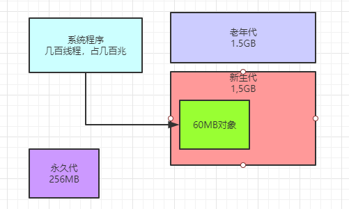

### 案例背景引入

案例背景是每日上亿请求量的电商系统，那么大家可以来推算一下每日上亿请求量的电商系统，他会每日有多少活跃用户？

一般按每个用户平均访问20次来计算，那么上亿请求量，大致需要有500万日活用户。

那么继续来推算一下，这500万的日活用户都是会进来进行大量的浏览，那么多少人会下订单？

这里可以按照10%的付费转化率来计算，每天大概有50万人会下订单，那么大致就是每天会有50万订单。

这50万订单算他集中在每天4小时的高峰期内，那么其实平均下来每秒钟大概也就几十个订单，大家是不是觉得根本没 啥可说的？

因为几十个订单的压力下，根本就不需要对JVM多关注，基本上就是每秒钟占用一些新生代内存，隔很久新生代才会 满，然后一次Minor GC后垃圾对象清理掉，内存就空出来了，几乎无压力

### 特殊的电商大促场景

但是如果你要是考虑到特殊的电商大促场景，就不会这么想了

因为很多中小型的电商平台，确实平时系统压力其实没那么大，也没太大的高并发，每秒几千并发压力就算是高峰压力了。

但是如果遇到一些大促场景，比如双11什么的，情况就不同了。

假设在类似双11的节日里，零点的时候，很多人等着大促开始就要剁手购物，这个时候，可能在大促开始的短短10分钟内，瞬间就会有50万订单。

那么此时每秒就会有接近1000的下单请求，我们就针对这种大促场景来对订单系统的内存使用模型分析一下。

### 抗住大促的瞬时压力需要几台机器？

那么要抗住大促期间的瞬时下单压力，订单系统需要部署几台机器呢？

基本上可以按3台来算，就是每台机器每秒需要抗300个下单请求。这个也是非常合理的，而且需要假设订单系统部署 的就是最普通的标配4核8G机器。

从机器本身的CPU资源和内存资源角度，抗住每秒300个下单请求是没问题的。

但是问题就在于需要对JVM有限的内存资源进行合理的分配和优化，包括对垃圾回收进行合理的优化，让JVM的GC次 数尽可能最少，而且尽量避免Full GC，这样可以尽可能减少JVM的GC对高峰期的系统性能的影响。

### 大促高峰期订单系统的内存使用模型估算

背景已经全部说完了，接下来咱们就得来预估订单系统的内存使用模型了.

基本上可以按照每秒钟处理300个下单请求来估算，其实无论是订单处理性能还是并发情况，都跟生产很接近

因为处理下单请求是比较耗时的，涉及很多接口的调用，基本上每秒处理100~300个下单请求是差不多的。

那么每个订单咱们就按1kb的大小来估算，单单是300个订单就会有300kb的内存开销

然后算上订单对象连带的订单条目对象、库存、促销、优惠券等等一系列的其他业务对象，一般需要对单个对象开销 放大10倍~20倍。

此外，除了下单之外，这个订单系统还会有很多订单相关的其他操作，比如订单查询之类的，所以连带算起来，可以 往大了估算，再扩大10倍的量。

那么每秒钟会有大概300kb * 20 * 10 = 60mb的内存开销。但是一秒过后，可以认为这60mb的对象就是垃圾了，因 为300个订单处理完了，所有相关对象都失去了引用，可以回收的状态。

大家看下图


### 内存到底该如何分配？

假设我们有4核8G的机器，那么给JVM的内存一般会到4G，剩下几个G会留点空余给操作系统之类的来使用，不要想 着把机器内存一下子都耗尽，其中堆内存我们可以给3G，新生代我们可以给到1.5G，老年代也是1.5G。

然后每个线程的Java虚拟机栈有1M，那么JVM里如果有几百个线程大概会有几百M

然后再给永久代256M内存，基本上这4G内存就差不多了。

同时还要记得设置一些必要的参数，比如说打开“-XX:HandlePromotionFailure”选项，JVM参数如下所示：

```
"-Xms3072M -Xmx3072M -Xmn1536M -Xss1M -XX:PermSize=256M -XX:MaxPermSize=256M -
XX:HandlePromotionFailure"

```

但是“-XX:HandlePromotionFailure”参数在JDK 1.6以后就被废弃了，所以现在一般都不会在生产环境里设置这个参数了。在JDK 1.6以后，只要判断“老年代可用空间”> “新生代对象总和”，或者“老年代可用空间”> “历次Minor GC升入老年代对象的平均大 小”，两个条件满足一个，就可以直接进行Minor GC，不需要提前触发Full GC了。

所以实际上，如果大家用的是JDK 1.7或者JDK 1.8，那么JVM参数就保持如下即可，后面也都不再加入这个参数了：

```
"-Xms3072M -Xmx3072M -Xmn1536M -Xss1M -XX:PermSize=256M -XX:MaxPermSize=256M"
```

此时JVM内存入下图所示。



接着就很明确了，订单系统的系统程序在大促期间不停的运行，每秒处理300个订单，都会占据新生代60MB的内存空 间

但是1秒过后这60MB对象都会变成垃圾，那么新生代1.5G的内存空间大概需要25秒就会占满，如下图。


25秒过后就会要进行Minor GC了，此时因为有“-XX:HandlePromotionFailure”选项，所以你可以认为需要进行的检查，主要就是比较 “老年代可用空间大小”和“历次Minor GC后进入老年代对象的平均大小”，刚开始肯定这个检查是可以通过的。

所以Minor GC直接运行，一下子可以回收掉99%的新生代对象，因为除了最近一秒的订单请求还在处理，大部分订单早就处理完了，所以此时可能存活对象就100MB左右。

但是这里问题来了，如果“-XX:SurvivorRatio”参数默认值为8，那么此时新生代里Eden区大概占据了1.2GB内存， 每个Survivor区是150MB的内存，如下图。


所以Eden区1.2GB满了就要进行Minor GC了，因此大概只需要20秒，就会把Eden区塞满，就要进行Minor GC了。

然后GC后存活对象在100MB左右，会放入S1区域内。如下图。


然后再次运行20秒，把Eden区占满，再次垃圾回收Eden和S1中的对象，存活对象可能还是在100MB左右会进入S2 区，如下图。


此时JVM参数如下：

```
"-Xms3072M -Xmx3072M -Xmn1536M -Xss1M -XX:PermSize=256M -XX:MaxPermSize=256M -
XX:SurvivorRatio=8"

```

### 新生代垃圾回收优化之一：Survivor空间够不够

首先在进行JVM优化的时候，第一个要考虑的问题，就是你通过估算，你的新生代的Survivor区到底够不够

按照上述逻辑，首先每次新生代垃圾回收在100MB左右，有可能会突破150MB，那么岂不是经常会出现Minor GC过后的对象无法放入Survivor中？然后岂不是频繁会让对象进入老年代？

还有，即使Minor GC后的对象少于150MB，但是即使是100MB的对象进入Survivor区，因为这是一批同龄对象，直 接超过了Survivor区空间的50%，此时也可能会导致对象进入老年代。

所以其实按照我们这个模型来说，Survivor区域是明显不足的。

这里其实建议的是**调整新生代和老年代的大小**，因为这种普通业务系统，明显大部分对象都是短生存周期的，根本不 应该频繁进入老年代，也没必要给老年代维持过大的内存空间，首先得先让对象尽量留在新生代里。

所以此时可以考虑把新生代调整为2G，老年代为1G，那么此时Eden为1.6G，每个Survivor为200MB，如下图。


这个时候，Survivor区域变大，就大大降低了新生代GC过后存活对象在Survivor里放不下的问题，或者是同龄对象超过Survivor 50%的问题。

这样就大大降低了新生代对象进入老年代的概率。

此时JVM的参数如下：

```
"-Xms3072M -Xmx3072M -Xmn2048M -Xss1M -XX:PermSize=256M -XX:MaxPermSize=256M -
XX:SurvivorRatio=8"
```

其实对任何系统，首先类似上文的内存使用模型预估以及合理的分配内存，尽量让每次Minor GC后的对象都留在 Survivor里，不要进入老年代，这是你首先要进行优化的一个地方。

### 新生代对象躲过多少次垃圾回收后进入老年代？

大家都知道，除了Minor GC后对象无法放入Survivor会导致一批对象进入老年代之外，还有就是有些对象连续躲过15 次垃圾回收后会自动升入老年代。

其实按照上述内存运行模型，基本上20多秒触发一次Minor GC，那么如果按照“-XX:MaxTenuringThreshold”参数 的默认值15次来说，你要是连续躲过15次GC，就是一个对象在新生代停留超过了几分钟了，此时他进入老年代也是应该的。

有些博客会说，应该提高这个参数，比如增加到20次，或者30次，其实**那种说法根本是不对的**

因为你对这个参数考虑必须**结合系统的运行模型**来说，如果躲过15次GC都几分钟了，一个对象几分钟都不能被回收， 说明肯定是系统里类似用@Service、@Controller之类的注解标注的那种需要长期存活的核心业务逻辑组件。

那么他就应该进入老年代，何况这种对象一般很少，一个系统累计起来最多也就几十MB而已。

所以你说你提高 “-XX:MaxTenuringThreshold” 参数的值，有啥用呢？让这些对象在新生代里多停留几分钟？

所以说，考虑问题，一定不要人云亦云，要结合运行原理，自己推演和思考，不同的业务系统还都是不一样的。

其实这个参数甚至你都可以降低他的值，比如降低到5次，也就是说一个对象如果躲过5次Minor GC，在新生代里停留超过1分钟了，尽快就让他进入老年代，别在新生代里占着内存了。

总之，对于这个参数务必是结合你的系统具体运行的模型来考虑。

要记住，JVM没有万能的最佳参数，但是有一套通用的分析和优化的方法。

此时JVM参数如下：

```
"-Xms3072M -Xmx3072M -Xmn2048M -Xss1M -XX:PermSize=256M -XX:MaxPermSize=256M -
XX:SurvivorRatio=8 -XX:MaxTenuringThreshold=5"

```

### 多大的对象直接进入老年代？

另外有一个逻辑是说，大对象可以直接进入老年代 ，因为大对象说明是要长期存活和使用的

比如在JVM里可能会缓存一些数据，这个一般可以结合自己系统中到底有没有创建大对象来决定。

但是一般来说，给他设置个1MB足以，因为一般很少有超过1MB的大对象。如果有，可能是你提前分配了一个大数组、大List之类的东西用来放缓存的数据。

此时JVM参数如下：

```
"-Xms3072M -Xmx3072M -Xmn2048M -Xss1M -XX:PermSize=256M -XX:MaxPermSize=256M -
XX:SurvivorRatio=8 -XX:MaxTenuringThreshold=5 -XX:PretenureSizeThreshold=1M"
```

### 别忘了指定垃圾回收器

同时别忘了要指定垃圾回收器，新生代使用ParNew，老年代使用CMS，如下JVM参数 ：

```
"-Xms3072M -Xmx3072M -Xmn2048M -Xss1M -XX:PermSize=256M -XX:MaxPermSize=256M -
XX:SurvivorRatio=8 -XX:MaxTenuringThreshold=5 -XX:PretenureSizeThreshold=1M -XX:+UseParNewGC -
XX:+UseConcMarkSweepGC"

```

ParNew垃圾回收器的核心参数，其实就是配套的新生代内存大小、Eden和Survivor的比例，只要你设置合理，避免 Minor GC后对象放不下Survivor进入老年代，或者是动态年龄判定之后进入老年代，给新生代里的Survivor充足的空 间，那么Minor GC一般就没什么问题。

然后根据你的系统运行模型，合理设置“-XX:MaxTenuringThreshold”，让那些长期存活的对象，抓紧尽快进入老年代，别在新生代里一直待着。

这样基本上一个初步的优化好的JVM参数就结合你的业务出来了。