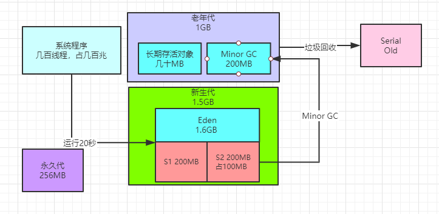

### 在案例背景下什么时候对象会进入老年代？

接着我们来分析一个问题，在目前优化好的背景下，**一般什么情况下会让一些对象进入老年代呢？**

首先第一种情况，那绝对就是 “-XX:MaxTenuringThreshold=5” 这个参数会让在一两分钟内连续躲过5次Minor GC 的对象迅速进入老年代中。

这种对象一般就是一些@Service、@Controller之类的注解标注的那种系统业务逻辑组件，这种对象实例一般全局就有一个实例就可以了，要一直使用的

所以一般会长期被GC Roots引用，这种对象一般不会太多，大概最多一个系统就几十MB这种对象。

所以此时类似这样的长期存活的对象就会进入老年代中，如下图所示。


此外，按照我们的JVM参数，如果分配一个超过1MB的大对象，比如说你创建一个大数组或者是大List之类的，就会直接进入老年代。

但是这种大对象我们假设在这个案例里是没有的，所以可以忽略不计。

此外就是Minor GC过后可能存活的对象超过200MB放不下Survivor了，或者是一下子占到超过Surviovr的50%，此时会有一些对象进入老年代中。

但是我们之前对新生代的JVM参数进行优化，就是为了避免这种情况，经过我们的测算，这种概率应该是很低的。

但是虽说是很低，也不能完全是是没有这种情况，比如某一次GC过后可能刚好机缘巧合有超过200MB对象，就会进入老年代里。

我们可以做一个假设，大概就是这个订单系统在大促期间，每隔5分钟会在Minor GC之后有一小批对象进入老年代， 大概200MB左右的大小，如下图所示。


### 大促期间多久会触发一次Full GC？

接着我们来研究一下，那么按照Full GC的触发条件，多久会触发一次Full GC？

首先来看看，Full GC的触发条件目前我们学习到的有以下4种：

（1）没有打开“ -XX:HandlePromotionFailure”选项，结果老年代可用内存最多也就1G，新生代对象总大小最多可以有1.8G

那么会导致每次Minor GC前一检查，都发现“老年代可用内存” < “新生代总对象大小”，这会导致每次Minor GC 前都触发Full GC。

当然，之前提到过了，现在JDK 1.6以后的版本废弃了这个参数，其实只要满足下面第二个条件就可以直接触发 Minor GC，不需要触发Full GC。

（2）每次Minor GC之前，都检查一下“老年代可用内存空间” < “历次Minor GC后升入老年代的平均对象大小”

其实按照我们目前设定的背景，要很多次Minor GC之后才可能有一两次碰巧会有200MB对象升入老年代，所以这个 “历次Minor GC后升入老年代的平均对象大小”，基本是很小的。

（3）可能某次Minor GC后要升入老年代的对象有几百MB，但是老年代可用空间不足了

（4）设置了 “-XX:CMSInitiatingOccupancyFaction” 参数，比如设定值为92%，那么此时可能前面几个条件都没满足，但是刚好发现这个条件满足了，比如就是老年代空间使用超过92%了，此时就会自行触发Full GC

其实在真正的系统运行期间，可能会慢慢的有对象进入老年代，但是因为新生代我们优化过了内存分配，所以对象进 入老年代的速度是很慢的。

所以很可能是在系统运行半小时~1小时之后，才会有接近 1GB的对象进入老年代。

此时可能会因为上述的条件234中任何一个满足了，就触发Full GC

但是这三个条件一般都需要老年代近乎占满的时候，才有可能会触发。

我们可以思考一下，假设在大促期间，订单系统运行1小时之后，大促下单高峰期几乎都快过了，此时才可能会触发一次Full GC。

注意，**这个推论很重要**，因为按照大促开始10分钟就有50万订单来计算，其实大促开始后一堆用户等着下单剁手购物

那么1小时候就可能有两三百万订单了，这是一年难得罕见的节日大促才会有的，然后这个高峰期过后，基本订单系统访问压力就很小了，那么GC的问题几乎就更不算什么了。

所以经过新生代的优化，可以推算出，基本上大促高峰期内，也就可能1小时才1次Full GC，然后高峰期一过，随着订单系统慢慢运行，可能就要几个小时才有一次Full GC。

### 老年代GC的时候会发生 "Concurrent Mode Failure" 吗？

经过前面的推算，我们基本可知道，假设就是订单系统运行1小时之后，老年代大概有900MB的对象了，剩余可用空间仅仅只有100MB了，此时就会触发一次Full GC，如下图。


但是有一个很大的问题，就是CMS在垃圾回收的时候，尤其是并发清理期间，系统程序是可以并发运行的，所以此时老年代空闲空间仅剩100MB了

然后此时系统程序还在不停的创建对象，万一这个时候系统运行触发了某个条件，比如说有200MB对象要进入老年 代，此时会如何？


这个时候就会触发 “Concurrent Mode Failure” 问题，因为此时老年代没有足够内存来放这200MB对象，此时就会导致立马进入Stop the World，然后切换CMS为Serial Old，直接禁止程序运行，然后单线程进行老年代垃圾回收，回收掉900MB对象过后，再让系统继续运行，如下图。



所以可以想一下，**这种情况可能发生吗？**

概率是挺小的，因为必须是CMS触发Full GC的时候，系统运行期间还让200MB对象进入老年代，这个概率其实本身就很小，但是理论上是有可能的。

此时需要思考一下，相对于这种小概率的事件而言，有必要去调整参数吗？

暂时看来是没有必要的，不需要针对小概率事件特意优化参数。

此时JVM参数如下：

```
"-Xms3072M -Xmx3072M -Xmn2048M -Xss1M -XX:PermSize=256M -XX:MaxPermSize=256M -
XX:SurvivorRatio=8 -XX:MaxTenuringThreshold=5 -XX:PretenureSizeThreshold=1M -XX:+UseParNewGC -
XX:+UseConcMarkSweepGC -XX:CMSInitiatingOccupancyFaction=92"
```

### CMS垃圾回收之后进行内存碎片整理的频率应该多高？

接着来看最后一个问题，在CMS完成Full GC之后，一般需要执行内存碎片的整理，可以设置多少次Full GC之后执行一次内存碎片整 理，但是我们有必要修改这些参数吗？

其实没必要，因为通过前面的分析，在大促高峰期，Full GC可能也就1小时执行一次，然后大促高峰期过去之后，就没那么多的订单 了，此时可能几个小时才会有一次Full GC

所以就保持默认的设置，每次Full GC之后都执行一次内存碎片整理就可以，目前JVM参数如下：

```
"-Xms3072M -Xmx3072M -Xmn2048M -Xss1M -XX:PermSize=256M -XX:MaxPermSize=256M -
XX:SurvivorRatio=8 -XX:MaxTenuringThreshold=5 -XX:PretenureSizeThreshold=1M -XX:+UseParNewGC -
XX:+UseConcMarkSweepGC -XX:CMSInitiatingOccupancyFaction=92 -XX:+UseCMSCompactAtFullCollection
-XX:CMSFullGCsBeforeCompaction=0"
```

其实从本文可以看到，Full GC优化的前提是Minor GC的优化，Minor GC的优化的前提是合理分配内存空间，合理分配内存空间的前提是对系统运行期间的内存使用模型进行预估。

其实对很多普通的Java系统而言，只要对系统运行期间的内存使用模型做好预估，然后分配好合理的内存空间，尽量让Minor GC之后的存活对象留在Survivor里不要去老年代，然后其余的GC参数不做太多优化，系统性能基本上就不会太差。

