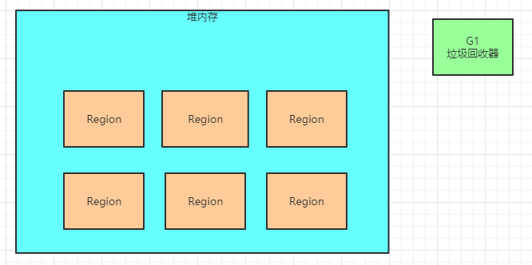

### ParNew + CMS的组合让我们有哪些痛点？

Stop the World，这个是最痛的一个点！

无论是新生代垃圾回收，还是老年代垃圾回收，都会或多或少产生 Stop the World” 现象，对系统的运行是有一定影响的

所以其实之后对垃圾回收器的优化，都是朝着减少 “Stop the World” 的目标去做的。

在这个基础之上，G1垃圾回收器就应运而生了，他可以提供比 “ParNew + CMS” 组合更好的垃圾回收的性能。

### G1垃圾回收器

G1垃圾回收器是可以同时回收新生代和老年代的对象的，不需要两个垃圾回收器配合起来运作，他一个人就可以搞定所有的垃圾回收。

***他最大的一个特点，就是把Java堆内存拆分为多个大小相等的Region***，如下图

然后G1也会有新生代和老年代的概念，但是只不过是**逻辑上的概念**

也就是说，新生代可能包含了某些Region，老年代可能包含了某些Reigon，如下图。

而且G1最大的一个特点，就是可以让**我们设置一个垃圾回收的预期停顿时间**

也就是说比如我们可以指定：希望G1同志在垃圾回收的时候，可以保证，在1小时内由G1垃圾回收导致的 “Stop the World” 时间， 也就是系统停顿的时间，不能超过1分钟。

这个就很厉害了，如果看明白了之前很多JVM优化的思路，都明白一点，其实我们对内存合理分配，优化一些参数，就是为 了尽可能减少Minor GC和Full GC，尽量减少GC带来的系统停顿，避免影响系统处理请求。

但是现在我们直接可以给G1指定，在一个时间内，垃圾回收导致的系统停顿时间不能超过多久，G1全权给你负责，保证达到这个目标。

这样相当于我们就可以直接控制垃圾回收对系统性能的影响了

### G1是如何做到对垃圾回收导致的系统停顿可控的？

其实G1如果要做到这一点，他就必须要追踪每个Region里的回收价值，**啥叫做回收价值呢？**

他必须搞清楚每个Region里的对象有多少是垃圾，如果对这个Region进行垃圾回收，需要耗费多长时间，可以回收掉多少垃圾？

看下图，G1通过追踪发现，1个Region中的垃圾对象有10MB，回收他们需要耗费1秒钟，另外一个Region中的垃圾对象有 20MB，回收他们需要耗费200毫秒。

然后在垃圾回收的时候，G1会发现在最近一个时间段内，比如1小时内，垃圾回收已经导致了几百毫秒的系统停顿了，现在又要执行一 次垃圾回收，那么必须是回收上图中那个只需要200ms就能回收掉20MB垃圾的Region啊！

于是G1触发一次垃圾回收，虽然可能导致系统停顿了200ms，但是一下子回收了更多的垃圾，就是20MB的垃圾，如下图。

所以简单来说，G1可以做到让你来设定垃圾回收对系统的影响，他自己通过把内存拆分为大量小Region，以及追踪每个Region中可 回收的对象大小和预估时间，最后在垃圾回收的时候，尽量把垃圾回收对系统造成的影响控制在你指定的时间范围内，同时在有限的时间内尽量回收尽可能多的垃圾对象。

这就是**G1的核心设计思路。**

### Region可能属于新生代也可能属于老年代

另外在G1中，每一个Region时可能属于新生代，但是也可能属于老年代的

刚开始Region可能谁都不属于，然后接着就分配给了新生代，然后放了很多属于新生代的对象，接着就触发了垃圾回收这个Region， 如下图。

然后下一次同一个Region可能又被分配了老年代了，用来放老年代的长生存周期的对象，如下图所示。

所以其实在G1对应的内存模型中，Region随时会属于新生代也会属于老年代，所以没有所谓新生代给多少内存，老年代给多少内存这一说了

实际上新生代和老年代各自的内存区域是不停的变动的，由G1自动控制。 

### 本文总结

本文先初步的介绍一下G1垃圾回收器的设计思想，包括Region的划分，然后Region动态转移给新生代或者老年代，按需分配

然后触发垃圾回收的时候，可以根据设定的预期系统停顿时间，来选择最少回收时间和最多回收对象的Region进行垃圾回收，保证GC对系统停顿的影响在可控范围内，同时还能尽可能回收最多的对象。

把本文思路串起来看看，首先高屋建瓴的对G1垃圾回收器的整体设计思想有了一定的理解