### 我们平时写的java代码是怎么运行起来的

首先，我们写好了一份java代码，在这份java代码中，肯定是包含了很多.java结尾的文件，比如
User.java，UserService.java，Order.java ...... 当我们写好这些.java 后缀的代码文件之后，接下来肯定会部署到线上的机器上去运行，一般情况下，我们会把代码打包成".jar"后缀的jar包，或者是".war"后缀的war包。然后就是把打包好的jar包或者是war包部署到线上机器上。这个部署就有很多途径了，但是最基本的就是通过tomcat这类容器来部署代码，当然也可以时自己手动通过"java"命令来运行一个jar包中的代码。

用图表示下关系就是
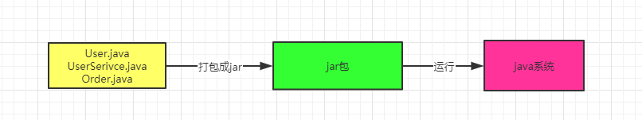

在上图中其实还有一个非常重要的步骤就是“编译”阶段，也就是说我们在写好".java"的代码打包过程中，一般会把代码编译成".class"后缀的字节码文件，比如"User.class，UserSerivce.class，Order.class"。

然后这个".class"后缀的字节码文件，它才是可以被运行起来的！

所以我们还是要熟悉下jvm机制，那画图来回顾下这个编译过程把，以及".class"字节码文件的概念。图总结如下

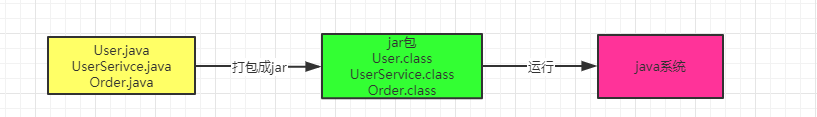

对于编译好的这些".class"字节码，是怎么让他们运行起来的，这时候就需要用我们的命令
"java - jar" 之类的命令来运行我们写好的代码了。

此时一旦你采用"java"命令，实际上此时就会启动一个jvm进程。

这个jvm 就会负责运行这些".class"字节码文件，也就是相当于负责运行着我们写好的系统

所以呢，我们平时写好的某个系统在一台机器上部署的时候，你一旦启动这个系统，其实就是启动了一个JVM，由它来负责运行这台机器上的这个系统。

用图来总结下就是

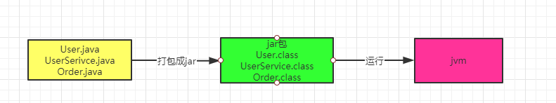

接着，jvm要运行这些".class"字节码文件中的代码，那首先得把这些".class"文件中包含的各种类给加载进来？

此时就会有一个”类加载器“的概念。类加载器会把编译好的那些".class"字节码文件给加载到JVM中，然后供后续的代码运行来使用。

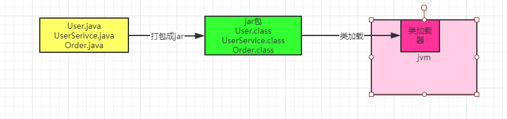

最后一步，JVM就会基于自己的**字节码执行引擎**，来执行加载到内存里的我们写好的那些类了，比如你的代码中有一个”main()"方法，那么jvm就会从这个"main()"方法开始执行里面的代码。当它需要哪个类的时候，就会使用类加载器来加载对应的类，反正对应的类就在".class"文件中。

流程如下图

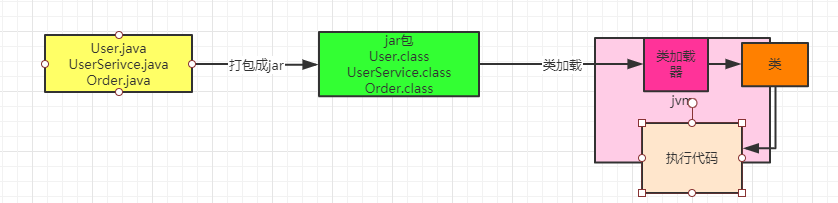

### JVM在什么情况下会加载一个类

其实类加载的过程非常的烦锁且复杂，但对于我们平时从工作中实用角度来说，主要是把握它的核心工作原理就可以了。一个类的加载到使用，一般会经历下面的过程：
**加载->验证->准备->解析->初始化->使用->卸载**

所以首先我们要搞明白的第一个问题，就是jvm在执行我们写好的代码的过程中，一般在什么情况下回去加载一个类呢？

也就是说，啥时候会从".class"字节码文件中加载这个类到JVM内存里来。

其实答案也非常简单，就是在**你的代码中用到这个类的时候**

举个简单的示列，比如下面你有一个类（Test.class）,里面有一个"main"方法作为主入口。

那么一旦你的JVM进程启动之后，它一定回先把你这个类（Test.class）加载到内存里，然后从"main()"方法的入口代码执行。

```
public Class Test{
   public static void main(){
   
   }
}
```

流程图如下 感受下

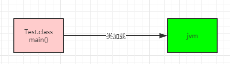

接着假设上面的代码中，出现了如下的代码

```
public Class Test{
   public static void main(){
      User user = new User();
   }
}
```

这样的话，大部分的人就会想，你的代码中明显需要使用 "User" 这个类去实例化一个对象，此时必须把 "User.class" 字节码文件中的这个类加载到内存里来。是不是呢？

所以这个时候就会触发JVM通过类加载器，从 "User.class" 字节码中加载对应的类到内存里来使用，这样的话代码才能跑起来

如下图所示

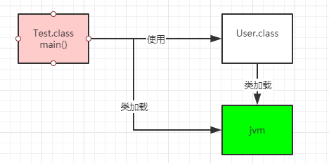

上面的一个例子，相信已经非常的清晰明了。

简单叙述下就是：首先你的代码中包含"main()"方法的主类一定回在JVM进程启动之后被加载到内存，开始执行你的 "main" 方法中的代码

接着遇到要使用的其他类，比如 "User" ，此时就会从对应的 ".class" 字节码文件加载对应的类到内存里。

### jvm的验证、准备和初始化的过程

其实上面的类加载实际的问题，对于很多有经验的人来时不是什么问题

但是对于很多初学者来说，是一个非常重要的需要弄清的概念：**验证，准备，初始化**
其实对于这三个概念，没太大的必须要去深究里面的细节，这里的细节很多很繁琐，对于大部分的人而言，只要明白下面几个概念就可以了：

（1）验证阶段
简单的说，这一步就是根据Java虚拟机规范，来校验你加载进来的 ".class" 文件中的内容，是否符合制定的规范，这个其实不难理解，你的 ".class" 文件被人篡改了，里面的字节码压根儿不符合规范，那么JVM是没法去执行这个字节码的！

所以把 ".class" 加载到内存里之后，必须先验证一下，校验他必须完全符合JVM规范，后续才能交给JVM来运行。

图如下：

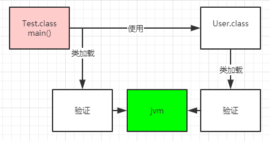

(2)准备阶段

这个阶段其实也很好理解，咱们都知道，我们写好的那些类，其实都有一些类变量

比如下面这个User类 

```
public class User{
   public static int flushInterval;
}
```

假设你有这么一个 "User" 类，他的 "User.class" 文件内容刚刚被加载到内存之后，会进行验证，确认这个字节码的内容是规范的，接着就会进行准备工作。

这个准备工作，其实就是给这个 "User" 类分配一定的内存空间

然后给他里面的类变量（也就是static修饰的变量）分配内存空间，来一个默认的初始值

比如上面的示例里，就会给"flushInterval" 这个类变量分配内容空间，给一个 "0" 这个初始值。

这个过程，如下图所示：

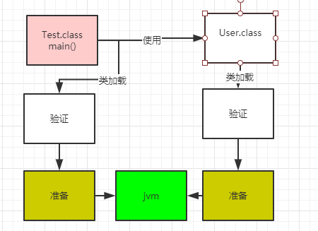

（3）解析阶段

这个阶段做的事情，实际上是把符号引用替换成直接引用的过程，这个过程的部分内容很复杂，涉及到JVM底层，所以针对这个阶段，现在不做过深的讨论，只要知道有这个阶段就行了

如图所示：

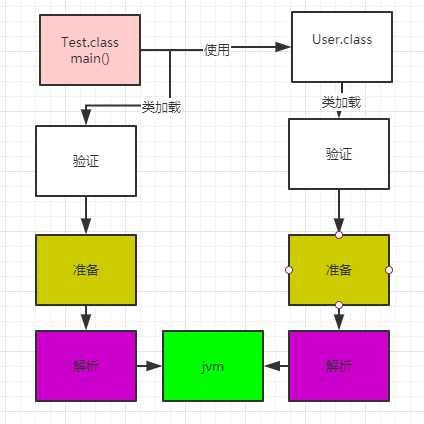

（4）三个阶段的小结

其实这三个阶段，最核心的大家务必关注，就是 "**准备阶段**"

因为这个阶段是给加载进来的类分配好了内存空间，类变量也分配好了内存空间，并且给了默认的初始值。

### 核心阶段：初始化

之前说过，在准备阶段时，就会把我们的"User"类给分配好内存空间

另外一个类变量"flushInterval" 也会给一个默认的初始值 "0"，那么接下来，在初始化阶段，就会正式执行我们的类的初始化的代码了

那什么是类初始化的代码呢？我们看下面的这段代码

```
public class User {
   public static int flushInterval =               
           Configuration.getInt("user.flush.interval")
}
```

可以看到，对于"flushInterval" 这个类变量，我们是打算通过 Configuration.getInt("user.flush.interval")这段代码来获取一个值，并赋值给他的，但是在准备阶段会执行这个赋值逻辑吗？答案是：NO! 。在准备阶段，仅仅是给 "flushInterval" 类变量开辟一个内存空间，然后给这个初始值 "0" 罢了。

那么这端赋值的代码是什么时候执行呢？答案是在 **"初始化"** 阶段执行。

在这个阶段，就会执行类的初始化代码，比如上面的Configuration.getInt("user.flush.interval")代码就会在这里执行，完成一个配置项的读取，然后在赋值给这个类变量 "flushInterval"。

另外比如下图的static静态代码快，也会在这个阶段执行。

类似下面的代码语义，可以理解为类初始化的时候，调用"loadReplicaFromDish()" 方法从磁盘中加载数据副本，并且放在静态变量”replicas“中:

```
public class User {
   public static int flushInterval =               
           Configuration.getInt("user.flush.interval")

   public static Map<String,Replica> replicas;

   static{
        loadReplicaFromDish();
   }

   public static void loadReplicaFromDish(){
      this.replicas = new HashMap<String,Replica>();
   }
}
```

那么搞明白了类的初始化是什么，就得来看看类的初始化规则了。

**什么时候会初始化一个类呢?**

一般来说有以下一些时机，比如 "new User()" 来实例化的对象了，此时就会触发类的加载到初始化的全过程，把这个类准备好，然后在实例化一个对象出来;

或者包含"main()"方法的主类，必须是立马初始化的。

此外，这里还有一个非常重要的规则，就是如果初始化一个类的时候，发现他的父类还没初始化，那么必须先初始化他的父类。

比如下面的代码

```
public class User extends xxxx {
   public static int flushInterval =               
           Configuration.getInt("user.flush.interval")

   public static Map<String,Replica> replicas;

   static{
        loadReplicaFromDish();
   }

   public static void loadReplicaFromDish(){
      this.replicas = new HashMap<String,Replica>();
   }
}
```

如果你要"new User()"初始化这个类的实例，那么会加载这个类，然后初始化这个类

但是初始化这个类之前，发现xxxx作为父类还没加载和初始化，那么必须先加载这个父类，并且初始化这个类。

这个规则，务必牢记，如图所示：

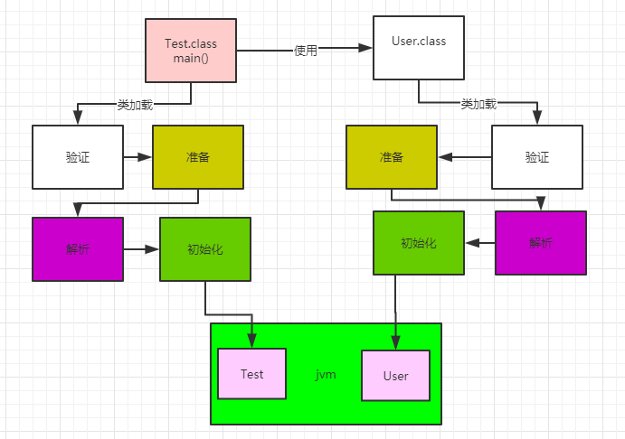

### 类的加载器和双亲委派机制

现在相信都搞明白了整个类加载从触发时机到初始化的过程了，接着说一下类加载器的概念，因为实现上述过程，那必须是依靠类的加载器来实现的。

那么Java里有哪些类加载器呢？简单来说有下面几种：

（1）启动类加载器

Bootstrap ClassLoader，他主要是负责加载我们在机器上安装的Java目录下的核心类的

相信大家都知道，如果我们要在机器上运行自己写的Java代码，无所事win，os，还是linux服务器，都得装一个JDK?

那么在我们得Java安装目录下，就有一个 **"lib"** 目录，大家可以自己找找看看，这里就有Java最核心得一些类库，支撑你的Java系统的运行。

所以一旦我们的JVM启动，那么首先就会依托启动类加载器，去加载我们的Java安装目录下的 "lib" 目录中的核心类库。

（2）扩展类加载器

Extension ClassLoader，这个类加载器其实也是类似的，就是我们的Java安装目录下，有一个"lib/ext" 目录， 这里面有一些类，就是需要使用这个类加载器来加载的，支撑我们的系统运行。

那么我们的JVM一旦启动，是不是也得从Java安装目录下，加载这个 "lib/ext" 目录中的类？

（3）应用程序类加载器

Application ClassLoader，这个类加载器负责去加载 "ClassPath" 环境变量所指的路径中的类

其实你大致就理解为去加载我们写好的Java代码吧，这个类加载器就负责我们写好的那些类到内存里。

（4）自定义类加载器

除了上面的几种之外，还可以自定义类加载器，去根据你自己的需求加载你的类。

（5）双亲委派机制

JVM 的类加载器是有亲子层级结构的，就是说启动类加载器是最上层的，扩展类加载器在第二层，第三层是应用程序类加载器，最后一层才是自定义类加载器。

如下图所示：

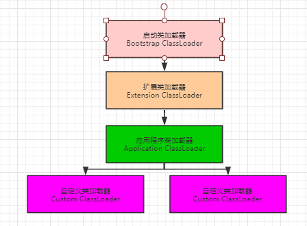

然后，基于这个亲子层结构，就有一个**双亲委派的机制**。

什么意思呢？

就是加入你的应用程序类加载器需要加载一个类，他首先会委派给自己的父类加载器去加载，最终传导到顶层的类加载器去加载，但是如果父类加载器在自己负责加载的范围内，没找到这个类，那么就会下推加载权力给自己的子类加载器。

听完了上上面的叙述，是不是很迷茫？别急，用一个例子来说明一下。

比如我们的JVM现在需要加载 "User" 类，此时应用程序类加载器会问问自己的爸爸，也就是扩展类加载器，你能加载到这个类吗？

然后扩展类加载器直接问自己的爸爸，也就是启动类加载器，你能加载这个类吗？

启动类加载器心想，我在Java安装目录下，也就是 "/lib" 下，没找到这个类啊，自己找去！

然后，就下推加载权力给扩展类加载器这个儿子，结果扩展类加载器找了半天，也没找到自己负责的目录中，也就是 "/lib/ext" 下。

这时他很生气，说：明明就是你应用程序加载器自己负责的，你自己找去。

然后应用程序类加载器在自己负责的范围内，比如就是我们写好的那个系统打包成的jar包吧，一下子发现，就在这里，然后就自己把这个类加载到内存去了。

这就是所谓的**双亲委派模型**：先找父亲去加载，不行的话在由儿子来加载。

最后，给大家来一张图，感受下类加载器的双亲委派模型。

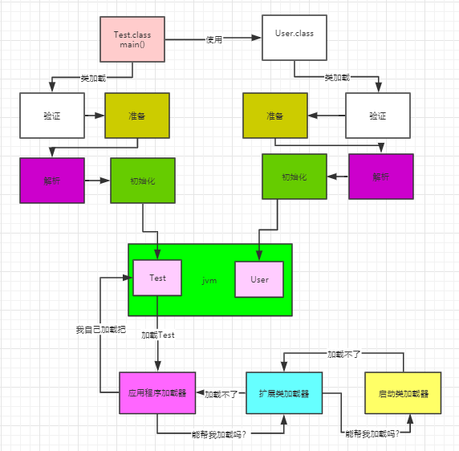