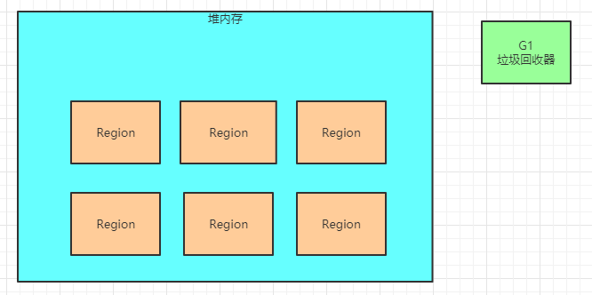
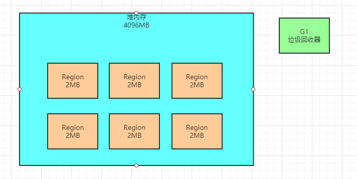
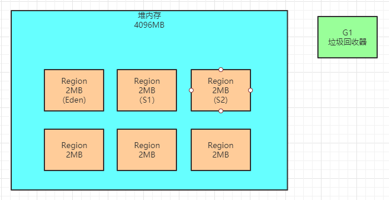
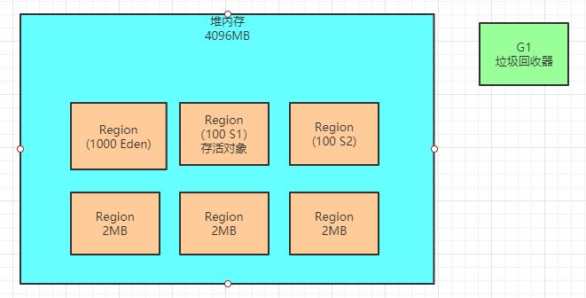
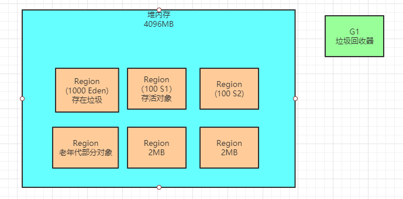
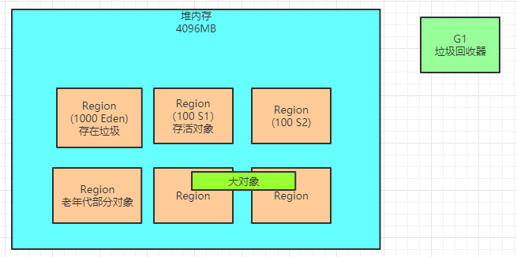

### 如何设定G1对应的内存大小

看如下的图，我们都知道G1对应的是一大堆的Region内存区域，每个Region的大小是一致的。

那么首先思考两个问题：**到底有多少个Region呢？每个Region的大小是多大呢？**

其实这个默认情况下自动计算和设置的，我们可以给整个堆内存设置一个大小，比如说用 “-Xms” 和“-Xmx” 来设置堆内存的大小。

然后JVM启动的时候一旦发现你使用的是G1垃圾回收器，可以使用 “-XX:+UseG1GC” 来指定使用G1垃圾回收器，此时会自动用堆大小除以2048

因为JVM最多可以有2048个Region，然后Region的大小必须是2的倍数，比如说1MB、2MB、4MB之类的。

比如说堆大小是4G，那么就是4096MB，此时除以2048个Region，每个Region的大小就是2MB。大概就是这样子来决定Region的数量和大小的，我们一般保持默认的计算方式就可以

如果通过手动方式来指定，则是 “-XX:G1HeapRegionSize”，如下图。

刚开始的时候，默认新生代对堆内存的占比是5%，也就是占据200MB左右的内存，对应大概是100个Region，这个是可以通过 “- XX:G1NewSizePercent” 来设置新生代初始占比的，其实维持这个默认值即可。

因为在系统运行中，JVM其实会不停的给新生代增加更多的Region，但是最多新生代的占比不会超过60%，可以通过 “- XX:G1MaxNewSizePercent” 。

而且一旦Region进行了垃圾回收，此时新生代的Region数量还会减少，这些其实都是动态的。

看下图，刚开始就是一部分的Region是属于新生代的。

### 新生代还有Eden和Survivor的概念吗

没错，其实在G1中虽然把内存划分为了很多的 Region，但是其实还是有新生代、老年代的区分

而且新生代里还是有Eden和Survivor的划分的，所以我们会发现之前学习的很多技术原理在G1时期都是有用的。

我们应该还记得之前说过的一个新生代的参数，“-XX:SurvivorRatio=8”，所以这里还是可以区分出来属于新生代的Region里哪些属于Eden，哪些属于Survivor。

比如新生代之前说刚开始初始的时候，有100个Region，那么可能80个Region就是Eden，两个Survivor各自占10个Region，如下图。

所以要明白在这里其实还是有Eden和Survivor的概念的，他们会各自占据不同的Region。

只不过随着对象不停的在新生代里分配，属于新生代的Region会不断增加，Eden和Survivor对应的Region也会不断增加。

### G1的新生代垃圾回收

既然G1的新生代也有Eden和Survivor的区分，那么触发垃圾回收的机制都是类似的

随着不停的在新生代的Eden对应的Region中放对象，JVM就会不停的给新生代加入更多的Region，直到新生代占据堆大小的最大比例 60%。

一旦新生代达到了设定的占据堆内存的最大大小60%，比如都有1200个Region了，里面的Eden可能占据了1000个Region，每个 Survivor是100个Region，而且Eden区还占满了对象，此时如下图所示。

这个时候还是会触发新生代的GC，G1就会用之前说过的复制算法来进行垃圾回收，进入一个“Stop the World”状态

然后把Eden对应的Region中的存活对象放入S1对应的Region中，接着回收掉Eden对应的Region中的垃圾对象，如下图

但是这个过程跟之前是有区别的，因为G1是可以设定目标GC停顿时间的，也就是G1执行GC的时候最多可以让系统停顿多长时间，可以通过“-XX:MaxGCPauseMills”参数来设定，默认值是200ms。

那么G1就会通过之前说的，对每个Region追踪回收他需要多少时间，可以回收多少对象来选择回收一部分的Region，保证GC停顿时间控制在指定范围内，尽可能多的回收掉一些对象。

### 对象什么时候进入老年代？

在G1的内存模型下，新生代和老年代各自都会占据一定的Region，老年代也会有自己的Region

按照默认新生代最多只能占据堆内存60%的Region来推算，老年代最多可以占据40%的Region，大概就是800个左右的Region。

**那么对象什么时候从新生代进入老年代呢？**

可以说跟之前几乎是一样的，还是这么几个条件：

（1）对象在新生代躲过了很多次的垃圾回收，达到了一定的年龄了， “-XX:MaxTenuringThreshold” 参数可以设置这个年龄，他就 会进入老年代

（2）动态年龄判定规则，如果一旦发现某次新生代GC过后，存活对象超过了Survivor的50%

此时就会判断一下，比如年龄为1岁，2岁，3岁，4岁的对象的大小总和超过了Survivor的50%，此时4岁以上的对象全部会进入老年 代，这就是动态年龄判定规则

看下图，所以经过一段时间的新生代使用和垃圾回收之后，总有一些对象会进入老年代中

### 大对象Region

此时可能会疑惑了，唉？以前说是那种大对象也是可以直接进入老年代的，那么现在在G1的这套内存模型下呢？

实际上这里会有所改变，G1提供了专门的Region来存放大对象，而不是让大对象进入老年代的Region中。

在G1中，大对象的判定规则就是一个大对象超过了一个Region大小的50%，比如按照上面算的，每个Region是2MB，只要一个大对象超过了1MB，就会被放入大对象专门的Region中

而且一个大对象如果太大，可能会横跨多个Region来存放。如下图。

肯定还有人会问，那堆内存里哪些Region用来存放大对象啊？

不是说60%的给新生代，40%的给老年代吗，那还有哪些Region给大对象？

很简单，之前说过了，在G1里，新生代和老年代的Region是不停的变化的

比如新生代现在占据了1200个Region，但是一次垃圾回收之后，就让里面1000个Region都空了，此时那1000个Region就可以不属于新生代了，里面很多Region可以用来存放大对象。

那么还有人会问了，大对象既然不属于新生代和老年代，那么什么时候会触发垃圾回收呢？

也很简单，其实新生代、老年代在回收的时候，会顺带带着大对象Region一起回收，所以这就是在G1内存模型下对大对象的分配和回收的策略。

### 本文总结

本文就初步介绍了G1的内存模型和分配规则，包括了下面的一些知识：

每个Region多大 新生代包含多少Region
新生代如何动态增加Region 
Eden和Survivor两个区域仍然还是存在
什么时候触发新生代的垃圾回收
垃圾回收的复制算法
还有G1特有的预设GC停顿时间的作用
什么时候对象进入老年代 
大对象的独立Region存放和回收