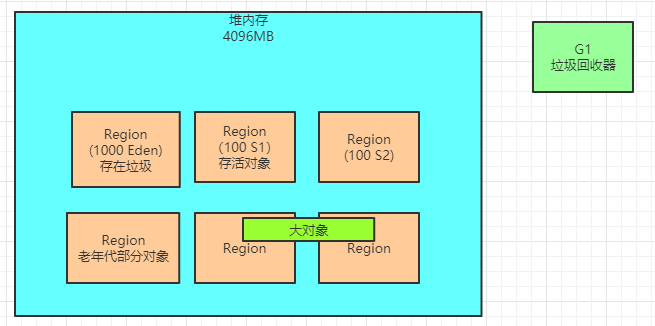

### 什么时候触发新生代+老年代的混合垃圾回收？

G1有一个参数，是“-XX:InitiatingHeapOccupancyPercent”，他的默认值是45%

意思就是说，如果老年代占据了堆内存的45%的Region的时候，此时就会尝试触发一个新生代+老年代一起回收的混合回收阶段。

比如按照我们之前说的，堆内存有2048个Region，如果老年代占据了其中45%的Region，也就是接近1000个Region的时候，就会开始触发一个混合回收，如下图所示。



### G1垃圾回收的过程

首先会触发一个 “初始标记” 的操作，这个过程是需要进入“Stop the World”的，仅仅只是标记一下GC Roots直接能引用的对象， 这个过程速度是很快的。

如下图，先停止系统程序的运行，然后对各个线程栈内存中的局部变量代表的GC Roots，以及方法区中的类静态变量代表的GC Roots，进行扫描，标记出来他们直接引用的那些对象。


接着会进入“并发标记” 的阶段，这个阶段会允许系统程序的运行，同时进行GC Roots追踪，从GC Roots开始追踪所有的存活对象， 如下图所示。


这里对GC Roots追踪做更加详细的说明，比如下面的代码

```java
public class Test {
    private static User user = new User();
}
public class User {
    private  Dept dept = new Dept();
}
```

可以看到，Test这个类有一个静态变量是 “user”，他就是一个GC Root对象，初始标记阶段，仅仅就是标记这个 “user” 作为GC Roots直接关联的对象，就是 “User” 对象，他肯定是要存活的。

然后在并发标记阶段，就会进行GC Roots追踪，会从 “user” 这个GC Root对象直接关联的 “User” 对象开始往下追踪

可以看到 “User” 对象里有一个实例变量 “dept”，此时追踪这个 “dept” 变量可以看到他引用了 “Dept” 对象，那么此时这个 “Dept” 对象也要被标记为存活对象。

这个并发标记阶段还是很耗时的，因为要追踪全部的存活对象。

但是这个阶段是可以跟系统程序并发运行的，所以对系统程序的影响不太大。

而且JVM会对并发标记阶段对对象做出的一些修改记录起来，比如说哪个对象被新建了，哪个对象失去了引用。

接着是下一个阶段，最终标记阶段，这个阶段会进入“Stop the World”，系统程序是禁止运行的，但是会根据并发标 阶段记录的那些对象修改，最终标记一下有哪些存活对象，有哪些是垃圾对象，如下图所示。


最后一个阶段，就是 “混合回收“ 阶段，这个阶段会计算老年代中每个Region中的存活对象数量，存活对象的占比，还有执行垃圾回收的预期性能和效率。

接着会停止系统程序，然后全力以赴尽快进行垃圾回收，此时会选择部分Region进行回收，因为必须让垃圾回收的停顿时间控制在我们指定的范围内。

比如说老年代此时有1000个Region都满了，但是因为根据预定目标，本次垃圾回收可能只能停顿200毫秒，那么通过之前的计算得知，可能回收其中800个Region刚好需要200ms，那么就只会回收800个Region，把GC导致的停顿时间控制在我们指定的范围内，如下图。


而且我们需要在这里有一点认识，其实老年代对堆内存占比达到45%的时候，触发的是 “混合回收”

也就是说，此时垃圾回收不仅仅是回收老年代，还会回收新生代，还会回收大对象。

那么，**到底是回收这些区域的哪些Region呢？**

那就要看情况了，因为我们设定了对GC停顿时间的目标，所以说他会从新生代、老年代、大对象里各自挑选一些Region，保证用指定的时间（比如200ms）回收尽可能多的垃圾，这就是所谓的混合回收，如下图。


### G1垃圾回收器的一些参数

在上面都看到了，一般在老年代的Region占据了堆内存的Region的45%之后，会触发一个混合回收的过程，也就是Mixed GC， 分为了好几个阶段。

在这里最后一个环节，其实就是执行混合回收，从新生代和老年代里都回收一些Region。

但是最后一个阶段混合回收的时候，其实会停止所有程序运行，所以说G1是允许执行多次混合回收。

比如先停止工作，执行一次混合回收回收掉 一些Region，接着恢复系统运行，然后再次停止系统运行，再执行一次混合回收回收掉一些Region。

有一些参数可以控制这个，比如“-XX:G1MixedGCCountTarget”参数，就是在一次混合回收的过程中，最后一个阶段执行几次混合
回收，默认值是8次

意味着最后一个阶段，先停止系统运行，混合回收一些Region，再恢复系统运行，接着再次禁止系统运行，混合回收一些Region，反复8次。

如下图，假设一次混合回收预期要回收掉一共有160个Region，那么此时第一次混合回收，会回收掉一些Region，比如就是20个Region


接着恢复系统运行一会儿，然后再执行一次 “混合回收”，如下图，再次回收掉20个Region。


如此反复执行8次混合回收阶段之后 ，不就把预订的160个Region都回收掉了？而且还把系统停顿时间控制在指定范围内。

那么为什么要反复回收多次呢？

因为你停止系统一会儿，回收掉一些Region，再让系统运行一会儿，然后再次停止系统一会儿，再次回收掉一些Region，这样可以尽可能让系统不要停顿时间过长，可以在多次回收的间隙，也运行一下。

还有一个参数，就是“-XX:G1HeapWastePercent”，默认值是5%

他的意思就是说，在混合回收的时候，对Region回收都是基于复制算法进行的，都是把要回收的Region里的存活对象放入其他 Region，然后这个Region中的垃圾对象全部清理掉


这样的话在回收过程就会不断空出来新的Region，一旦空闲出来的Region数量达到了堆内存的5%，此时就会 立即停止混合回收，意味着本次混合回收就结束了。

而且从这里也能看出来G1整体是基于复制算法进行Region垃圾回收的，不会出现内存碎片的问题，不需要像CMS那样标记-清理之 后，再进行内存碎片的整理

还有一个参数，“-XX:G1MixedGCLiveThresholdPercent”，他的默认值是85%，意思就是确定要回收的Region的时候，必须是存活对象低于85%的Region才可以进行回收

否则要是一个Region的存活对象多余85%，你还回收他干什么？这个时候要把85%的对象都拷贝到别的Region，这个成本是很高的。

### 回收失败时的Full GC

如果在进行Mixed回收的时候，无论是年轻代还是老年代都基于复制算法进行回收，都要把各个Region的存活对象拷贝到别的 Region 里去

此时万一出现拷贝的过程中发现没有空闲Region可以承载自己的存活对象了，就会触发一次失败。

一旦失败，立马就会切换为停止系统程序，然后采用单线程进行标记、清理和压缩整理，空闲出来一批Region，这个过程是极慢极慢的。

### 本文总结

本文看完，基本上对老年代占堆内存45%的时候触发的Mixed垃圾回收的过程就很清楚了

包括如何标记，如何进行混合回收，回收时采用的复制算法，包括一些对应的参数的含义