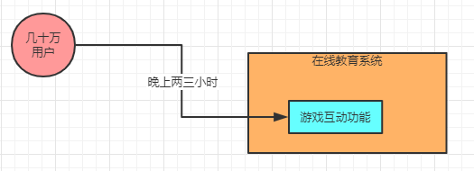

### 案例背景引入

接下来用一个真实的案例来聊聊G1垃圾回收器的一些性能优化的手段和背后的原理

其实核心思想跟之前文章的 “ParNew+CMS” 的垃圾回收器组合的优化思想是类似的，但是因为G1的运行原理有一些不一样的地方，所以说在优化上会略有不同。

首先我们来说说案例的背景，这是一个**百万级注册用户的在线教育平台**，主要目标用户群体是几岁到十几岁的孩子，注册用户大概是几百万的规模，日活用户规模大概在几十万。

系统的业务流程其实也不复杂，而且我们可以排除掉一些选课、排课、浏览课程详情以及付费购买之类的低频的行为。

为什么这么说呢？大家可以想一下，一个在线教育平台，本来用户也不是特别多，他不是一个电商平台，不会说每天每个人都会进来浏览幼儿课程详情。

所以一般业务流程就是，有人进来浏览一下 ，考虑一段时间，然后下定决心了给自己孩子报名一个在线的英语课程，或者数学课程之类的。

所以其实他的普通用户浏览课程详情、下单付费、选课排课，这些都是绝对的低频行为，我们几乎不用考虑到系统的运行中去，可以暂时忽略掉。

那么对于这样的一个系统，他最关键的高频行为是什么呢？

**上课！**

也就是说，大家从这个系统的本质来思考一下，这样的一个平台，他的使用人群是幼儿园的孩子到中小学的孩子

他们平时白天都要上学，一般也就是晚上放学之后到八九点钟的样子，是最活跃使用这个平台的时候，还有就是周末也是最活跃使用这个平台的时候。

这里尤为关键的需要注意的，就是每天晚上那两三小时的高峰时期，几乎你可以认为每天几十万日活用户（那些小孩儿）都会集中在这个时间段来平台上上在线课程，比如青少年英语课，或者数学课之类的。

所以这个晚上两三小时的时间段里，将会是平台每天绝对的高峰期，而且白天几乎没什么流量，可能99%的流量都集中在晚上，如下图所示。

### 系统核心业务流程分析

接着我们来明确一下，这样的一个系统，孩子们在上课的时候主要高频使用的是哪些功能呢？

我们都生活在互联网时代，多多少少对一些在线教育APP有一定了解，应该知道现在在线教育APP都会尤为主打的是互动环节。

举个例子，比如说给五六岁的孩子上的幼儿英语课，你觉得，还会跟20年前一样，给他们放非常枯燥的 “李雷和韩梅梅” 的情节么？然后机械式的去跟读？

那肯定不是了！现在尤为强调的是在欢快的娱乐游戏中进行教学，让孩子们快乐的学习英语、数学之类学科的知识。

所以说，在那几十万用户晚上高峰时间段使用系统上课的时候，尤为核心的业务流程，就是大量的游戏互动环节

通过游戏互动让孩子们感兴趣，愿意学，而且通过游戏强互动让他们保持注意力，促使他们对学习到的东西进行输出，提升学习的效果，大家看下图。

也就是说，这个游戏互动功能，一定会承载用户高频率、大量的互动点击

比如在完成什么任务的时候必须要点击很多的按钮，频繁的进行互动，然后系统后台需要接收大量的互动请求，并且记录下来用户的互动过程和互动结果。

系统得记录下来用户完成了多少个任务，做对了几个，做错了几个，诸如此类的。

### 系统的运行压力

现在我们开始来分析一下这个系统运行时候对内存使用产生的一个压力

其实核心点就是搞明白在晚上两三小时高峰期内，每秒钟会有多少请求，每个请求会连带产生多少对象，占用多少内存，每个请求要处理多长时间。

首先我们来分析一下晚上高峰期内几十万用户同时在线使用平台，每秒钟会产生多少请求？

我们可以大致来估算一下，比如说晚上3小时高峰期内有总共60万活跃用户，平均每个用户大概会使用1小时左右来上课，那么每小时大概会有20万活跃用户同时在线学习

这20万活跃用户因为需要进行大量的互动操作，所以大致可以认为是每分钟进行1次互动操作，一小时内会进行60次互动操作

那么20万用户在1小时内会进行1200万次互动操作，平均到每秒钟大概是3000次左右的互动操作，这是一个很合理的数字。

那么每秒钟要承载3000并发请求，根据经验来看，一般系统的核心服务需要部署5台4核8G的机器来抗住是差不多的，每台机器每秒钟抗个600请求，这个压力可以接受，一般不会导致宕机的问题。

那么每个请求会产生多少个对象呢？

一次互动请求不会有太复杂的对象，他主要是记录一些用户互动过程的，可能会跟一些积分之类的东西有关联

如果玩儿过在线教育APP都知道，每次你完成一个活动，一般会给你累加一些对应的“XX币“，“XX宝石”之类的东西。

所有大致估算一下，一次互动请求大致会连带创建几个对象，占据几KB的内存，比如我们就认为是5KB吧那么一秒600请求会占用3MB左右的内存。

### G1垃圾回收器的默认内存布局

接着我们来看看G1垃圾回收器的默认内存布局，之前说过我们采用的是4核8G的机器来部署系统，然后每台机器每秒会有600个请求会占用3MB左右的内存空间。

那么假设我们对机器上的JVM，分配4G给堆内存，其中新生代默认初始占比为5%，最大占比为60%，每个Java线程的栈内存为1MB， 元数据区域（永久代）的内存为256M，此时JVM参数如下：

” -Xms4096M -Xmx4096M -Xss1M -XX:PermSize=256M -XX:MaxPermSize=256M -XX:+UseG1GC “

"-XX:G1NewSizePercent" 参数是用来设置新生代初始占比的，不用设置，维持默认值为5%即可。

“-XX:G1MaxNewSizePercent”参数是用来设置新生代最大占比的，也不用设置，维持默认值为60%即可。

此时堆内存共4G，那么此时会除以2048，计算出每个Region的大小，此时每个Region的大小就是2MB，刚开始新生代就占5%的Region，可以认为新生代就是只有100个Region，有200MB的内存空间，如下图所示。

### GC停顿时间如何设置

在G1垃圾回收器中有一个至关重要的参数会影响到GC的表现，就是 “-XX:MaxGCPauseMills”，他的默认值是200毫秒

也就是说咱们希望每次触发一次GC的时候导致的系统停顿时间（也就是“Stop the World”）不要超过200毫秒，避 免系统因为GC长时间卡死。

这个参数我们可以先保持一个默认值，继续往下分析看看，不着急忙下结论。

### 到底多长时间会触发新生代GC

有一个问题，就是系统运行起来之后，会不停的在新生代的Eden区域内分配对象，按照之前的推算是每秒分配3MB的 对象，如下图。

那么之前是说 “Eden区域的空间不够了，就触发新生代gc”，但是到底什么时候Eden区域会内存不够呢？

之前说过 “-XX:G1MaxNewSizePercent” 参数限定了新生代最多就是占用堆内存60%的空间

那么难道必须得随着系统运行一直给新生代分配更多的Region，直到新生代占据了60%的Region之后，无法再分配更 多的Region了，再触发新生代gc？

G1肯定不是这么搞的

我们首先假设一个前提，这个纯碎就是我们人为设定的，就是假设在这个系统里，G1回收掉300个Region（600MB内存），大致需要200ms。

那么很有可能系统运行时，G1呈现出如下的运行效果。

首先，随着系统运行，每秒创建3MB的对象，大概1分钟左右就会塞满100个Region（200MB内存），如下图所示

此时很可能G1会觉得，要是我现在就触发一次新生代gc，那么回收区区200MB只需要大概几十ms，最多就让系统停 顿几十ms而已，跟我的主人设定的 “-XX:MaxGCPauseMills” 参数限制的200ms停顿时间相差甚远

要是我现在就触发新生代gc，那岂不是会导致回收完过后接着1分钟再次让新生代这100个Region塞满，接着又触发新生代gc？

那这样算下来，岂不是每分钟都要执行一次新生代gc？是不是太频繁了？好像没这个必要吧！

所以还不如给新生代先增加一些Region，然后让系统继续运行着在新生代Region中分配对象好了，这样就不用过于频繁的触发新生代gc了，此时如下图。

然后系统继续运行，一直到可能300个Region都占满了，此时通过计算发现回收这300个Region大概需要200ms，那么可能这个时候就会触发一次新生代gc了。

所以通过这一分析就明白了，其实G1里是很动态灵活的，他会根据你设定的gc停顿时间给你的新生代不停分配更多Region

然后到一定程度，感觉差不多了，就会触发新生代gc，保证新生代gc的时候导致的系统停顿时间在你预设范围内

但是上述的数字一定精准吗？

**No！**

完全只是示范一下做一个示例，其实这个G1到底会分配多少个Region给新生代，多久触发一次新生代gc，每次耗费多 长时间，这些都是不确定的，必须通过一些工具去查看系统实际情况才知道，这个提前是无法预知的。

但是需要知道的，就是G1它本身是这样的一个运行原理，他会根据你预设的gc停顿时间，给新生代分配一些 Region，然后到一定程度就触发gc，并且把gc时间控制在预设范围内，尽量避免一次性回收过多的Region导致gc停顿时间超出预期。

### 新生代gc如何优化

此时就可以思考一下了，**那么新生代gc如何优化？**

其实，垃圾回收器是一代比一代先进，内部实现机制越来越复杂，但是对我们来说优化的时候越来越简单了。

比如对于G1而言，我们首先应该给整个JVM的堆区域足够的内存，比如我们在这里就给了JVM超过5G的内存，其中堆内存有4G的内存。

接着就应该合理设置 “-XX:MaxGCPauseMills” 参数

如果这个参数设置的小了，那么说明每次gc停顿时间可能特别短，此时G1一旦发现你对几十个Region占满了就立即触发新生代gc，然后gc频率特别频繁，虽然每次gc时间很短。

比如说30秒触发一次新生代gc，每次就停顿30毫秒。

如果这个参数设置大了呢？

那么可能G1会允许你不停的在新生代理分配新的对象，然后积累了很多对象了，再一次性回收几百个Region

此时可能一次GC停顿时间就会达到几百毫秒，但是GC的频率很低。比如说30分钟才触发一次新生代GC，但是每次停顿500毫秒。

所以这个参数到底如何设置，需要结合系统压测工具、gc日志、内存分析工具结合起来进行考虑， 尽量让系统的gc频率别太高，同时每次gc停顿时间也别太长，达到一个理想的合理值。

### mixed gc如何优化

说完了这个新生代gc之后，那接下来就是mixed gc的优化了

对于这个mixed gc的触发，都知道是老年代在堆内存里占比超过45%就会触发。

之前都很清楚了年轻代的对象进入老年代的几个条件了，要不然是新生代gc过后存活对象太多没法放入Survivor 区域，要不然是对象年龄太大，要不然是动态年龄判定规则。

其中尤其关键的，就是新生代gc过后存活对象过多无法放入Survivor区域，以及动态年龄判定规则

这两个条件尤其可能让很多对象快速进入老年代，一旦老年代频繁达到占用堆内存45%的阈值，那么就会频繁触发 mixed gc。

所以mixed gc本身很复杂，很多参数可以优化，但是优化mixed gc的核心不是优化他的参数，而是跟我们之前分析的思路一样，尽量避免对象过快进入老年代，尽量避免频繁触发mixed gc，就可以做到根本上优化mixed gc了。

**那么G1里面跟之前的ParNew+CMS的组合是不同的，我们到底应该如何来优化参数呢？**

其实核心的点，还是 “-XX:MaxGCPauseMills” 这个参数。

可以想一下，假设你 “-XX:MaxGCPauseMills” 参数设置的值很大，导致系统运行很久，新生代可能都占用了堆内存的60%了，此时才触发新生代gc。

那么存活下来的对象可能就会很多，此时就会导致Survivor区域放不下那么多的对象，就会进入老年代中。

或者是你新生代gc过后，存活下来的对象过多，导致进入Survivor区域后触发了动态年龄判定规则，达到了 Survivor 区域的50%，也会快速导致一些对象进入老年代中。

所以这里核心还是在于调节 “-XX:MaxGCPauseMills” 这个参数的值，在保证他的新生代gc别太频繁的同时，还得考虑每次gc过后的存活对象有多少，避免存活对象太多快速进入老年代，频繁触发mixed gc。

至于到底如何优化这个参数，一切都要**结合大量工具的讲解和实操演练了**，后续再说，到这里为止，至少对原理性的东西都很了解了。

