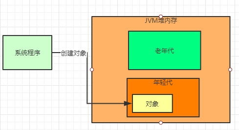
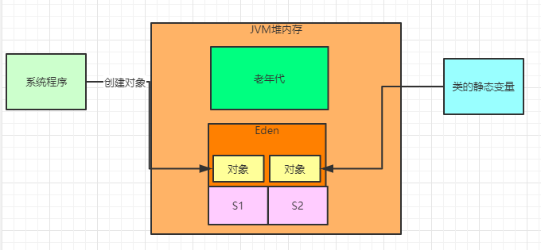
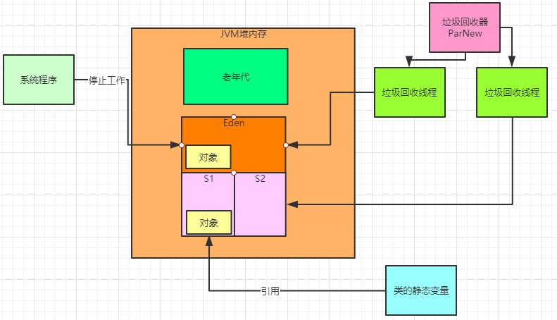
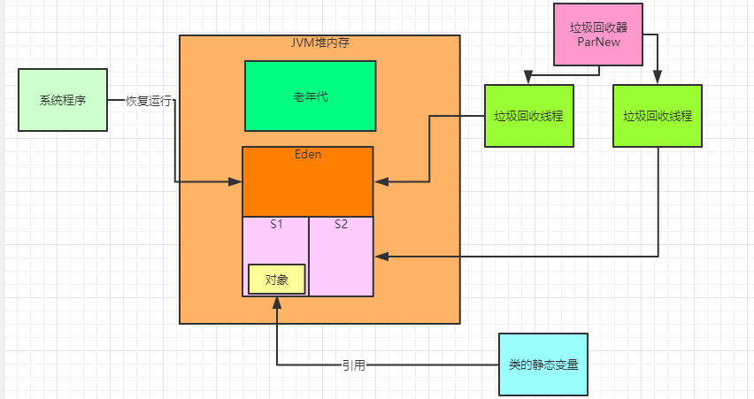
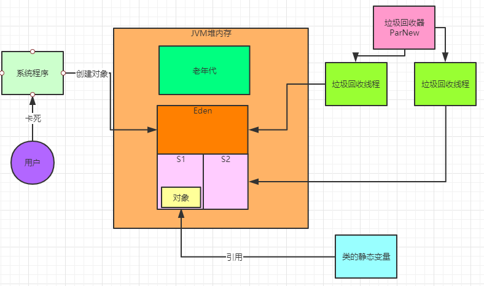
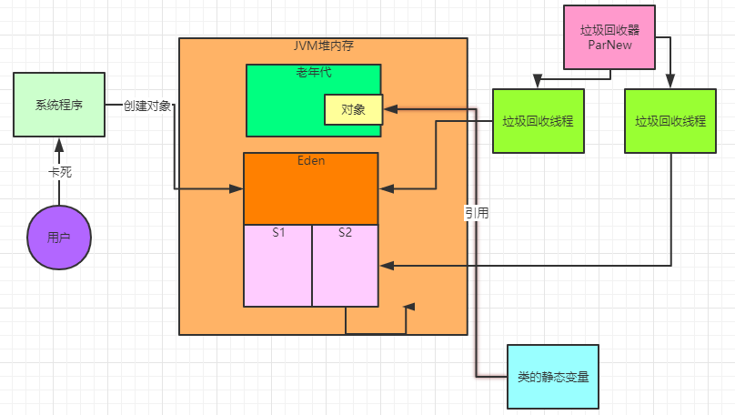

### 基于JVM运行的系统最怕什么

我们先来梳理一下，平时我们基于Java写出来的系统在部署的时候，基于JVM把系统跑起来之后，这样一个系统最怕的是什么？

通过之前的学习相信大家现在都能理解一个点，就是在JVM运行的时候，最核心的内存区域，其实就是堆内存，在这里会放各种我们系统中创建出来的对象。

而且堆内存里通常都会划分为新生代和老年代两个内存区域，对象一般来说都是优先放在新生代的，如下图所示。

接着随着系统不停的运行，一定会导致越来越多的对象放入年轻代中，然后年轻代都快塞满了，放不下更多的对象了，毕竟内存都是有限的

这个时候你就必须清理一下年轻代的垃圾对象，也就是那些没有GC Roots引用的对象

所谓的GC Roots就是类的静态变量，方法的局部变量。平时我们最经常创建对象的地方，就是在方法里，但是一旦一个方法运行完毕之后，方法的局部变量就没了，此时之前在方法里创建出来的对象就是垃圾了，没人引用了。

所以在咱们的年轻代里，其实99%都是这种没人引用的垃圾对象。

在年轻代（也可以叫做新生代）快要塞满的时候，就会触发年轻代gc，也就是对年轻代进行垃圾回收，需要把年轻代里的垃圾对象都给回收掉。

那么到底怎么回收呢？

通过复制算法进行回收，通常来说新生代会有一块Eden区域用来创建对象，默认占据80%的内存，还有两块Survivor区域用来放垃圾回收后存活下来的对象，分别占据10%的内存，如下图所示。

而且要注意一点，一旦要对新生代进行垃圾回收了，此时一定会停止系统程序的运行，不让系统程序执行任何代码逻辑了，这个叫做“Stop the World”

此时只能允许后台的垃圾回收器的多个垃圾回收线程去工作，执行垃圾回收，如下图。

所谓的复制算法，说白了，就是对所有的GC Roots进行追踪，去标记出来所有被GC Roots直接或者间接引用的对象，他们就是存活对象

比如上图中可以看到有一个类的静态变量就引用了一个对象，那个对象就是存活对象。

接着就会把存活对象都转移到一块Survivor区域里去，如上图，就把存活的对象转移到一块Survivor区域里去了。

接着就会直接把Eden区里的剩下的垃圾对象全部回收掉，释放内存空间，然后恢复系统程序的运行，如下图。

这里有一个很大的问题，就是每次一旦年轻代塞满之后，在进行垃圾回收的时候，这个期间都必须停止系统程序的运行！

这个就是基于JVM运行的系统最害怕的问题：**系统卡顿问题！**

假设一次年轻代垃圾回收需要20ms，那么就意味着在这20ms内，系统是无法工作的，此时用户对系统发送的请求，在这20ms内是无法处理的，需要卡住20ms，如下图所示。

### 年轻代gc到底多久一次对系统影响不大

那么现在有一个问题，年轻代gc对系统的性能影响到底大不大？

其实通常来说是不大的，不知道我们发现没有，其实年轻代gc几乎没什么好调优的，因为他的运行逻辑非常简单，就是Eden一旦满了无法放新对象就触发一次gc。

一般来说，真要说对年轻代的gc进行调优，只要你给系统分配足够的内存即可，核心点还是在于堆内存的分配、新生代内存的分配

内存足够的话，通常来说系统可能在低峰时期在几个小时才有一次新生代gc，高峰期最多也就几分钟一次新生代gc。

而且一般的业务系统都是部署在2核4G或者4核8G的机器上，此时分配给堆的内存不会超过3G，给新生代中的Eden区的内存也就1G左右

而且新生代采用的复制算法效率极高，因为新生代里存活的对象很少，只要迅速标记出这少量存活对象，移动到Survivor区，然后回收掉其他全部垃圾对象即可，速度很快。

很多时候，一次新生代gc可能也就耗费几毫秒，几十毫秒。设想一下，假如说你的系统运行着，然后每隔几分钟或者几十分钟执行 一次新生代gc，系统卡顿几十毫秒，就这期间的请求会卡顿几十毫秒，几乎用户都是无感知的，所以新生代gc一般基本对系统性能影响不大。

### 什么时候新生代gc对系统影响很大

简单，当你的系统部署在大内存机器上的时候，比如说你的机器是32核64G的机器，此时你分配给系统的内存有几十个G，新生代的 Eden区可能30G~40G的内存

比如类似Kafka、Elasticsearch之类的大数据相关的系统，都是部署在大内存的机器上的，此时如果你的系统负载非常的高，对于大数据系统是很有可能的，比如每秒几万的访问请求到Kafka、Elasticsearch上去。

那么可能导致你Eden区的几十G内存频繁塞满要触发垃圾回收，假设1分钟会塞满一次。

然后每次垃圾回收要停顿掉Kafka、Elasticsearch的运行，然后执行垃圾回收大概需要几秒钟，此时你发现，可能每过一分钟，你的系统就要卡顿几秒钟，有的请求一旦卡死几秒钟就会超时报错，此时可能会导致你的系统频繁出错。

### 如何解决大内存机器的新生代GC过慢的问题

**用G1垃圾回收器**

我们都知道，我们针对G1垃圾回收器，可以设置一个期望的每次GC的停顿时间，比如我们可以设置一个20ms。

那么G1基于他的Region内存划分原理，就可以在运行一段时间之后，比如就针对2G内存的Region进行垃圾回收，此时就仅仅停顿 20ms，然后回收掉2G的内存空间，腾出来了部分内存，接着还可以继续让系统运行。

G1天生就适合这种大内存机器的JVM运行，可以完美解决大内存垃圾回收时间过长的问题。

### 要命的频繁老年代gc问题

综上所述，其实新生代gc一般问题不会太大，但是真正问题最大的地方，在于频繁触发老年代的GC。

之前讲过对象进入老年代的几个条件：年龄太大了、动态年龄判断规则、新生代gc后存活对象太多无法放入Survivor中。

重新分析一下这几个条件：

**第一个**，对象年龄太大了，这种对象一般很少，都是系统中确实需要长期存在的核心组件，他们一般不需要被回收掉，所以在新生代熬过默认15次垃圾回收之后就会进入老年代。

**第二个**，动态年龄判定规则，如果一次新生代gc过后，发现Survivor区域中的几个年龄的对象加起来超过了Survivor区域的50%，比如
说年龄1+年龄2+年龄3的对象大小总和，超过了Survivor区域的50%，此时就会把年龄3以上的对象都放入老年代

**第三个**，新生代垃圾回收过后，存活对象太多了，无法放入 Surviovr中，此时直接进入老年代。

其实上述条件中，第二个和第三个都是很关键的，通常如果你的新生代中的Survivor区域内存过小，就会导致上述第二个和第三个条件频繁发生，然后导致大量对象快速进入老年代，进而频繁触发老年代的gc，如下图。

老年代gc通常来说都很耗费时间，无论是CMS垃圾回收器还是G1垃圾回收器，因为比如说CMS就要经历初始标记、并发标记、重新标记、并发清理、碎片整理几个环节，过程非常的复杂，G1同样也是如此。

通常来说，老年代gc至少比新生代gc慢10倍以上，比如新生代gc每次耗费200ms，其实对用户影响不大，但是老年代每次gc耗费2s， 那可能就会导致老年代gc的时候用户发现页面上卡顿2s，影响就很大了。

所以一旦你因为jvm内存分配不合理，导致频繁进行老年代gc，比如说几分钟就有一次老年代gc，每次gc系统都停顿几秒钟，那简直对你的系统就是致命的打击。此时用户会发现页面上或者APP上经常性的出现点击按钮之后卡顿几秒钟。

### JVM性能优化到底在优化什么

其实说白了，系统真正最大的问题，就是因为内存分配、参数设置不合理，导致你的对象频繁的进入老年代，然后频繁触发老年代gc，导致系统频繁的每隔几分钟就要卡死几秒钟。

这就是所谓JVM的性能问题，也是所谓的JVM性能优化到底在优化什么东西！