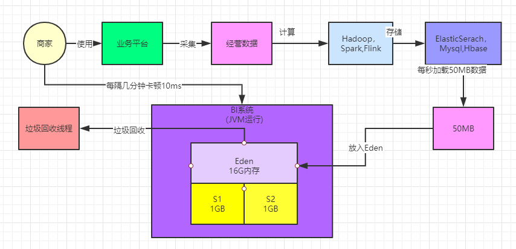

### 服务于百万级商家的BI系统是什么

说一下我们线上一个真实的生产系统，是一个服务于百万级商家的BI系统。

这个所谓BI系统，很多开发业务系统可能没接触过，所以我们简单介绍一下他的背景。

简单来说，比如你是一个平台，然后有数十万甚至上百万的商家在你的平台上做生意，会使用你的这个平台系统

此时一定会产生大量的数据，然后基于这些数据我们需要为商家提供一些数据报表，比如：每个商家每天有多少访客？有多少交易？付费转化率是多少？

当然实际情况会比这个简单几句话复杂很多，我们这里就简单说个概念而已。所以此时就需要一套BI系统

所谓BI，英文全称是 “Business Intelligence”，也就是 “商业智能” ，听起来是不是特别的高大上

所谓“商务智能”，指的就是给你看一些数据报表，然后让你平时能够更好的了解自己的经营状况，然后让老板“智能”的去调整经营 策略，提升业绩。

所以类似这样的一个BI系统，大致的运行逻辑如下所示，首先从我们提供给商家日常使用的一个平台上会采集出来很多商家日常经营的数据，如下图所示。

接着就可以对这些经营数据依托各种大数据计算平台，比如Hadoop、Spark、Flink等技术进行海量数据的计算，计算出来各种各样的数据报表，如下图所示。

然后我们需要将计算好的各种数据分析报表都放入一些存储中，比如说MySQL、Elastcisearch、HBase都可以存放类似的数据，如下 图所示。

最后一步，就是基于MySQL、HBase、Elasticsearch中存储的数据报表，基于Java开发出来一个BI系统，通过这个系统把各种存储好的数据暴露给前端，允许前端基于各种条件对存储好的数据进行复杂的筛选和分析，如下图所示。

### 刚开始上线系统时候的部署架构

我们在这里重点作为案例分析的就是上述场景中的BI系统，其他环节都跟大数据相关的技术是有关联的，我们暂时先不涉及

刚开始的时候，这个BI系统使用的商家是不多的。要知道，即使在一个庞大的互联网大厂里，虽然说大厂本身积累了大量的商家，但是你要是针对他们上线一个付费的产品，刚开始未必所有人都买账，所以一开始系统上线大概就少数商家在使用，比如就几千个商家。

所以刚开始系统部署的非常简单，就是用几台机器来部署了上述的BI系统，机器都是普通的4核8G的配置，然后在这个配置之下，一般来说给堆内存中的新生代分配的内存都在1.5G左右，Eden区大概也就1G左右的空间

如下图所示。

### 技术痛点：实时自动刷新报表 + 大数据量报表

其实刚开始，在少数商家的量级之下，这个系统是没多大问题的，运行的非常良好，但是问题恰恰就出在突然使用系统的商家数量开始暴涨的时候。

突然使用系统的商家开始越来越多，举个例子，当商家的数量级达到几万的时候。

此时要说明一个此类BI系统的特点，就是在BI系统中有一种数据报表，他是支持前端页面有一个JS脚本，自动每隔几秒钟就发送请求到后台刷新一下数据的，这种报表称之为 “实时数据报表”，如下图所示。

那么可以设想一下，假设仅仅就几万商家作为你的系统用户，很可能同一时间打开那个实时报表的商家就有几千个

然后每个商家打开实时报表之后，前端页面都会每隔几秒钟发送请求到后台来加载最新数据，基本上会出现你BI系统部署的每台机器每秒的请求会达到几百个，我们假设就是每秒500个请求吧。

然后每个请求会加载出来一张报表需要的大量数据，因为BI系统可能还需要针对那些数据进行内存中的现场计算加工一下，才能返回给前端页面展示。

根据之前的测算，每个请求大概需要加载出来100kb的数据进行计算，因此每秒500个请求，就需要加载出来50MB的数据到内存中进行计算，如下图所示。

### 没什么大影响的频繁Young GC

其实我们都已经发现上述系统的问题了，在上述系统运行模型下，基本上每秒会加载50MB的数据到Eden区中，只要区区200s，也就是3分钟左右的时间，就会迅速填满Eden区，然后触发一次Young GC对新生代进行垃圾回收。

当然1G左右的Eden进行Young GC其实速度相对是比较快的，可能也就几十ms的时间就可以搞定了

所以之前也分析过，其实对系统性能影响并不大。而且上述BI系统场景下，基本上每次Young GC后存活对象可能就几十MB，甚至是几MB。

所以如果仅仅只是这样的话，那么可能会看到如下场景，BI系统运行几分钟过后，就会突然卡顿个10ms，但是对终端用户和系统性能几乎是没有影响的，如下图。

### 提升机器配置：运用大内存机器

针对这样的一套系统，后来随着越来越多的商家来使用，并发压力越来越大，甚至高峰期会有每秒10万的并发压力

如果还是用4核8G的机器来支撑，那么可能需要部署上百台机器来抗住每秒10万的高并发压力。

所以一般针对这种情况，我们会提升机器的配置，本身BI系统就是非常吃内存的系统，所以我们将部署的机器全面提升到了16核32G的高配置机器上去。每台机器可以抗个每秒几千请求，此时只要部署比如二三十台机器就可以了。

但是此时问题就来了，可以想一下，如果要是用大内存机器的话，那么新生代至少会分配到20G的大内存，Eden区也会占据16G以上的内存空间，此时如下图所示。

此时每秒几千请求的话，每秒大概会加载到内存中几百MB的数据，那么大概可能几十秒，甚至1分钟左右就会填满Eden区，会就需要执行Young GC。

此时Young GC要回收那么大的内存，速度会慢很多，也许此时就会导致系统卡顿个几百毫秒，或者1秒钟，如下图所示。

那么你要是系统卡顿时间过长，必然会导致瞬间很多请求积压排队，严重的时候会导致线上系统时不时出现前端请求超时的问题，就是前端请求之后发现一两秒后还没返回就超时报错了。

### 用G1来优化大内存机器的Young GC性能

所以当时对这个系统的一个优化，就是**采用G1垃圾回收器**来应对大内存的Young GC过慢的问题

对G1设置一个预期的GC停顿时间，比如100ms，让G1保证每次Young GC的时候最多停顿100ms，避免影响终端用户的使用。

此时效果是非常显著的，G1会自动控制好在每次Young GC的时候就回收一部分Region，确保GC停顿时间控制在100ms以内

这样的话，也许Young GC的频率会更高一些，但是每次停顿时间很小，这样对系统影响就不大了。

