### 程序的JVM参数示范

首先，我们通过之前的学习都知道，我们平时系统运行创建的对象，除非是那种大对象，否则通常来说都是优先分配在新生代中的 Eden区域的

而且新生代还有另外两块Survivor区域，默认Eden区域占据新生代的80%，每块Survivor区域占据新生代的10%。

比如我们用以下JVM参数来运行代码：

```
-XX:NewSize=5242880 -XX:MaxNewSize=5242880 
-XX:InitialHeapSize=10485760 -XX:MaxHeapSize=10485760
-XX:SurvivorRatio=8 -XX:PretenureSizeThreshold=10485760 
-XX:+UseParNewGC -XX:+UseConcMarkSweepGC
```

上述参数都是基于JDK 1.8版本来设置的，不同的JDK版本对应的参数名称是不太一样的，但是基本意思是类似的。

上面“-XX:InitialHeapSize”和“-XX:MaxHeapSize”就是初始堆大小和最大堆大小，“-XX:NewSize”和“- XX:MaxNewSize”是初始新生代大小和最大新生代大小，“-XX:PretenureSizeThreshold=10485760”指定了大对象阈值是10MB

相当于给堆内存分配10MB内存空间，其中新生代是5MB内存空间，其中Eden区占4MB，每个Survivor区占0.5MB， 大对象必须超过10MB才会直接进入老年代，年轻代使用ParNew垃圾回收器，老年代使用CMS垃圾回收器，看下图图示。

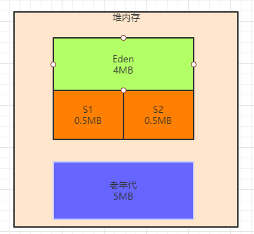

### 如何打印出JVM GC日志

接着我们需要在系统的JVM参数中加入GC日志的打印选型，如下所示：

```
-XX:+PrintGCDetils：打印详细的gc日志
-XX:+PrintGCTimeStamps：这个参数可以打印出来每次GC发生的时间
-Xloggc:gc.log：这个参数可以设置将gc日志写入一个磁盘文件
```

加上这个参数之后，jvm参数如下所示：

```
-XX:NewSize=5242880 -XX:MaxNewSize=5242880 
-XX:InitialHeapSize=10485760 -XX:MaxHeapSize=10485760 
-XX:SurvivorRatio=8 -XX:PretenureSizeThreshold=10485760 
-XX:+UseParNewGC -XX:+UseConcMarkSweepGC 
-XX:+PrintGCDetails -XX:+PrintGCTimeStamps 
-Xloggc:gc.log

```

### 示例程序代码

接着我们看一段示例程序代码：

```java
public class Demo1 {
    public static void main(String[] args) {
        byte[] array1 = new byte[1024 * 1024];
        array1 = new byte[1024 * 1024];
        array1 = new byte[1024 * 1024];
        array1 = null;
        byte[] array2 = new byte[2 * 1024 * 1024];
    }
}

```

### 对象是如何分配在Eden区内的

上面的这段代码非常简单，先通过 “new byte[1024 * 1024]” 这样的代码连续分配了3个数组，每个数组都是1MB

然后通过array1这个局部变量依次引用这三个对象，最后还把array1这个局部变量指向了null

**那么在JVM中上述代码是如何运行的呢**

首先我们来看第一行代码：byte[] array1 = new byte[1024 * 1024];。

这行代码一旦运行，就会在JVM的Eden区内放入一个1MB的对象，同时在main线程的虚拟机栈中会压入一个main() 方法的栈帧，在main()方法的栈帧内部，会有一个“array1”变量，这个变量是指向堆内存Eden区的那个1MB的数组，如下图。

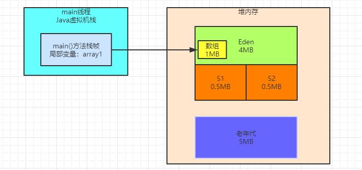

接着我们看第二行代码：array1 = new byte[1024 * 1024];

此时会在堆内存的Eden区中创建第二个数组，并且让局部变量指向第二个数组，然后第一个数组就没人引用了，此时第一个数组就成了没人引用的“垃圾对象”了，如下图所示。

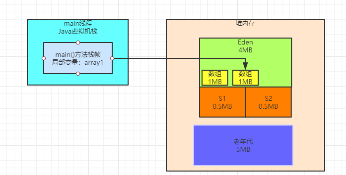

然后看第三行代码：array1 = new byte[1024 * 1024];。

这行代码在堆内存的Eden区内创建了第三个数组，同时让array1变量指向了第三个数组，此时前面两个数组都没有人引用了，就都成了垃圾对象，如下图所示。

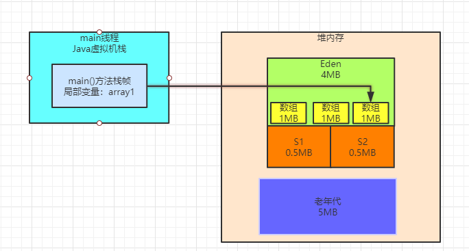

接着我们来看第四行代码：array1 = null;。

这行代码一执行，就让array1这个变量什么都不指向了，此时会导致之前创建的3个数组全部变成垃圾对象，如下图

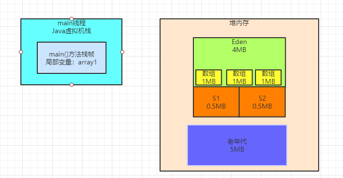

最后看第五行代码：byte[] array2 = new byte[2 * 1024 * 1024];。

此时会分配一个2MB大小的数组，尝试放入Eden区中，**这个时候Eden区能放的下吗？**

**明显是不行的**，因为Eden区总共就4MB大小，而且里面已经放入了3个1MB的数组了，所以剩余空间只有1MB了，此时你放一个2MB的数组是放不下的。

所以这个时候就会触发年轻代的Young GC。

### 采用指定JVM参数运行程序

之前说过eclips的配置启动参数。现在我们配置idea的，下图所示

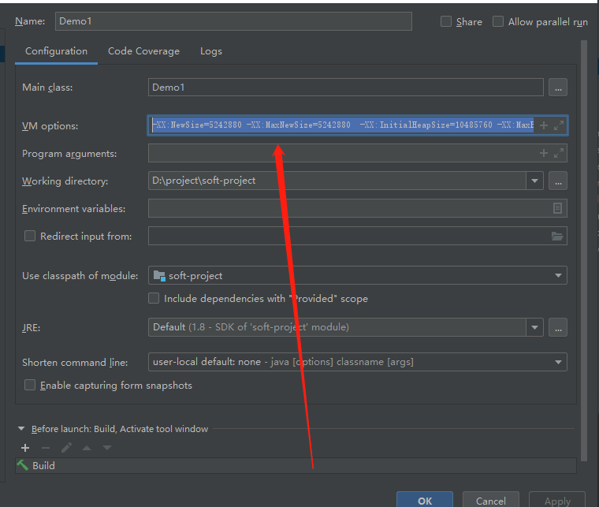

然后运行即可，此时运行完毕后，会在下述工程目录中出现一个gc.log文件，里面就是本次程序运行的gc日志，如下图所示。

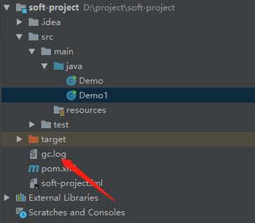

打开gc.log文件，我们会看到如下所示的gc日志：

```
Java HotSpot(TM) 64-Bit Server VM (25.171-b11) for windows-amd64 JRE (1.8.0_171-b11), built on Mar 28 2018 16:06:12 by "java_re" with MS VC++ 10.0 (VS2010)
Memory: 4k page, physical 8319676k(1283388k free), swap 66483512k(50590584k free)
CommandLine flags: -XX:InitialHeapSize=10485760 -XX:MaxHeapSize=10485760 -XX:MaxNewSize=5242880 -XX:NewSize=5242880 -XX:OldPLABSize=16 -XX:PretenureSizeThreshold=10485760 -XX:+PrintGC -XX:+PrintGCDetails -XX:+PrintGCTimeStamps -XX:SurvivorRatio=8 -XX:+UseCompressedClassPointers -XX:+UseCompressedOops -XX:+UseConcMarkSweepGC -XX:-UseLargePagesIndividualAllocation -XX:+UseParNewGC 
0.132: [GC (Allocation Failure) 0.133: [ParNew: 3908K->512K(4608K), 0.0020463 secs] 3908K->1692K(9728K), 0.0027513 secs] [Times: user=0.00 sys=0.00, real=0.00 secs] 
Heap
 par new generation   total 4608K, used 3703K [0x00000000ff600000, 0x00000000ffb00000, 0x00000000ffb00000)
  eden space 4096K,  77% used [0x00000000ff600000, 0x00000000ff91dc40, 0x00000000ffa00000)
  from space 512K, 100% used [0x00000000ffa80000, 0x00000000ffb00000, 0x00000000ffb00000)
  to   space 512K,   0% used [0x00000000ffa00000, 0x00000000ffa00000, 0x00000000ffa80000)
 concurrent mark-sweep generation total 5120K, used 1180K [0x00000000ffb00000, 0x0000000100000000, 0x0000000100000000)
 Metaspace       used 3443K, capacity 4496K, committed 4864K, reserved 1056768K
  class space    used 376K, capacity 388K, committed 512K, reserved 1048576K

```

**是不是觉得乱七八糟，密密麻麻的？**

### 程序运行采用的默认JVM参数如何查看

在GC日志中，可以看到如下内容：

```
CommandLine flags: -XX:InitialHeapSize=10485760 -XX:MaxHeapSize=10485760 -XX:MaxNewSize=5242880 .......
```

这就是告诉你这次运行程序采取的JVM参数是什么，基本都是我们设置的，同时还有一些参数默认就给设置了，不过一般关系不大。

以上可以拿来验证如果没设置JVM参数的话，怎么看系统用的默认JVM参数？

很简单，给你的JVM起码加一段打印gc日志的参数，就可以在这里看到他默认会给你的JVM进程分配多大的内存空间了。默认给的内存是很小的。

### 一次GC的概要说明

接着我们看GC日志中的如下一行：

```
0.132: [GC (Allocation Failure) 0.133: [ParNew: 3908K->512K(4608K), 0.0020463 secs] 3908K->1692K(9728K), 0.0027513 secs] [Times: user=0.00 sys=0.00, real=0.00 secs] 
```

这个就是概要说明了本次GC的执行情况

GC (Allocation Failure)，这个看字面意思就知道，为啥会发生一次GC呢？

很简单，因为看上图，要分配一个2MB的数组，结果Eden区内存不够了，所以就出现了 “Allocation Failure” ，也就是对象分配失败。

所以此时就要触发一次Young GC。

那这次GC是什么时候发生的呢？

很简单，看一个数字，“0.132”，这个意思就是你的系统运行以后过了多少秒发生了本次GC，比如这里就是大概系统运行之后过了大概100多毫秒，发生了本次GC。

```
ParNew: 3908K->512K(4608K), 0.0020463 secs
```

这个 “ParNew” 的意思，很明确了吧，我们触发的是年轻代的Young GC，所以是用我们指定的ParNew垃圾回收器执行GC的。

3908K->512K(4608K)

这个代表的意思是，年轻代可用空间是4608KB，也就是4.5MB，为啥是4.5MB呢？

看上图，Eden区是4MB，两个Survivor中只有一个是可以放存活对象的，另外一个是必须一致保持空闲的，所以 他考虑年轻代的可用空间，就是Eden+1个Survivor的大小，也就是4.5MB。

然后3908K->512K，意思就是对年轻代执行了一次GC，GC之前都使用了4030KB了，但是GC之后只有512KB的对象是存活下来的。

0.0020463 secs，这个就是本次gc耗费的时间，看这里来说大概耗费了2ms，仅仅是回收3MB的对象而已。

3908K->1692K(9728K), 0.0027513 secs 这段话指的是整个Java堆内存的情况

意思是整个Java堆内存是总可用空间9728KB（9.5MB），其实就是年轻代4.5MB+老年代5M，然后GC前整个Java堆内存里使用了3908KB，GC之后Java堆内存使用了1692KB。

Times: user=0.00 sys=0.00, real=0.00 secs 

这个意思就是本次gc消耗的时间，可以看出，这里最小单位是小数点之后两位，但是这里全部是0.00 secs，也就是说本次gc就耗费了几毫秒，所以从秒为单位来看，几乎是0。

### 图解GC执行过程

第一个问题，看这行日志，ParNew: 3908K->512K(4608K), 0.0020463 secs

很奇怪，我们在GC之前，明明在Eden区里就放了3个1MB的数组，一共是3MB，也就是3072KB的对象，那么GC之前年轻代应该是使用了3072KB的内存啊，为啥是使用了3908KB的内存呢？

其实这个问题，先不要纠结，你只要明白两点：

其实你创建的数组本身虽然是1MB，但是为了存储这个数组，JVM内置还会附带一些其他信息，所以每个数组实际占用的内存是大于1MB的；

除了你自己创建的对象以外，可能还有一些你看不见的对象在Eden区里，至于这些看不见的未知对象是什么，后面我们有专门的工具可以分析堆内存快照，以后会知道这些对象是什么。

所以如下图所示，GC之前，三个数组和其他一些未知对象加起来，就是占据了3908KB的内存。

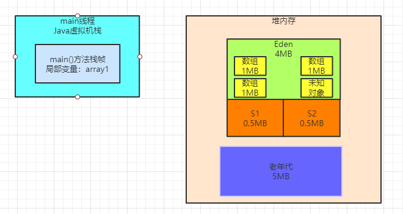

接着你想要在Eden分配一个2MB的数组，此时肯定触发了 “Allocation Failure“，对象分配失败，就触发了Young GC

然后ParNew执行垃圾回收，回收掉之前我们创建的三个数组，此时因为他们都没人引用了，一定是垃圾对象，如下图所示

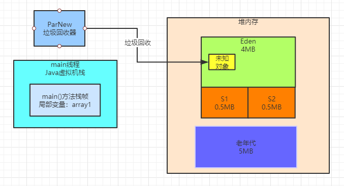

然后我们继续看gc日志，**ParNew: 3908K->512K(4608K), 0.0020463 secs**

gc回收之后，从3908KB内存使用降低到了512KB的内存使用

也就是说这次gc日志有512KB的对象存活了下来，从Eden区转移到了Survivor1区，其实我们可以把称呼改改，叫做 Survivor From区，另外一个Survivor叫做Survivor To区，如下图。

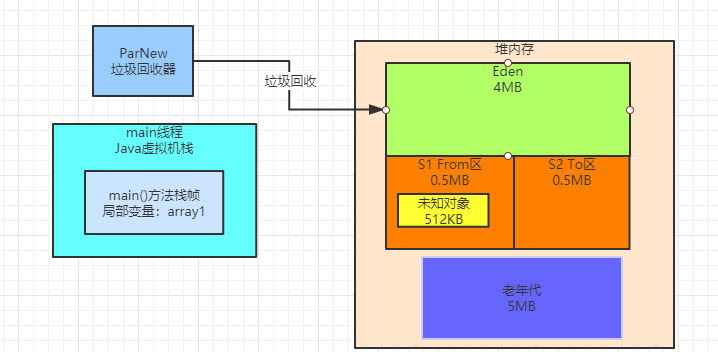

其实结合GC日志就能看出来，这就是本次GC的全过程。

### GC过后的堆内存使用情况

接着我们看下面的GC日志：

```
Heap
 par new generation   total 4608K, used 3703K [0x00000000ff600000, 0x00000000ffb00000, 0x00000000ffb00000)
  eden space 4096K,  77% used [0x00000000ff600000, 0x00000000ff91dc40, 0x00000000ffa00000)
  from space 512K, 100% used [0x00000000ffa80000, 0x00000000ffb00000, 0x00000000ffb00000)
  to   space 512K,   0% used [0x00000000ffa00000, 0x00000000ffa00000, 0x00000000ffa80000)
 concurrent mark-sweep generation total 5120K, used 1180K [0x00000000ffb00000, 0x0000000100000000, 0x0000000100000000)
 Metaspace       used 3443K, capacity 4496K, committed 4864K, reserved 1056768K
  class space    used 376K, capacity 388K, committed 512K, reserved 1048576K
```

这段日志是在JVM退出的时候打印出来的当前堆内存的使用情况，其实也很简单，一点点看一下，先看下面这段。

```
par new generation   total 4608K, used 3703K [0x00000000ff600000, 0x00000000ffb00000, 0x00000000ffb00000)
  eden space 4096K,  77% used [0x00000000ff600000, 0x00000000ff91dc40, 0x00000000ffa00000)
  from space 512K, 100% used [0x00000000ffa80000, 0x00000000ffb00000, 0x00000000ffb00000)
  to   space 512K,   0% used [0x00000000ffa00000, 
```

par new generation   total 4608K, used 3703K,这就是说 “ParNew” 垃圾回收器负责的年轻代总共有 4608KB（4.5MB）可用内存，目前是使用了3703KB（3.5MB）。

思考一下，此时在JVM退出之前，为什么年轻代占用了3.5MB的内存？

很简单，在gc之后，我们这不是通过如下代码又分配了一个2MB的数组吗：byte[] array2 = new byte[2 * 1024 * 1024];

所以此时在Eden区中一定会有一个2MB的数组，也就是2048KB，然后上次gc之后在From Survivor区中存活了一个 512KB的对象，我们也不知道是啥，先不用管他。

但是此时疑惑了，2048KB + 512KB = 2560KB。

那为什么说年轻代使用了3703KB呢？

因为之前说过了每个数组他会额外占据一些内存来存放一些自己这个对象的元数据，所以你可以认为多出来的1MB可以是数组对象额外使用的内存空间。

如下图所示。

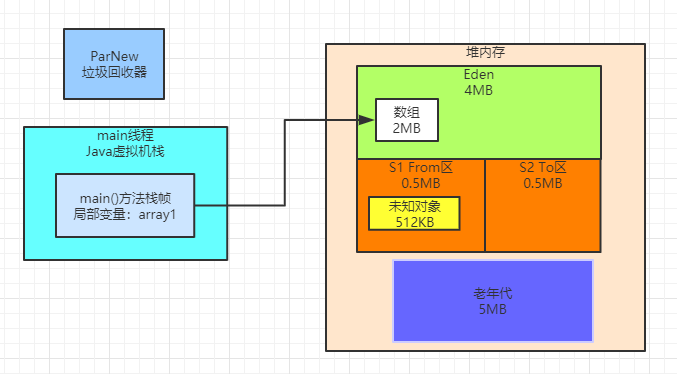

接着我们继续看GC日志：

```
eden space 4096K,  77% used [0x00000000ff600000, 0x00000000ff91dc40, 0x00000000ffa00000)  from space 512K, 100% used [0x00000000ffa80000, 0x00000000ffb00000, 0x00000000ffb00000)  to   space 512K,   0% used [0x00000000ffa00000, 
```

通过GC日志就能验证我们的推测是完全准确的，这里说的很清晰了，Eden区此时4MB的内存被使用了 77%，就是因为有一个2MB的数组和一些数组对象额外使用的内存空间在里面。

然后From Survivor区，512KB是100%的使用率，此时被之前gc后存活下来的512KB的未知对象给占据了。

接着看GC日志：

```
 concurrent mark-sweep generation total 5120K, used 1180K [0x00000000ffb00000, 0x0000000100000000, 0x0000000100000000)
 Metaspace       used 3443K, capacity 4496K, committed 4864K, reserved 1056768K
  class space    used 376K, capacity 388K, committed 512K, reserved 1048576K
```

 **concurrent mark-sweep generation total 5120K, used 1180K**  这个很简单，就是说Concurrent Mark-Sweep垃圾回收器，也就是CMS垃圾回收器，管理的老年代内存空间一共是5MB，此时使用了1180K的空间，这个是啥也先不用管了，可以先忽略不计，以后我们有内存分析工具了，你都能清楚。

```
 Metaspace       used 3443K, capacity 4496K, committed 4864K, reserved 1056768K
  class space    used 376K, capacity 388K, committed 512K, reserved 1048576K
```

上述两段日志也很简单，意思就是Metaspace元数据空间和Class空间，存放一些类信息、常量池之类的东西，此时他们的总容量，使用内存，等等。

