### 动态年龄判定规则

之前我们总结过对象进入老年代的4个常见的时机：

1. 躲过15次gc，达到15岁高龄之后进入老年代；
2. 动态年龄判定规则，如果Survivor区域内年龄1+年龄2+年龄3+年龄n的对象总和大于Survivor区的50%，此时年龄n以上的对象会进入老年代，不一定要达到15岁
3. 如果一次Young GC后存活对象太多无法放入Survivor区，此时直接计入老年代
4. 大对象直接进入老年代

首先我们先通过代码模拟出来最常见的一种进入老年代的情况，如果Survivor区域内年龄1+年龄2+年龄3+年龄n的对象总和大                                                                                                                                                                                                                                                                                                                                                                                                                                                                                                                                                                                                                                                                                                                                                                           于Survivor区的50%，此时年龄n以上的对象会进入老年代，也就是所谓的动态年龄判定规则。

先来看看我们这次示例程序的JVM参数：

```
-XX:NewSize=10485760 -XX:MaxNewSize=10485760 
-XX:InitialHeapSize=20971520 -XX:MaxHeapSize=20971520 
-XX:SurvivorRatio=8 -XX:MaxTenuringThreshold=15 
-XX:PretenureSizeThreshold=10485760 -XX:+UseParNewGC 
-XX:+UseConcMarkSweepGC -XX:+PrintGCDetails -XX:+PrintGCTimeStamps 
-Xloggc:gc.log
```

在这些参数里我们注意几点，新生代我们通过 “-XX:NewSize” 设置为10MB了

然后其中Eden区是8MB，每个Survivor区是1MB，Java堆总大小是20MB，老年代是10MB，大对象必须超过10MB才会直接进入老年代

但是我们通过 “-XX:MaxTenuringThreshold=15” 设置了，只要对象年龄达到15岁才会直接进入老年代。

一切准备就绪，先看看我们当前的内存分配情况，如下图，然后接下来我们开始来看看我们的示例代码。

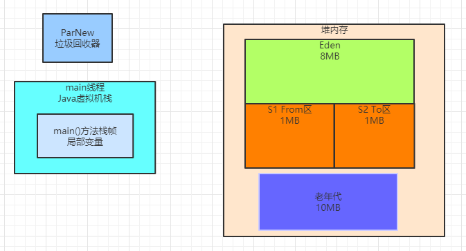

### 动态年龄判定规则的部分示例代码

```java
public class Demo2 {
    public static void main(String[] args) {
        byte[] array1 = new byte[2 * 1024 * 1024];
        array1 = new byte[2 * 1024 * 1024];
        array1 = new byte[2 * 1024 * 1024];
        array1 = null;
        byte[] array2 = new byte[128 * 1024];
        byte[] array3 = new byte[2 * 1024 * 1024];
    }
}
```

研究jvm运行过程，一定要一步一步调试代码，上面只是我们例子的部分代码，但是我们需要先运行部分代码，通过gc日志来分析这部分代码执行过后jvm中的对象分配情况。

### 部分示例代码运行后产生的gc日志

接着我们把上述示例代码以及我们给出的JVM参数配合起来运行，此时会看到如下的GC日志，接着我们就开始一步一步分析一下这部分代码运行后的gc日志。

```
0.297: [GC (Allocation Failure) 0.297: [ParNew: 7260K->715K(9216K), 0.0012641 secs] 7260K->715K(19456K), 0.0015046
secs] [Times: user=0.00 sys=0.00, real=0.00 secs]
Heap
par new generation total 9216K, used 2845K [0x00000000fec00000, 0x00000000ff600000, 0x00000000ff600000)
 eden space 8192K, 26% used [0x00000000fec00000, 0x00000000fee14930, 0x00000000ff400000)
 from space 1024K, 69% used [0x00000000ff500000, 0x00000000ff5b2e10, 0x00000000ff600000)
 to space 1024K, 0% used [0x00000000ff400000, 0x00000000ff400000, 0x00000000ff500000)
concurrent mark-sweep generation total 10240K, used 0K [0x00000000ff600000, 0x0000000100000000,
0x0000000100000000)
Metaspace used 2782K, capacity 4486K, committed 4864K, reserved 1056768K
 class space used 300K, capacity 386K, committed 512K, reserved 1048576K

```

### 部分代码的GC日志分析

首先我们先看下述几行代码：

```java
byte[] array1 = new byte[2 * 1024 * 1024];
array1 = new byte[2 * 1024 * 1024];
array1 = new byte[2 * 1024 * 1024];
array1 = null;
```

在这里连续创建了3个2MB的数组，最后还把局部变量array1设置为了null，所以此时的内存如下图所示：

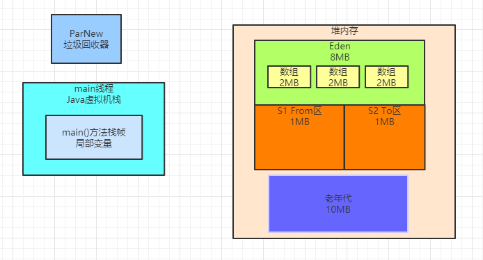

接着执行了这行代码：byte[] array2 = new byte[128 * 1024];。此时会在Eden区创建一个128KB的数组同时由array2 变量来引用，如下图。

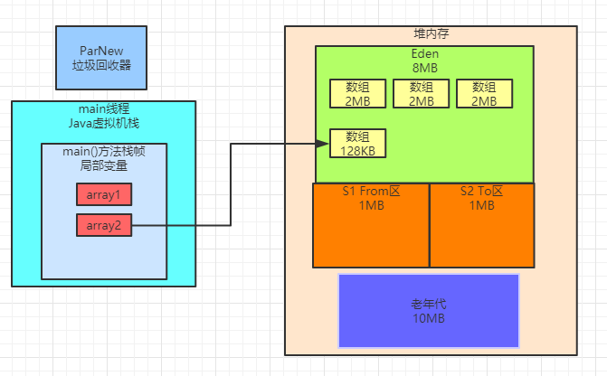

然后会执行下面的代码：byte[] array3 = new byte[2 * 1024 * 1024];

此时希望在Eden区再次分配一个2MB的数组，可行吗？

因为此时Eden区里已经有3个2MB的数组和1个128KB的数组，大小都超过6MB了，Eden总共才8MB，此时是不可能让你创建2MB的数组的

因此此时一定会触发一次Young GC，接着我们开始看GC日志

ParNew: 7260K->715K(9216K), 0.0012641 secs

这行日志清晰表明了，在GC之前年轻代占用了7260KB的内存，这里大概就是6MB的3个数组 + 128KB的1个数组 + 几百MB的一些未知对象

如下图所示：

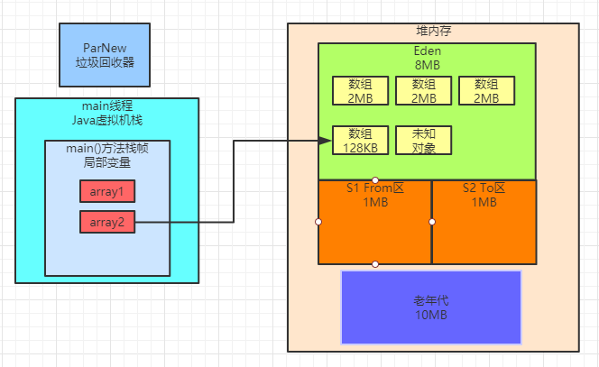

接着看这里，7260K->715K(9216K)，一次Young GC过后，剩余的存活对象大概是715KB

之前就说过大概年轻代刚开始会有512KB左右的未知对象，此时再加上我们自己的128KB的数组，想想，是不是差不多就是700KB？

接着看GC日志如下：

```
par new generation total 9216K, used 2845K [0x00000000fec00000, 0x00000000ff600000, 0x00000000ff600000) eden space 8192K, 26% used [0x00000000fec00000, 0x00000000fee14930, 0x00000000ff400000) from space 1024K, 69% used [0x00000000ff500000, 0x00000000ff5b2e10, 0x00000000ff600000) to space 1024K, 0% used [0x00000000ff400000, 0x00000000ff400000, 0x00000000ff500000) concurrent mark-sweep generation total 10240K, used 0K [0x00000000ff600000, 0x0000000100000000, 0x0000000100000000)
```

从上面的日志可以清晰看出，此时From Survivor区域被占据了69%的内存，大概就是700KB左右，这就是一次Young GC后存活下来 的对象，他们都进入From Survivor区了。

同时Eden区域内被占据了26%的空间，大概就是2MB左右，这就是byte[] array3 = new byte[2 * 1024 * 1024];，这行代码在gc过后分配在Eden区域内的数组

如下图所示：

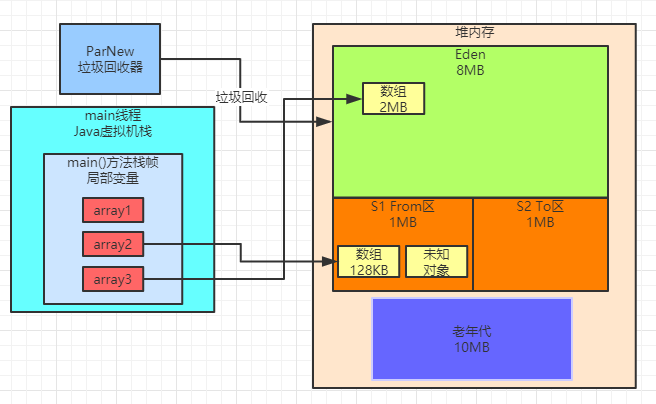

思考一个问题，现在Survivor From区里的那700kb的对象，是几岁呢？

**答案是：1岁**

他熬过一次gc，年龄就会增长1岁。而且此时Survivor区域总大小是1MB，此时Survivor区域中的存活对象已经有700KB了，绝对超过了50%。

完善示例代码

```java
public class Demo2 {
    public static void main(String[] args) {
        byte[] array1 = new byte[2 * 1024 * 1024];
        array1 = new byte[2 * 1024 * 1024];
        array1 = new byte[2 * 1024 * 1024];
        array1 = null;
        byte[] array2 = new byte[128 * 1024];
        byte[] array3 = new byte[2 * 1024 * 1024];
        array3 = new byte[2 * 1024 * 1024];
        array3 = new byte[2 * 1024 * 1024];
        array3 = new byte[128 * 1024];
        array3 = null;
        byte[] array4 = new byte[2 * 1024 * 1024];
    }
}
```

接着我们把示例代码给完善一下，变成上述的样子，我们要触发出来第二次Young GC，然后看看Survivor区域内的动态年龄判定规则能否生效。

先看下面几行代码：

```java
array3 = new byte[2 * 1024 * 1024];
array3 = new byte[2 * 1024 * 1024];
array3 = new byte[128 * 1024];
array3 = null;
```

这几行代码运行过后，实际上会接着分配2个2MB的数组，然后再分配一个128KB的数组，最后是让array3变量指向null，如下图所示。

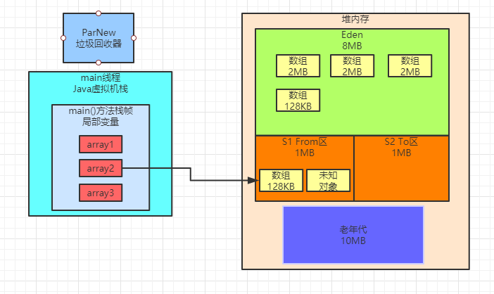

此时接着会运行下面的代码：byte[] array4 = new byte[2 * 1024 * 1024];

这个时候，会发现，Eden区如果要再次放一个2MB数组下去，是放不下的了，所以此时必然会触发一次Young GC。

使用上述的JVM参数运行这段程序会看到如下的GC日志：

```
0.269: [GC (Allocation Failure) 0.269: [ParNew: 7260K->713K(9216K), 0.0013103 secs] 7260K->713K(19456K), 0.0015501 secs] [Times: user=0.00 sys=0.00, real=0.00 secs] 0.271: [GC (Allocation Failure) 0.271: [ParNew: 7017K->0K(9216K), 0.0036521 secs] 7017K->700K(19456K), 0.0037342 secs] [Times: user=0.06 sys=0.00, real=0.00 secs] Heap par new generation total 9216K, used 2212K [0x00000000fec00000, 0x00000000ff600000, 0x00000000ff600000) eden space 8192K, 27% used [0x00000000fec00000, 0x00000000fee290e0, 0x00000000ff400000)
 from space 1024K, 0% used [0x00000000ff400000, 0x00000000ff400000, 0x00000000ff500000)
 to space 1024K, 0% used [0x00000000ff500000, 0x00000000ff500000, 0x00000000ff600000)
concurrent mark-sweep generation total 10240K, used 700K [0x00000000ff600000, 0x0000000100000000,
0x0000000100000000)
Metaspace used 2782K, capacity 4486K, committed 4864K, reserved 1056768K
 class space used 300K, capacity 386K, committed 512K, reserved 1048576K

```

**好，接下来我们来分析这些GC日志**

### 分析最终版的GC日志

首先第一次GC的日志如下：

```
0.269: [GC (Allocation Failure) 0.269: [ParNew: 7260K->713K(9216K), 0.0013103 secs] 7260K->713K(19456K), 0.0015501 secs] [Times: user=0.00 sys=0.00, real=0.00 secs] 
```

这个过程刚才我们分析过了。

接着第二次GC的日志如下：

```
0.271: [GC (Allocation Failure) 0.271: [ParNew: 7017K->0K(9216K), 0.0036521 secs] 7017K->700K(19456K), 0.0037342 secs] [Times: user=0.06 sys=0.00, real=0.00 secs] 
```

第二次触发Yuong GC，就是我们上述代码执行的时候，此时大家发现ParNew: 7017K->0K(9216K)

这行日志表明，这次GC过后，年轻代直接就没有对象了，也就是说没有任何存活对象，**你觉得可能吗？**

要是这么简单的想，绝对是侮辱自己的智商了，大家还记得array2这个变量一直引用着一个128KB的数组，他绝对是 存活对象，还有那500多KB的未知对象，此时都去哪里了呢？

首先我们先看看上面的图，在Eden区里有3个2MB的数组和1个128KB的数组，这绝对是会被回收掉的，如下图所示。

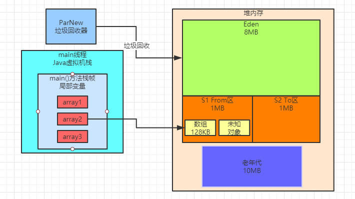

接着其实此时会发现Survivor区域中的对象都是存活的，而且总大小超过50%了，而且年龄都是1岁

此时根据动态年龄判定规则：年龄1+年龄2+年龄n的对象总大小超过了Survivor区域的50%，年龄n以上的对象进入老年代。

当然这里的对象都是年龄1的，所以直接全部进入老年代了，如下图

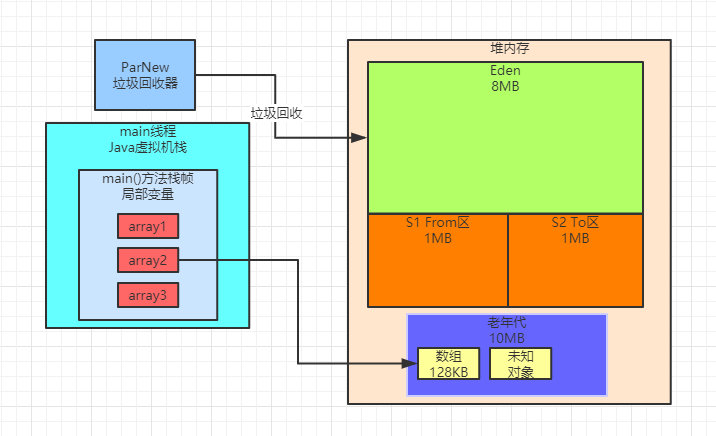

大家看下面的日志可以确认这一点：

concurrent mark-sweep generation total 10240K, used 700K [0x00000000ff600000, 0x0000000100000000, 0x0000000100000000)

CMS管理的老年代，此时使用空间刚好是700KB，证明此时Survivor里的对象触发了动态年龄判定规则，虽然没有达到15岁，但是全部进入老年代了。

包括我们自己的那个array2变量一直引用的128KB的数组。

然后array4变量引用的那个2MB的数组，此时就会分配到Eden区域中，如下图所示。

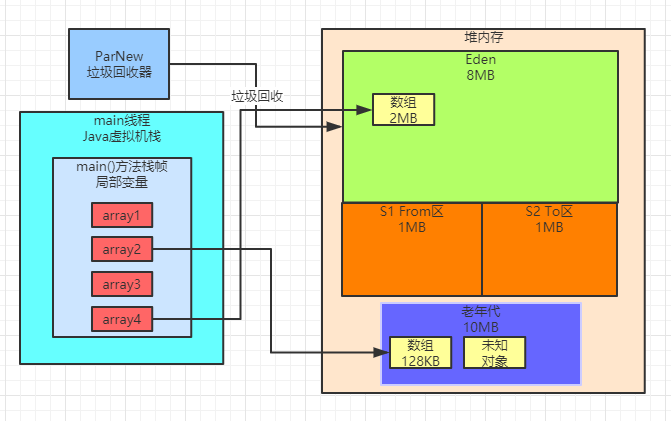

此时看下面的日志： 

eden space 8192K, 27% used [0x00000000fec00000, 0x00000000fee290e0, 0x00000000ff400000)

这里就说明Eden区当前就是有一个2MB的数组。

然后再看下面的日志： 

from space 1024K, 0% used [0x00000000ff400000, 0x00000000ff400000, 0x00000000ff500000) 
to space 1024K, 0% used [0x00000000ff500000, 0x00000000ff500000, 0x00000000ff600000)

两个Survivor区域都是空的，因为之前存活的700KB的对象都进入老年代了，所以当然现在Survivor里都是空的了。

### Survivor区域装不下存活对象分析

先来看看下面的示例代码：

```java
public class Demo3 {
    public static void main(String[] args) {
        byte[] array1 = new byte[2 * 1024 * 1024];
        array1 = new byte[2 * 1024 * 1024];
        array1 = new byte[2 * 1024 * 1024];
        byte[] array2 = new byte[128 * 1024];
        array2 = null;
        byte[] array3 = new byte[2 * 1024 * 1024];
    }
}

```

### GC日志

然后我们使用之前的JVM参数来跑一下上面的程序，可以看到下面的GC日志：

```
0.421: [GC (Allocation Failure) 0.421: [ParNew: 7260K->573K(9216K), 0.0024098 secs] 7260K->2623K(19456K), 0.0026802 secs] [Times: user=0.00 sys=0.00, real=0.00 secs] 
Heap 
par new generation total 9216K, used 2703K [0x00000000fec00000, 0x00000000ff600000, 0x00000000ff600000) 
eden space 8192K, 26% used [0x00000000fec00000, 0x00000000fee14930, 0x00000000ff400000) 
from space 1024K, 55% used [0x00000000ff500000, 0x00000000ff58f570, 0x00000000ff600000)
 to space 1024K, 0% used [0x00000000ff400000, 0x00000000ff400000, 0x00000000ff500000)
concurrent mark-sweep generation total 10240K, used 2050K [0x00000000ff600000, 0x0000000100000000,
0x0000000100000000)
Metaspace used 2782K, capacity 4486K, committed 4864K, reserved 1056768K
 class space used 300K, capacity 386K, committed 512K, reserved 1048576K

```

### 一步一图来分析GC日志

接着我们一点点来分析一下，首先看如下几行代码：

```java
byte[] array1 = new byte[2 * 1024 * 1024];
array1 = new byte[2 * 1024 * 1024];
array1 = new byte[2 * 1024 * 1024];
byte[] array2 = new byte[128 * 1024];
array2 = null;
```

上面的代码中，首先分配了3个2MB的数组，然后最后让array1变量指向了第三个2MB数组

接着创建了一个128K的数组，但是确让array2指向了null，同时我们一直都知道，Eden区里会有500KB左右的未知对象

此时如下图所示：
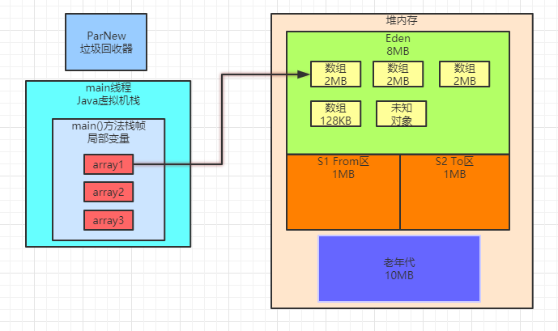

接着会执行如下代码：byte[] array3 = new byte[2 * 1024 * 1024];。此时想要在Eden区里再创建一个2MB的数组，肯定是不行的， 所以此时必然触发一次Young GC。

先看如下日志：ParNew: 7260K->573K(9216K), 0.0024098 secs。

这里清晰说明了，本次GC过后，年轻代里就剩下了500多KB的对象

这是为什么呢？此时明明array1变量是引用了一个2MB的数组的啊！

其实道理很简单，可以想一下，这次GC的时候，会回收掉上图中的2个2MB的数组和1个128KB的数组，然后留下 一个2MB的数组和1个未知的500KB的对象

如下图所示。

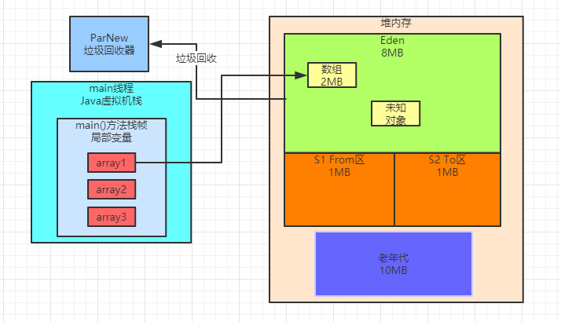

那么此时剩下来的2MB的数组和500KB的未知对象能放入From Survivor区吗？

**答案是：不能**

因为Survivor区仅仅只有1MB。根据我们之前说过的规则，此时是不是要把这些存活对象全部放入老年代？

**答案：也不是**

看如下日志： 

eden space 8192K, 26% used [0x00000000fec00000, 0x00000000fee14930, 0x00000000ff400000)

首先Eden区内一定放入了一个新的2MB的数组，就是刚才最后想要分配的那个数组，由array3变量引用，如下图。

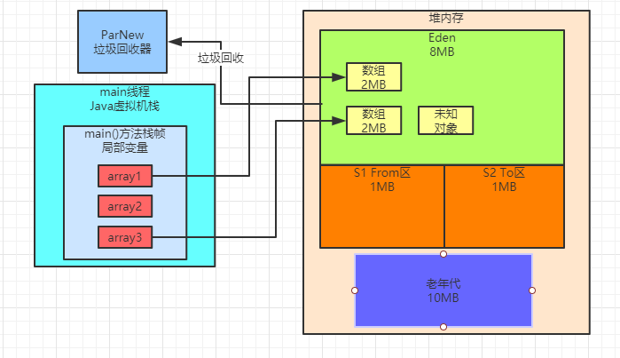

其次，看下面的日志：

from space 1024K, 55% used [0x00000000ff500000, 0x00000000ff58f570, 0x00000000ff600000)

可以发现此时From Survivor区中有500KB的对象，其实就是那500KB的未知对象！

所以在这里并不是让2MB的数组和500KB的未知对象都进入老年代，而是把500KB的未知对象放入From Survivor区中！

从这里可以看到，很多细节，都是逐步揭露开来的

但是现在结合GC日志，可以清晰的看到，在这种情况下，是会把部分对象放入Survivor区的。

此时如下图所示。

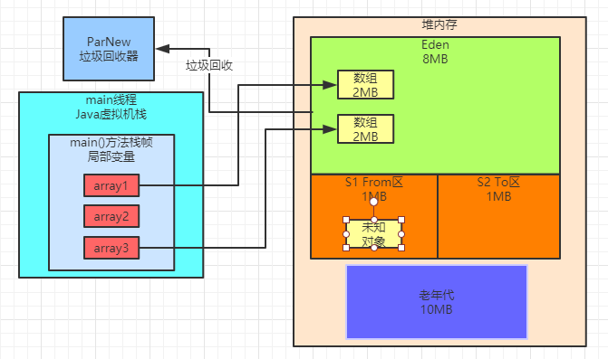

接着我们看如下日志：

concurrent mark-sweep generation total 10240K, used 2050K [0x00000000ff600000, 0x0000000100000000, 0x0000000100000000)

此时老年代里确有2MB的数组，因此可以认为，Young GC过后，发现存活下来的对象有2MB的数组和500KB的未知对象。

此时把500KB的未知对象放入Survivor中，然后2MB的数组直接放入老年代，如下图。

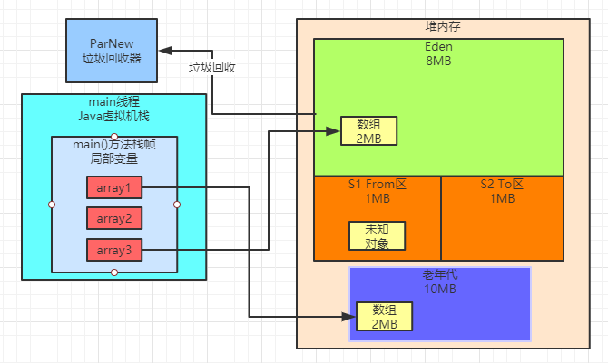