### 到底什么是JVM的内存区域划分

其实这个问题非常简单，JVM在运行我们写好的代码时，他是必须使用多块内存空间的，不同的内存空间用来存放不同的数据，然后配合我们写的代码流程，才能让我们的系统运行起来。

举个简单的例子，比如咱们现在知道了JVM会加载类到内存里来供后续运行，那么我问问大家，这些类加载到内存之后，放到哪儿去了呢？想过这个问题吗？

所以呢，JVM里就必须有一块内存区域，用来存放我们写的那些类。

如下图所示：

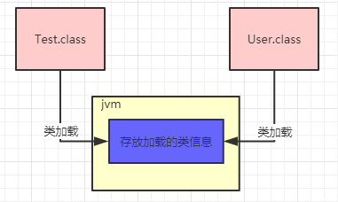

继续来看，我们的代码运行起来时，是不是需要执行我们写的一个一个方法？

那么运行方法的时候，方法里面有很多变量之类的东西，是不是需要放在某个内存区域里？

接着如果我们写的代码里创建一些对象，这些对象是不是也需要内存空间来存放？

同样的，大家看下图：

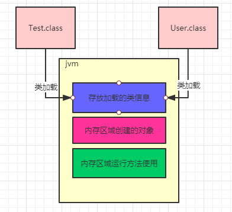

这就是为什么JVM中必须划分出来不同的内存区域，它是为了我们写好的代码在运行过程中根据需要来使用的。

### 存放类的方法区

这个方法区是在JDK1.8以前的版本里，代表JVM中的一块区域。

主要是放从 ".class" 文件加载进来的类，还会有一些类似常量池的东西放在这个区域里。

但是在JDK1.8之后，这块区域的名字就改了，叫做 "Metaspace" ，可以认为是 "元数据空间" 这样的意思。当然这里主要还是存放我们写的各种类相关信息。

举个例子，还是更我们之前说的那样，假如我们有一个 "Test.class" 类和 "User.class" 类，类似于下面的代码。

```
public class Test {
   public static void main() {
       User user = new User();
   }
}
```

这两哥类加载到JVM后，就会放在这个方法区中，如下图所示：

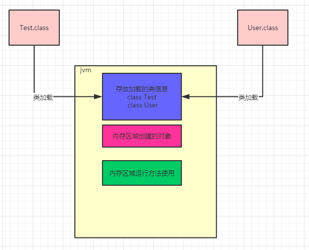

### 执行代码指令用的程序计数器

继续假设我们的代码是如下所示

```
public class Test {
   public static void main() {
       User user = new User();
       user.loadReplicasFromDisk();
   }
}
```

之前给大家普及过，实际上上面那段代码首先会存在于 ".java" 后缀的文件里，这个文件就是java源代码文件。

但是这个文件是面向我们程序员的，计算机他是看不懂我们写的这段代码的

所以此时就通过编译器，把 ".java" 后缀的源代码文件编译成 ".class" 后缀的字节码文件。

字节码才是计算器可以理解的一种语言，而不是我们写出来的那一堆代码。

字节码看起来大概是下面这样的，跟以上的代码无关，只是一个示例：

```
public java.lang.String getName();
      descriptor: ()Ljava/lang/String;
      flags: ACC_PUBLIC
      Code:
           stack=1,locals=1,args_size=1
               0: aload_0
               1: get_field  #2
               4: areturn
```

这段字节码就是让大家知道 ".java" 翻译成 ".class" 是大概什么样子的。

比如 "0:aload_0" 这样的，就是 "字节码指令" ，他对应了一条一条的机器指令，计算机只有读到这种机器码指令，才知道具体应该感谢什么。

比如字节码指令可能会让计算机从内存里读取某个数据，或者把某个数据写入到内存里去，都有可能，各种各样的指令就会指示计算机去干各种各样的事情。

所以现在大家首先明白一点：**我们写好的Java代码会被翻译成字节码，对应各种字节码的指令**

现在Java代码通过JVM跑起来的第一件事情就明确了，首先Java代码被编译成字节码指令，然后字节码指令一定会被一条一条执行，这样才能实现我们写好的代码执行的效果。

所以当JVM加载类信息到内存之后，实际就会使用自己的**字节码执行引擎**，去执行我们写的代码编译出来的代码指令，如下图：

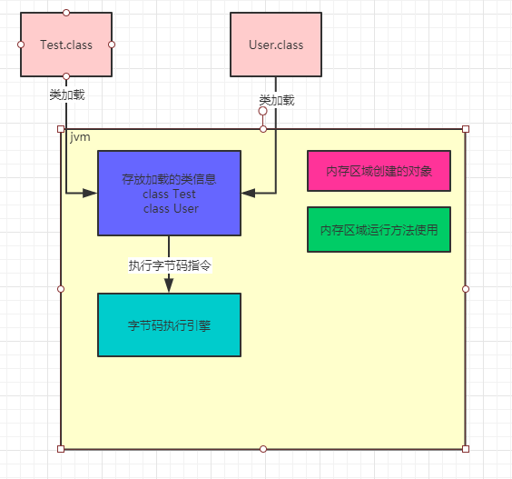

那么在执行字节码指令的时候，JVM里就需要一个特殊的内存区域了，那就是 "程序计数器"

这个程序计数器就是用来**记录当前执行的字节码指令的位置**，也就是记录目前执行到了哪一条字节码指令。

我们通过一张图来说明

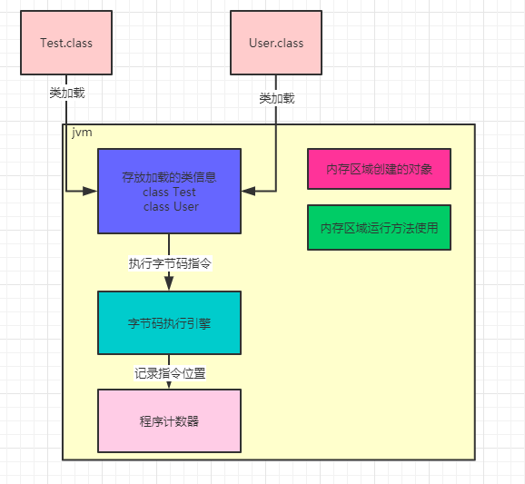

大家都知道JVM是支持多个线程的，所以其实你写好的代码可能会开启多个线程并发执行不同的代码，所以就会有多个线程来并发执行不同的代码指令

因此每个线程都会有自己的一个程序计数器，专门记录当前这个线程目前执行到了哪一条字节码指令了

下图更加清晰的展示除了它们之间的关系。

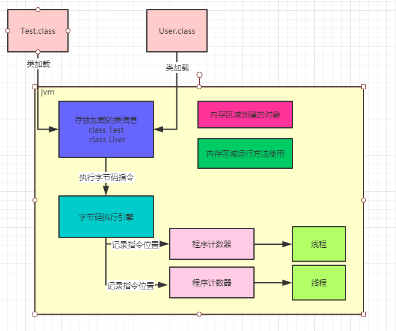

### Java虚拟机栈

java代码在执行的时候，一定是线程来执行某个方法中的代码

哪怕就是下面的代码，也会用一个main线程来执行main()方法里的代码

在main线程执行main()方法的代码指令的时候，就会通过main线程对应的程序计数器记录自己执行的指令位置

```
public class Test {
   public static void main() {
        User user = new User();
        user.loadReplicasFromDisk();
   }
}
```

但是在方法里，我们经常会定义一些方法内的局部变量

比如在上面的额main()方法里，其实就有一个 "User" 局部变量，他是应用一个User实例对象的，关于这个对象我们先别去管他，先来看方法和局部变量。

因此，JVM必须有一块区域是来保存每个方法内的**局部变量**等数据的，这个区域就是**Java虚拟机栈**

每个线程都有自己的Java虚拟机栈，比如这里的main线程就会有自己的一个Java虚拟机栈，用来存放自己执行的那些方法的局部便变量。

如果线程执行了一个方法，就会对这个方法调用创建对应的一个**栈帧**

栈帧里就有这个方法的局部变量表、操作数栈、动态链接、方法出口等东西，这里就不深入理解了，我们先关注局部变量。

比如main线程执行了main()方法，那么就会欸这个main()方法创建一个栈帧，压入main线程的Java虚拟机栈

同时在main()方法的栈帧里，会存放对应的 "user" 局部变量。

上述过程，如下图所示：

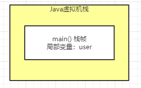

然后假设main线程继续执行User对象里的方法，比如下面这样，就在 "loadReplicasFromDisk" 方法里定义了一个局部变量 "hasFinishedLoad"

```
public class User {
    public void loadReplicasFromDisk() {
         Boolean hasFinishedLoad = false;
    }
}
```

那么main线程在执行上面的 "loadReplicasFromDisk" 方法时，就会为 "loadReplicasFromDisk" 方法创建一个栈帧压入线程自己的Java虚拟机栈里面去。

然后在栈帧的局部变量表里就会有 "hasFinishedLoad" 这个变量。

整个过程如下：

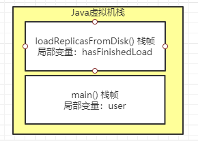

接着如果 "loadReplicasFromDisk" 方法调用了另外一个 "isLocalDataCorrupt()" 方法，这个方法 里也有自己的局部变量，比如下面这样的代码：

```
public class User {
    public void loadReplicasFromDisk() {
         Boolean hasFinishedLoad = false;
         if(isLocalDataCorrupt()){};
    }
    
    public Boolean isLocalDataCorrupt() {
         Boolean isCorrupt = false;
         return isCorrupt;
    }
}
```

那么这个时候会给 "isLocalDataCorrupt" 方法创建一个栈帧，压入线程的Java虚拟机栈里。

而且 "isLocalDataCorrrupt" 方法的栈帧局部变量里会有一个 "isCorrupt" 变量，这是 "isLocalDataCorrupt" 方法的局部变量。

整个过程如下图：

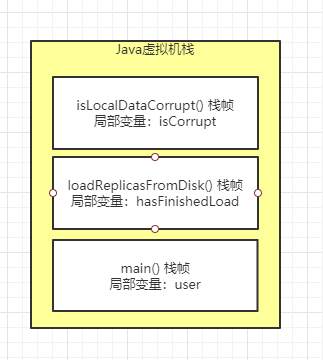

接着如果 "isLocalDataCorrupt" 方法执行完毕了，就会把 "isLocalDataCorrupt" 方法对应的栈帧从Java虚拟机栈里给出栈，然后如果 "loadReplicasFromDisk" 方法也执行完毕了，就会把 "loadReplicasFromDisk" 方法也从Java虚拟机栈里出栈。

上述就是JVM中的 "Java虚拟机栈" 这个组件的作用：调用执行任何方法时，都会给方法创建栈帧然后入栈

在栈帧里存放了这个方法对应的局部变量之类的数据，包括执行任何方法时，都会给方法创建栈帧然后入栈。

在栈帧里存放了这个方法对应的局部变量之类的数据，包括这个方法执行的其他相关信息，方法执行完毕之后就出栈。

咱们在来看一个图，了解一下每个线程在执行代码时，除了程序计数器以外，还搭配了一个Java虚拟机栈内存区域来存放每个方法中的局部变量表。

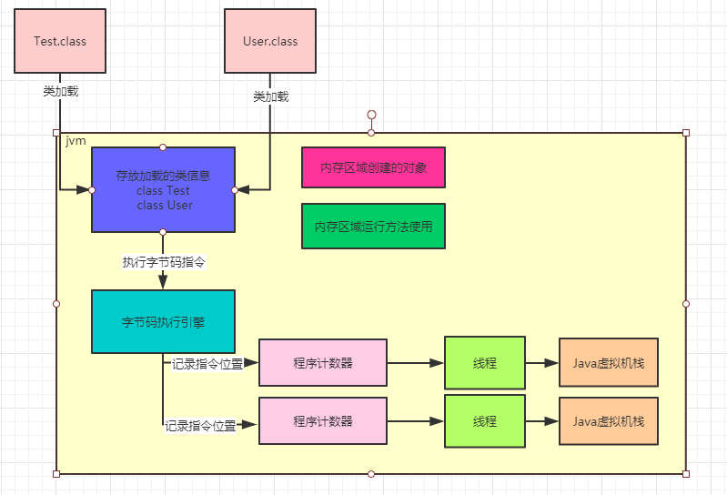

### java堆内存

现在大家知道了，main线程执行main()方法的时候，会有自己的程序计数器。

此外，还会依次把main()方法，loadReplicasFromDisk()方法，isLoacalDataCorrupt()方法的栈帧压入Java虚拟机栈，存放每个方法的局部变量。

那么接着我们就的得来看JVM中得另外一个非常关键得区域，就是**Java堆内存**，这里就是存放我们在代码中创建的各种对象的，比如下面的代码：

```
public class Test {
    public static void main() {
         User user = new User();
         user.loadReplicasFromDisk();
    }
}
```

上面 "new User()" 这个代码就是创建了一个User类的对象实例，这个对象实例里面回包含一些数据，如下面的代码所示：

```
public class User {

    private long replicaCount;
    
    public void loadReplicasFromDisk() {
         Boolean hasFinishedLoad = false;
         if(isLocalDataCorrupt()){};
    }
    
    public Boolean isLocalDataCorrupt() {
         Boolean isCorrupt = false;
         return isCorrupt;
    }
}
```


这个 "User" 类里的 "replicaCount" 就是属于这个对象实例的一个数据。

类似User对象这样的对象实例，就会存放在Java堆内存里。

Java堆内存区域里会放入类似User的对象，然后我们因为在main方法里创建了User对象的，那么在线程执行main方法代码的时候，就会在main方法对应的栈帧的局部变量表里，让一个引用类型的 "user" 局部变量来存放User对象的地址

相当于你可以认为局部变量表里的 "user" 指向了Java堆内存里的User 对象

如下图所示：

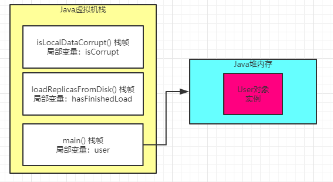

### 核心内存区域的全流程

其实我们把上面的那个图和下面的这个总的大图一起串起来看看，在配合整体的代码，我们来捋一下整体的流程，大家就会觉得很清晰。

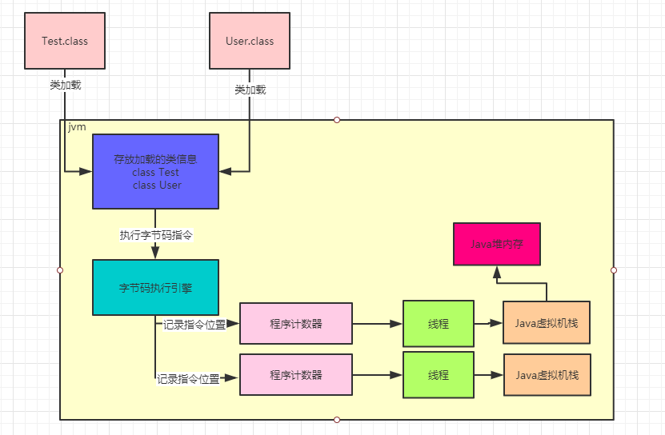

```
public class Test {
    publci static void main() {
        User user = new User();
        user.loadReplicasFromDisk();
    }
}

public class User {
   private long replicaCount;
   
   public void loadReplicasFromDisk() {
       Boolean hasFinishedLoad = false;
       if(isLocalDataCorrupt()){};
   }
   
   public Boolean isLocalDataCorrupt() {
       Boolean isCorrupt =  false;
       returen isCorrupt;
   }
}
```

首先，你的JVM进程会启动，就会现在加你的User类到内存里。然后有一个main线程，开始执行你的Kafka中的main()方法。

main线程是关联了一个程序计数器的，那么他执行到哪一行指令，就会记录在这里。

可以结合上图中的程序计数器来理解一下。

其次，就是main线程在执行main()方法的时候，会在main线程关联的Java虚拟机栈里，压入一个main()方法的栈帧。

接着会发现需要创建一个User类的实例对象，此时会加载User类到内存里来。

然后会创建一个User的对象实例分配在Java堆内存里，并且在main()方法的栈帧里的局部变量表引入一个 "user" 变量，让他引用User对象在Java堆内存中的地址。

看到这里，在结合上图理解一下。

接着，main线程开始执行User对象中的方法，会依次把自己执行的方法对应的栈帧压入自己的Java虚拟机栈，执行完方法之后在把方法对应的栈帧从Java虚拟机栈里出栈。

如果都理解了这个过程，那么JVM中的各个核心内存区域的功能和对应的我们的Java代码之间的关系，就彻底理解了。

### 其他内存区域

其实在JDK很多底层API里，比如IO相关的，NIO相关的，网络Socket相关的

如果看过内部的源码，会发现很多地方都不是Java代码了，二是走的native方法去调用本地操作系统里的一些方法，可能调用的都是c语言写的方法，或者一些底层类库

比如下面这样：public native int hashCode();

在调用这种native方法的时候，就会有线程对应的本地方法栈，这个里面也跟Java虚拟机栈类似的，也是存放各种native方法的局部变量表之类的信息。

还有一个区域，是不属于JVM的，通过NIO的allocateDirect这种API，可以在Java堆外分配内存空间。然后，通过Java虚拟机里的DirectByteBuffer来引用和操作堆外内存空间。

其实很多技术都会用这种方式，因为有一些场景下，堆外内存分配可以提示性能。