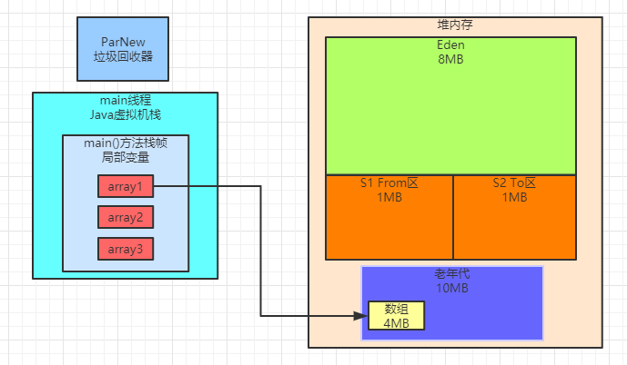
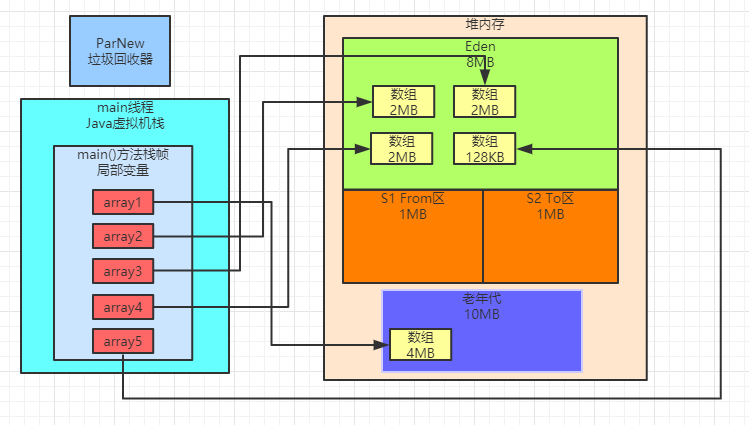
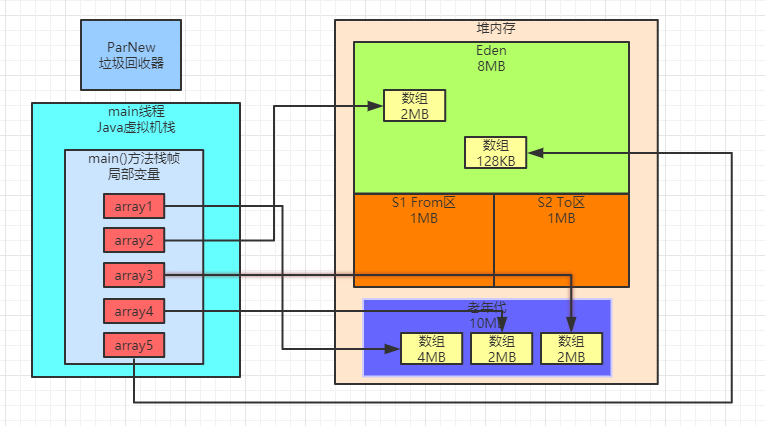
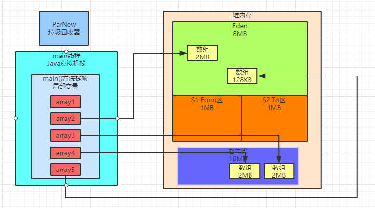
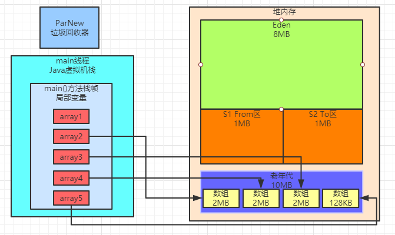
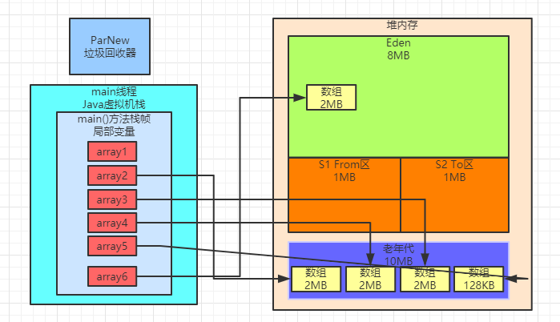

### 示例代码

```java
public class Demo4 {
    public static void main(String[] args) {
        byte[] array1 = new byte[4 * 1024 * 1024];
        array1 = null;
        byte[] array2 = new byte[2 * 1024 * 1024];
        byte[] array3 = new byte[2 * 1024 * 1024];
        byte[] array4 = new byte[2 * 1024 * 1024];
        byte[] array5 = new byte[128 * 1024];
        byte[] array6 = new byte[2 * 1024 * 1024];
    }
}
```

### GC日志

我们需要采用如下参数来运行上述程序：

```
-XX:NewSize=10485760 -XX:MaxNewSize=10485760 
-XX:InitialHeapSize=20971520 -XX:MaxHeapSize=20971520 
-XX:SurvivorRatio=8 -XX:MaxTenuringThreshold=15 
-XX:PretenureSizeThreshold=3145728 -XX:+UseParNewGC 
-XX:+UseConcMarkSweepGC -XX:+PrintGCDetails -XX:+PrintGCTimeStamps 
-Xloggc:gc.log
```

这里最关键一个参数，就是“-XX:PretenureSizeThreshold=3145728”

这个参数要设置大对象阈值为3MB，也就是超过3MB，就直接进入老年代。

运行之后会得到如下GC日志：

```
0.308: [GC (Allocation Failure) 0.308: [ParNew (promotion failed): 7260K->7970K(9216K), 0.0048975 secs]0.314: [CMS: 8194K->6836K(10240K), 0.0049920 secs] 11356K->6836K(19456K), [Metaspace: 2776K->2776K(1056768K)], 0.0106074 secs]
[Times: user=0.00 sys=0.00, real=0.01 secs] 
Heap 
par new generation total 9216K, used 2130K [0x00000000fec00000, 0x00000000ff600000, 0x00000000ff600000) 
eden space 8192K, 26% used [0x00000000fec00000, 0x00000000fee14930, 0x00000000ff400000) 
from space 1024K, 0% used [0x00000000ff500000, 0x00000000ff500000, 0x00000000ff600000) 
to space 1024K, 0% used [0x00000000ff400000, 0x00000000ff400000, 0x00000000ff500000) 
concurrent mark-sweep generation total 10240K, used 6836K [0x00000000ff600000, 0x0000000100000000, 0x0000000100000000) 
Metaspace used 2782K, capacity 4486K, committed 4864K, reserved 1056768K 
class space used 300K, capacity 386K, committed 512K, reserved 1048576K
```

### 一步一图分析日志

首先我们看如下代码：

```java
byte[] array1 = new byte[4 * 1024 * 1024];
array1 = null;
```

这行代码直接分配了一个4MB的大对象，此时这个对象会直接进入老年代，接着array1不再引用这个对象

此时如下图所示。



接着看下面的代码：

```java
byte[] array2 = new byte[2 * 1024 * 1024];
byte[] array3 = new byte[2 * 1024 * 1024];
byte[] array4 = new byte[2 * 1024 * 1024];
byte[] array5 = new byte[128 * 1024];
```

连续分配了4个数组，其中3个是2MB的数组，1个是128KB的数组，如下图所示，全部会进入Eden区域中。



接着会执行如下代码：byte[] array6 = new byte[2 * 1024 * 1024];。此时还能放得下2MB的对象吗？不可能了，因为Eden区已经放不下了。因此此时会直接触发一次Young GC。

我们看下面的GC日志：

```
ParNew (promotion failed): 7260K->7970K(9216K), 0.0048975 secs
```

这行日志显示了，Eden区原来是有7000多KB的对象，但是回收之后发现一个都回收不掉，因为上述几个数组都被变量引用了。

所以此时，一定会直接把这些对象放入到老年代里去，但是此时老年代里已经有一个4MB的数组了，还能 放的下3个2MB的数组和1个128KB的数组吗？

明显是不行的，此时一定会超过老年代的10MB大小。

所以此时我们看gc日志：

```
[CMS: 8194K->6836K(10240K), 0.0049920 secs] 11356K->6836K(19456K), [Metaspace: 2776K->2776K(1056768K)], 0.0106074 secs]
```

可以清晰看到，此时执行了CMS垃圾回收器的Full GC，我们之前讲过Full GC其实就是会对老年代进行Old GC， 同时一般会跟一次Young GC关联，还会触发一次元数据区（永久代）的GC。

在CMS Full GC之前，就已经触发过Young GC了，此时可以看到此时Young GC就已经有了，接着就是执行针对老年代的Old GC，也就是如下日志：

```
CMS: 8194K->6836K(10240K), 0.0049920 secs
```

这里看到老年代从8MB左右的对象占用，变成了6MB左右的对象占用，这是怎么个过程呢？

很简单，一定是在Young GC之后，先把2个2MB的数组放入了老年代，如下图。



此时要继续放1个2MB的数组和1个128KB的数组到老年代，一定会放不下，所以此时就会触发CMS的Full GC

然后此时就会回收掉其中的一个4MB的数组，因为他已经没人引用了，如下图所示。



接着放入进去1个2MB的数组和1个128KB的数组，如下图所示。



所以再看CMS的垃圾回收日志：CMS: 8194K->6836K(10240K), 0.0049920 secs，他是从回收前的8MB变成了6MB，就是上图所示。

最后在CMS Full GC执行完毕之后，其实年轻代的对象都进入了老年代，此时最后一行代码要在年轻代分配2MB的数组就可以成功了，如下图。

