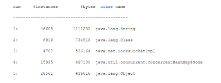

### 使用jmap了解系统运行时的内存区域

其实如果单单只是要了解JVM的运行状况，然后去进行JVM GC优化，通常来说jstat就完全够用了

但是有的时候可能我们会发现JVM新增对象的速度很快，然后就想要去看看，**到底什么对象占据了那么多的内存。**

如果发现有的对象在代码中可以优化一下创建的时机，避免那种对象对内存占用过大，那么也许甚至可以去反过来优化一下代码。

当然，其实如果不是出现OOM那种极端情况，也并没有那么大的必要去着急优化代码。

但是这篇文章我们来学习一下如何了解线上系统jvm中的对象分布，也是有好处的，比如之前我们的案例中就发现年轻代里总是有500kb左右的未知对象，是不是会很好奇？如果可以看到jvm中这500kb的对象到底是什么就好了，所以学习一下这个技巧是有用的。

先看一个命令：**jmap -heap PID**

这个命令可以打印出来一系列的信息，我们就不长篇大论的粘贴出来具体的信息了，因为内容篇幅太大了，其实也没太大意义，因为里面的东西自己看字面意思都能看懂的。我们就简单说一下这里会打印出来什么东西。

大致来说，这个信息会打印出来堆内存相关的一些参数设置，然后就是当前堆内存里的一些基本各个区域的情况

比如Eden区总容量、已经使用的容量、剩余的空间容量，两个Survivor区的总容量、已经使用的容量和剩余的空间容量，老年代的总容量、已经使用的容量和剩余的容量。

但是这些信息我们会想了，其实jstat已经有了啊！对的，所以一般不会用jmap去看这些信息，毕竟他信息还没jstat全呢，因为没有gc相关的统计。

### 使用jmap了解系统运行时的对象分布

其实jmap命令比较有用的一个使用方式，是如下的：

**jmap -histo PID**

这个命令会打印出来类似下面的信息：

这个就很有意思了，看上述打印出来的东西，他会按照各种对象占用内存空间的大小降序排列，把占用内存最多的对象放在最上面。

所以如果你只是想要简单的了解一下当前jvm中的对象对内存占用的情况，只要直接用jmap -histo命令即可，非常好用

你可以快速了解到当前内存里到底是哪个对象占用了大量的内存空间。

### 使用jmap生成堆内存转储快照

但是如果你仅仅只是看一个大概，感觉就只是看看上述那些对象占用内存的情况，感觉还不够，想要来点深入而且仔细点的

那就可以用jmap命令生成一个堆内存快照放到一个文件里去，用如下的命令即可：

**jmap -dump:live,format=b,file=dump.hprof PID**

这个命令会在当前目录下生成一个dump.hrpof文件，这里是二进制的格式，你不能直接打开看的，他把这一时刻JVM堆内存里所有对象的快照放到文件里去了，供你后续去分析。

### 使用jhat在浏览器中分析堆转出快照

接着就可以使用jhat去分析堆快照了，jhat内置了web服务器，他会支持你通过浏览器来以图形化的方式分析堆转储快照

使用如下命令即可启动jhat服务器，还可以指定自己想要的http端口号，默认是7000端口号：

**jhat dump.hprof -port 7000**

接着你就在浏览器上访问当前这台机器的7000端口号，就可以通过图形化的方式去分析堆内存里的对象分布情况了。

