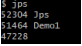

### 服务于百万级商家的BI系统是什么

说一下我们线上一个真实的生产系统，是一个服务于百万级商家的BI系统。

这个所谓BI系统，很多开发业务系统可能没接触过，所以我们简单介绍一下他的背景。

简单来说，比如你是一个平台，然后有数十万甚至上百万的商家在你的平台上做生意，会使用你的这个平台系统

此时一定会产生大量的数据，然后基于这些数据我们需要为商家提供一些数据报表，比如：每个商家每天有多少访客？有多少交易？付费转化率是多少？

当然实际情况会比这个简单几句话复杂很多，我们这里就简单说个概念而已。所以此时就需要一套BI系统

所谓BI，英文全称是 “Business Intelligence”，也就是 “商业智能” ，听起来是不是特别的高大上

所谓“商务智能”，指的就是给你看一些数据报表，然后让你平时能够更好的了解自己的经营状况，然后让老板“智能”的去调整经营 策略，提升业绩。

所以类似这样的一个BI系统，大致的运行逻辑如下所示，首先从我们提供给商家日常使用的一个平台上会采集出来很多商家日常经营的数据，如下图所示。


接着就可以对这些经营数据依托各种大数据计算平台，比如Hadoop、Spark、Flink等技术进行海量数据的计算，计算出来各种各样的数据报表，如下图所示。


然后我们需要将计算好的各种数据分析报表都放入一些存储中，比如说MySQL、Elastcisearch、HBase都可以存放类似的数据，如下 图所示。


最后一步，就是基于MySQL、HBase、Elasticsearch中存储的数据报表，基于Java开发出来一个BI系统，通过这个系统把各种存储好的数据暴露给前端，允许前端基于各种条件对存储好的数据进行复杂的筛选和分析，如下图所示。


### 刚开始上线系统时候的部署架构

我们在这里重点作为案例分析的就是上述场景中的BI系统，其他环节都跟大数据相关的技术是有关联的，我们暂时先不涉及

刚开始的时候，这个BI系统使用的商家是不多的。要知道，即使在一个庞大的互联网大厂里，虽然说大厂本身积累了大量的商家，但是你要是针对他们上线一个付费的产品，刚开始未必所有人都买账，所以一开始系统上线大概就少数商家在使用，比如就几千个商家。

所以刚开始系统部署的非常简单，就是用几台机器来部署了上述的BI系统，机器都是普通的4核8G的配置，然后在这个配置之下，一般来说给堆内存中的新生代分配的内存都在1.5G左右，Eden区大概也就1G左右的空间

如下图所示。


### 技术痛点：实时自动刷新报表 + 大数据量报表

其实刚开始，在少数商家的量级之下，这个系统是没多大问题的，运行的非常良好，但是问题恰恰就出在突然使用系统的商家数量开始暴涨的时候。

突然使用系统的商家开始越来越多，举个例子，当商家的数量级达到几万的时候。

此时要说明一个此类BI系统的特点，就是在BI系统中有一种数据报表，他是支持前端页面有一个JS脚本，自动每隔几秒钟就发送请求到后台刷新一下数据的，这种报表称之为 “实时数据报表”，如下图所示。


那么可以设想一下，假设仅仅就几万商家作为你的系统用户，很可能同一时间打开那个实时报表的商家就有几千个

然后每个商家打开实时报表之后，前端页面都会每隔几秒钟发送请求到后台来加载最新数据，基本上会出现你BI系统部署的每台机器每秒的请求会达到几百个，我们假设就是每秒500个请求吧。

然后每个请求会加载出来一张报表需要的大量数据，因为BI系统可能还需要针对那些数据进行内存中的现场计算加工一下，才能返回给前端页面展示。

根据之前的测算，每个请求大概需要加载出来100kb的数据进行计算，因此每秒500个请求，就需要加载出来50MB的数据到内存中进行计算，如下图所示。


### 没什么大影响的频繁Young GC

其实我们都已经发现上述系统的问题了，在上述系统运行模型下，基本上每秒会加载50MB的数据到Eden区中，只要区区200s，也就是3分钟左右的时间，就会迅速填满Eden区，然后触发一次Young GC对新生代进行垃圾回收。

当然1G左右的Eden进行Young GC其实速度相对是比较快的，可能也就几十ms的时间就可以搞定了

所以之前也分析过，其实对系统性能影响并不大。而且上述BI系统场景下，基本上每次Young GC后存活对象可能就几十MB，甚至是几MB。

所以如果仅仅只是这样的话，那么可能会看到如下场景，BI系统运行几分钟过后，就会突然卡顿个10ms，但是对终端用户和系统性能几乎是没有影响的，如下图。


### 模拟代码的JVM参数设置

接着我们会用一段程序来模拟出上述BI系统那种频繁Young GC的一个场景，此时JVM参数如下所示：

```
-XX:NewSize=104857600 -XX:MaxNewSize=104857600 
-XX:InitialHeapSize=209715200 -XX:MaxHeapSize=209715200 
-XX:SurvivorRatio=8 -XX:MaxTenuringThreshold=15 
-XX:PretenureSizeThreshold=3145728 -XX:+UseParNewGC 
-XX:+UseConcMarkSweepGC -XX:+PrintGCDetails 
-XX:+PrintGCTimeStamps -Xloggc:gc.log
```

只要注意一下上述我们把堆内存设置为了200MB，把年轻代设置为了100MB，然后Eden区是80MB，每块Survivor区是10MB， 老年代也是100MB。

我们把案例中的内存大小适当缩小了一些，这样方便在本地windows电脑来运行试验。

### 示例程序

```java
public class Demo1 {
    public static void main(String[] args) throws Exception {
        Thread.sleep(30000);
        while(true){
          loadData();
        }
    } 
    private static void loadData() throws Exception {
        byte[] data = null;
        for(int i=0; i < 50; i++) {
            data = new byte[100 * 1024];
        }
        data = null;
        Thread.sleep(1000);
    }
}
```

针对这段示例程序做一点说明。

首先看第一行代码：Thread.sleep(30000); 

**为什么刚开始先休眠30s？**

因为一会儿再说明，程序刚启动，必须得先让我们找到这个程序的PID，也就是进程ID，然后再执行jstat命令来观察程序运行时JVM的状态。

接着看loadData()方法内的代码，其实非常简单，他会循环50次，模拟每秒50个请求

然后每次请求会分配一个100KB的数组，模拟每次请求会从数据存储中加载出来100KB的数据。接着会休眠1秒钟，模拟这一切都是发生在1秒内的。

其实这些对象都是短生存周期的对象，所以方法运行结束直接对象都是垃圾，随时可以回收的。

然后在main()方法里有一个while(true)循环，模拟系统按照每秒钟50个请求，每个请求加载100KB数据的方式不停的运行，除非我们手动终止程序，否则永不停歇。

### 如何在windows上执行命令

这里说下windows上做实验特别好用的工具，就是Git for Windows

可能疑惑，这跟Git有什么关系？他不是一个版本管理工具吗？

没错，但是这个Git for Windows，你主要安装之后，就可以在windows上启动一个Git Bash的窗口，然后你可以随意执行各种命令，非常的好用。

所以推荐这个工具的官网：https://gitforwindows.org/

自己到官网里下载最新版本即可，安装和使用非常的简单。

在你安装完毕之后，在windows桌面上右击的时候，会看到一个“Git Bash Here”的选项，此时选择他，就可以直接打开一个命令行窗口，里面可以随意执行命令。

当然，其实如果你不想那么麻烦，也可以直接打开windows自己的命令行窗口，在里面也可以执行jps、jstat等命令， 这也是没问题的。只不过我习惯于通过Git for Windows来执行一些命令。

### 通过jstat观察程序的运行状态

接着我们使用预订的JVM参数启动程序，此时程序会先进入一个30秒的休眠状态，此时尽快执行jps命令，查看一下我们启动程序的进程ID，如下图所示：



此时会发现我们运行的Demo1这个程序的JVM进程ID是51464。

然后尽快执行下述jstat命令：

```
jstat -gc 51464 1000 1000
```

他的意思就是针对51464这个进程统计JVM运行状态，同时每隔1秒钟打印一次统计信息，连续打印1000次。

然后我们就让jstat开始统计运行，每隔一秒他都会打印一行新的统计信息，过了几十秒后可以看到如下图所示的统计信息：


接着我们一点点来分析这个图。首先我们先看如下图所示的一段信息：


这个EU应该还记得，就是之前我们所说的Eden区被使用的容量，可以发现他刚开始是3MB左右的内存使用量

接着从我们程序开始运行，会发现每秒钟都会有对象增长，从3MB左右到7MB左右，接着是12MB，17MB，22MB，每秒都会新增5MB左右的对象。

这个跟我们写的代码是完全吻合的，我们就是每秒钟会增加5MB左右的对象。

然后当Eden区使用量达到70多MB的时候，再要分配5MB的对象就失败了，此时就会触发一次Young GC，然后继续看下面的图：


**注意看上面红圈里的内容**，会发现，Eden区的使用量从70多MB降低为了1MB多，这就是因为一次Young GC直接回收掉了大部分对象。

所以我们现在就知道了，针对这个代码示例，可以清晰的从jstat中看出来，对象增速大致为每秒5MB左右，大致在十几秒左右会触发一 次Young GC

这个就是Young GC的触发频率，以及每次Young GC的耗时，看下图：


上图清晰告诉你了，一次Young GC回收70多MB对象，大概就1毫秒，所以想想，Young GC其实是很快的，即使回收800MB的对象，也就10毫秒那样。

所以你想如果是线上系统，他Eden区800MB的话，每秒新增对象50MB，十多秒一次Young GC，也就10毫秒左右，系统卡顿10毫秒，几乎没什么大影响的。

所以我们继续推论，在这个示例中，80MB的Eden区，每秒新增对象5MB，大概十多秒触发一次Young GC，每次Young GC耗时在1毫秒左右。

**那么每次Young GC过后存活的对象呢？**

简单看上上图，S1U就是Survivor中被使用的内存，之前一直是0，在一次Young GC过后变成了675KB，所以一次Young GC后也就存 活675KB的对象而已，轻松放入10MB的Survivor中。

而且注意上上图中的OU，那是老年代被使用的内存量，在Young GC前后都是0

这说明这个系统运行良好，Young GC都不会导致对象进入老年代，这就几乎不需要什么优化了。因为几乎可以默认老年代对象增速为 0，Full GC发生频率趋向于0，对系统无影响。

所以回顾一下，通过一个示例程序的运行，是不是可以通过jstat分析出来以下信息：

```
新生代对象增长的速率 
Young GC的触发频率 
Young GC的耗时 
每次Young GC后有多少对象是存活下来的 
每次Young GC过后有多少对象进入了老年代 
老年代对象增长的速率 
Full GC的触发频率 
Full GC的耗时
```

