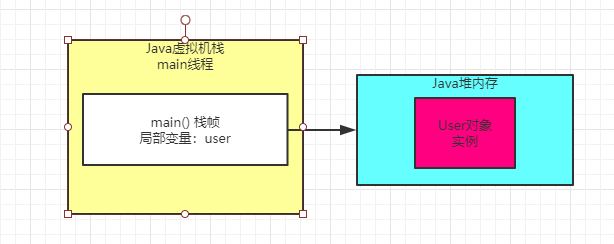

### 一个方法执行完毕之后会怎么样

回顾下以下代码

```
public class Test {
   public static void main(String[] args) {
      loadReplicasFromDisk();
   }
   
   private static void loadReplicasFromDisk() {
       User user  = new User();
       user.load();
   }
}
```

其实目前的图我们已经表述到了 "user.load()" 这行代码里

那么现在有个问题，如果这行代码执行结束了，此时会怎么样？

之前文章说过，一旦方法里的代码执行完毕，那么方法就执行完毕了，也就是说loadReplicasFromDisk()方法就执行完毕了。

一旦你的loadReplicasFromDisk()方法执行完毕，此时就会把loadReplicasFromDisk()方法对应的栈帧从main线程的Java虚拟栈里出栈

如下图所示：



此时一旦loadReplicasFromDisk()方法的栈帧出栈，那么大家会发现那个栈帧里的局部变量，"user" 也就没有了。

也就是说，没有任何一个变量指向Java堆内存里的 "User" 实例对象了。

### 我们创建的Java对象其实都是占用内存资源的

核心点来了，此时大家发现了，Java堆内存里的那个 "User" 实例对象已经没有人引用他了

这个对象实际上已经没有用了，该干的事儿都干完了，现在你还在让他留在内存里干嘛呢？

大家要知道，内存资源是有限的。

一般来说，我们回在一台机器上启动一个Java系统，机器的内存资源是有限的，比如就4个G的内存，然后我们启动Java系统本质就是一个JVM进程，他负责运行我们的系统的代码，这个之前都解释过了。

那么这个JVM进程本身也是占用机器上的部分内存资源，比如占用2G的内存资源。

那么我们在JVM的Java堆内存中创建的对象，其实本质也是会占用JVM的内存资源，比如 "User" 实例对象，会占用500字节的内存。

所以大家看到这里，心中应该无比明白的一个核心点：我们在Java堆内存里的对象，都是占用内存资源的，而且内存资源有限。

大家看下面的图，感受会强烈一点。


### 不在需要的那些对象应该怎么处理

继续思考上面的图，既然 "User" 对象实例是不需要使用的，已经没有任何方法的局部变量在引用这个实例对象了，而且他还空占着内存资源，那么我们应该怎么处理呢？

答案浮出水面：**JVM的垃圾回收机制**

JVM本身是有垃圾回收机制的，他是一个后台**自动运行的线程**

你只要启动一个JVM进程， 他就会自带这么一个垃圾回收的后台线程。

这个线程会在后台不断检查JVM堆内存中的各个实例对象

如下图所示：


如果某个实例对象没有任何一个方法的局部变量指向它，也没有任何一个类的静态变量，包括常量等地方在指向它。

那么这个垃圾回收线程，就会把这个没人指向 "User" 实例对象给回收掉，从内存里清除掉，让它不再占用任何内存资源。

### 发散思考

我们创建的那些对象，到底在Java堆内存里会占用多少内存空间呢？

这个其实很好想象，一个对象对内存空间的占用，大致分为两块：

（1）一个对象自己本身的一些信息

（2）一个是对象的实例变量作为数据占用的空间

比如对象头，如果在64位的linux操作系统上，会占用16字节，然后结果你的实例对象内部有int类型的实例变量，它会占用4个字节，如果是long类型的实例变量，会占用8个字节。如果是数组，Map之类的，那么就会占用更多的内存了。

另外JVM对这块有很多优化的地方，比如补齐机制，指针压缩机制。