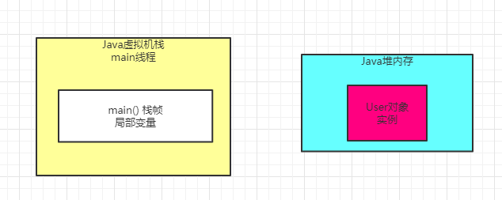

### 背景引入

首先介绍下JVM内存的一个分代模型：年轻代，老年代，永久代。

我们现在应该都知道一点，那就是我们在代码里创建的对象，都会进入到Java堆内存中，比如下面的代码：

```
public class Test {
    public static void main(String[] arg) {
       while(true) {
           loadReplicasFromDisk();
           Thread.sleep(1000);
       }
    }
    private static void loadReplicasFromDisk() {
        User user = new User();
        user.load();
    }
}
```

这段代码，稍稍做了点改动，在main()方法里，会周期性的执行loadReplicasFromDisk()方法，加载副本数据。

首先一旦执行main()方法，那么就会把main()方法的栈帧压入main()线程的Java虚拟机栈

如图所示


然后每次在while循环里，调用loadReplicasFromDisk()方法，就会把loadReplicasFromDisk()方法的栈帧压入自己的Java虚拟机栈

如图所示


接着执行loadReplicasFromDisk()方法的时候，会在Java堆内存里会创建一个User对象实例

而且loadReplicasFromDisk()方法栈帧里会有 "user" 局部变量去应用Java堆内存里的User对象

如图所示：


然后就会执行User对象的laod()方法。

### 大部分对象都是存活周期极短的

现在又一个问题，在上面代码中，那个User对象，实际上属于短暂存活的这么一个对象

大家可以观察以下，在loadReplicasFromDisk()方法中创建的这个对象，然后执行User对象的load()方法，然后执行完毕之后，loadReplicasFromDisk()方法就会结束。

一旦方法结束，那么loadReplicasFromDisk()方法的栈帧就会出栈，如下图:



然后接着上篇文章已经说过，此时一旦没人引用这个User对象了，就会被JVM的垃圾回收线程给回收掉，释放内存空间，如下图。


然后main()方法的while循环里，下一次循环再次执行loadReplicasDiskFrom()方法的时候，又会走一遍上面那个流程，把loadReplicasFromDisk()方法的栈帧压入Java虚拟机栈，然后构造一个User实例对象放在Java堆里。

一旦执行完User对象的load()方法之后，loadReplocasFromDisk()方法又会结束，再次出栈，然后垃圾回收释放掉Java堆内存里的User对象。

所以其实这个User对象，在上面的代码中，是一个存活期极为短暂的对象。

可能每次执行loadReplicasFromDisk()方法的时候，被创建出来，然后执行它的load()方法，接着可能1ms之后，就会被垃圾回收掉了。

所以从这段代码可以明显看出，大部分在我们代码里创建的对象，其实都是存活周期很短的，这种对象，其实在我们写的Java代码中，占到绝大部分的比例。

### 少数对象是长期存活的

但是我们在看另外一段代码，假如说咱们用下面的这种方式来实现同样的功能：

```
public class Test {
    private static User user = new User();
    public static void main(String[] arg) {
       while(true) {
           loadReplicasFromDisk();
           Thread.sleep(1000);
       }
    }
    private static void loadReplicasFromDisk() {
        user.load();
    }
}
```

上面那段代码的意思，就是给Test这个类定义一个静态变量，也就是 "user" ，这个Test类实在JVM方法区里的，然后让 "user" 引用一个在Java堆内存里创建的User实例对象，如下图： 


接着在main()方法中，就会在一个while循环里，不停的调用User对象的load()方法，做成一个周期性运行的模式。

这个时候，我们就要思考一下，这个User实例对象，他是会一直在Test的静态变量引用的，然后会一直驻留在Java堆内存里，是不会被垃圾回收掉的。

因为这个实例对象他需要长期被使用，周期性的被调用load()方法，所以它就成为了一个长时间存在的对象。

那么类似这种被类的静态变量长期引用的对象，他需要长期停留在Java堆内存里，这种对象就是生存周期很长的对象，它是轻易不会被垃圾回收的，他需要长期存在，不停的去使用他。

### JVM分代模型：年轻代和老年代

接下来进入核心主题，就是JVM的分代模型，年轻代和老年代。

现在就可以看出，其实根据我们写代码方式的不同，采用不同的方式来创建和使用对象，其实对象的生存周期是不同的。

所以JVM将Java堆内存划分为了两个区域，一个是年轻代，一个是老年代。

其中年轻代，顾名思义，就是把第一种代码示列中的那种，创建和使用完之后立马就要回收的对象放在里面

然后老年代呢，就是把第二种代码示列中的那种，创建之后需要一直存在的对象放在里面，如下图所示：


再比如上面的代码，我们在来改造一下，在结合图，会看的更明确一些。

```
public class Test {
   private static DeptService deptService = new DeptService();
   
   public static void main(String[] args) {
      loadReplicasFromDisk();
      while(true) {
         fetchReplicasFromRemote();
         Thread.sleep(1000);
      }
   }
  
    private static void loadReplicasFromDisk(){
        User user = new User();
        user.load();
    }
    
    private static void addDept() {
      deptService.add();
    }
}
```

上面这段代码稍微复杂了点，解释一下

Test的静态变量 "deptService" 引用了DeptService对象，这是长期需要留在内存里的对象

这个对象会在年轻代停留一会儿，但是最终会进入老年代，如图所示


进入main()方法之后，会先调用loadReplicasFromDisk()方法，业务含义是系统启动就从磁盘加载一次副本数据，这个方法的栈帧会入栈

然后在这个方法里面创建一个User对象，这个对象他是用完就回收，所以是会放在年轻代里的，由栈帧里的局部变量来引用

下图所示：


然后一旦loadReplicasFromDisk()方法执行完毕了，方法的栈帧就会出栈，对应的年轻代里的User对象也会被回收掉，如下图：


但是接着会执行一段while循环代码，他会周期性的调用DeptService的addDept()方法，去从远程加载副本数据。

所以DeptSerivece这个对象因为被Test类的静态变量deptService给引用了，所以他会长期存在于老年代里，持续被使用。

### 为什么要分成年轻代和老年代

看完这里的分析，什么样的对象是短期存活的对象，什么样的对象是长期存活的对象，然后如何分别存在于年轻代和老年代里。

那么为什么需要这么区分呢？

其实这个是跟垃圾回收有关，对于年轻代里的对象，他们的特点是创建之后很快被回收，所以需要用一种垃圾的回收算法

对于老年代里的对象，他们的特点是需要长期存在，所以需要另外一种垃圾回收算法，所以需要分成两个区域来放不同的对象。

### 什么是永久代

很简单，JVM里的永久代其实就是我们之前说的方法区

上面那个图里的方法区，其实就是所谓的永久代，我们可以认为永久代就是放一些类信息的。

这个先不深入讨论。

### 发散思考

方法区内会不会**进行垃圾回收**

在以下几种情况下，方法区里的类是会被回收的。

（1）首先该类的所有实例对象都已经从Java堆内存里被回收

（2）其次加载这个类的ClassLaoder已经被回收

（3）最后，对该类的Class对象没有任何引用

满足上面三个条件就可以回收该类了。