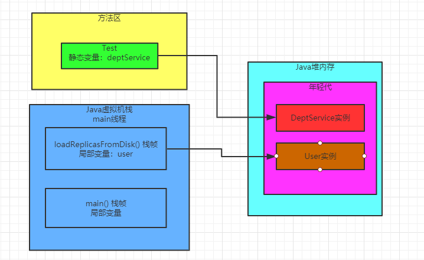
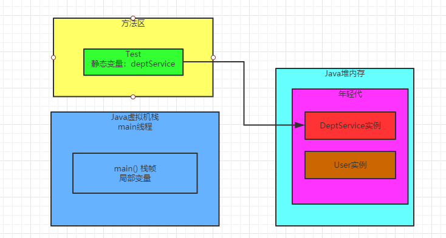
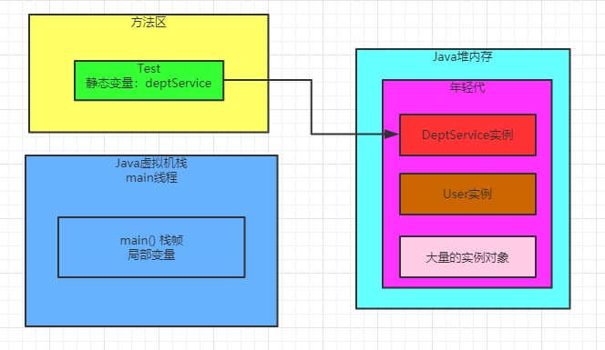
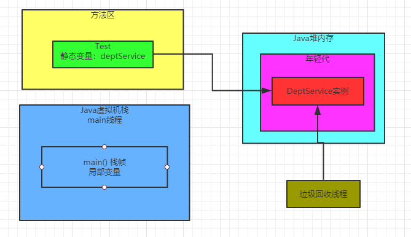
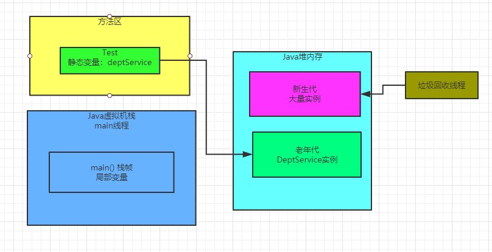

### 大部分正常对象都优先在新生代分配内存

首先我们先来看下之前文章种的一段代码，然后在理解：**大部分的正常对象，都是优先在新生代分配内存的。**

```
public class Test {
   private static DeptService deptService = new DeptService();
   
   public static void main(String[] args) {
      loadReplicasFromDisk();
      while(true) {
         fetchReplicasFromRemote();
         Thread.sleep(1000);
      }
   }
  
    private static void loadReplicasFromDisk(){
        User user = new User();
        user.load();
    }
    
    private static void addDept() {
      deptService.add();
    }
}
```

我们还记得上面那段代码吗？虽然我们代码知道，类静态变量 "deptService" 引用那个 "DeptService" 对象，就会长期存活在内存里的。

但是哪怕是这种对象，其实刚开始你通过 "new DeptService()" 代码来实例化一个对象时，他也是分配在新生代里的。

包括在 "loadReplicasFromDisk()" 方法种创建的 "ReplicaManager" 实例对象，也都是一样分配在新生代里的，同样，我们以一张图，来展示一下：



### 什么情况下会触发年轻代的垃圾回收

现在我们来假设一个场景，大家应该都知道，一旦 "loadReplicasFromDisk()" 方法执行完毕之后，这个方法的栈帧出栈，会导致没有任何局部变量引用那么 "User" 实例对象了。

此时可能会如下图所示：



那么此时就**一定会立即发生垃圾回收，去回收掉Java堆内存里那个没人使用的 "User" 实例对象吗？**

NO！我们别想那么简单了，实际上垃圾回收他也得有触发得条件。

其中一个比较常见得场景可能是这样的，假设我们写的代码中创建了N多对象，然后导致Java堆内存里囤积了大量的对象。

然后这些对象都是之前有人引用，比如各种各样的方法中的局部变量，但是现在也就没人引用了。

如图所示：



这个时候，如果年轻代（新生代）我们预先分配的内存空间，几乎都被全部对象给占满了！此时假设我们代码继续运行，他需要在新生代里去分配一个对象，怎么办？发现新生代里内存空间都不够了！

这个时候，就会触发一次新生代内存空间的垃圾回收，新生代内存空间的垃圾回收，也称之为 "Minor GC"，有的时候我们也叫 "Young GC"，它会尝试把新生代里那些没有人引用的垃圾对象，都给回收掉。

比如上图中，那个 "User" 实例对象，其实就是没有人引用的垃圾对象。

此时就会当机立断，把 "User" 实例对象给回收掉，腾出更多的内存空间，然后放一个新的对象到新生代里去。

包括上图中那大量的实例对象，其实也没用被引用，在这个新生代垃圾回收过程中，就会把这些垃圾对象也都回收掉。

其实话说回来，仔细回忆一下，**我们在代码中创建的大部分对象，其实都是这种使用之后立马就可以回收掉的生存周期极短的对象？**

可能我们会在新生代里分配大量的对象，但是使用完之后立马就没人引用了，此时新生代差不多满了

然后要分配新的对象的时候，发现新生代内存空间不足，就会触发一次垃圾回收，然后就把所有垃圾对象给干掉，腾出大量的内存空间。

如图所示：



### 长期存活的对象会躲过多次垃圾回收

接着我们来看下一个问题，上图中大家都注意到了 "DeptService" 实例对象，它是一个长期被 "Test" 类的静态变量 "deptService" 引用的对象。

所以虽然你的新生代可能随着系统的运行，不停的创建对象，然后让新生代变满，接着垃圾回收一次，大量对象被回收掉，但是这个 "DeptService" 对象，它确是一直会存活在新生代里。

因为它一直被 "Test" 类的静态变量给引用了，所以它不回被回收。那么此时**JVM就有一条规定了**  

如果一个实例对象在新生代中，成功的在15次垃圾回收之后，还是没被回收掉，就说明它已经15岁了。

这是对象的年龄，没垃圾回收一次，如果一个对象没被回收掉，它的年龄就会增加1。

所以如果上图中的那个 "DeptSerivce" 对象在新生代中成功躲过10多次垃圾回收，成为一个 "老年人"，那么就会被认为是会长期存活在内存里的对象。

然后它会被转移到Java堆内存的老年代中去，顾名思义，老年代就是放这些年龄很多大的对象。

如下图所示：



### 老年代会垃圾回收吗

接着下一个问题就是，老年代里的那些对象会被垃圾回收吗？

答案是**肯定的**，因为老年代里的对象也有可能随着代码的运行，不再被任何人引用了，就需要被垃圾回收。

我们可以思考一下，如果随着类似上面的情况，越来越多的对象进入老年代，一旦老年代也满了，是不是就要对老年代进行垃圾回收了？

没错，这是肯定的，但是暂时我们先不用过多的考虑这里的细节。

但是其实在对象分配这块，还有很多其他复杂机制，比如：

（1）新生代垃圾回收之后，因为存活对象太多，导致大量对象直接进入老年代

（2）特别大的超大对象直接不经过新生代就进入老年代

（3）动态对象年龄判断机制

（4）空间担保机制

总结下：

（1）先理解对象优先分配在新生代

（2）新生代如果对象满了，就会触发Minor GC回收掉没有人引用的垃圾对象

（3）如果对象躲过了10多次的垃圾回收，就会放入老年代里

（4）如果老年代也满了，那么也会触发垃圾回收，把老年代里没人引用的垃圾对象清理掉

### 发散思考

每个线程都有Java虚拟机栈，里面也有方法的局部变量等数据，这个Java虚拟机栈需要进行垃圾回收吗？为什么？

其实这是一个偏题，JVM里的垃圾回收针对的是新生代，老年代，还有方法区（永久代），不会针对方法的栈帧。

方法一旦执行完毕，栈帧出栈，里面的局部变量直接就从内存里清理掉了。

