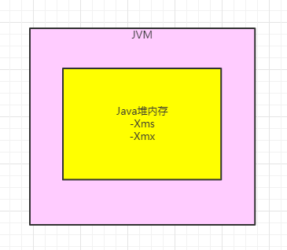
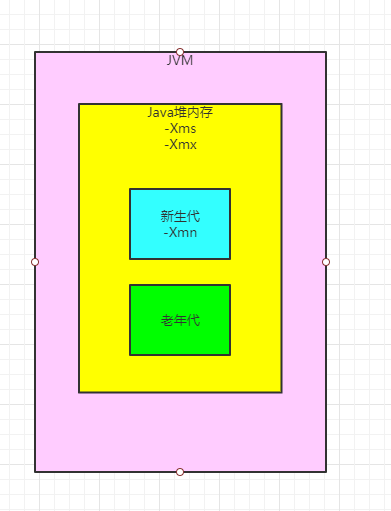
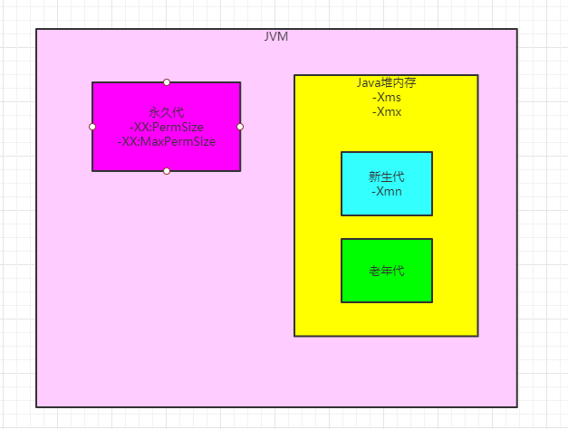
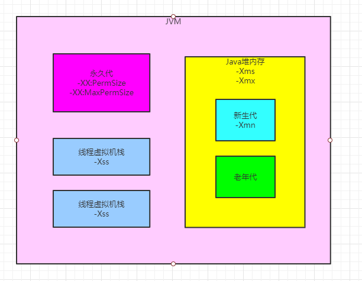
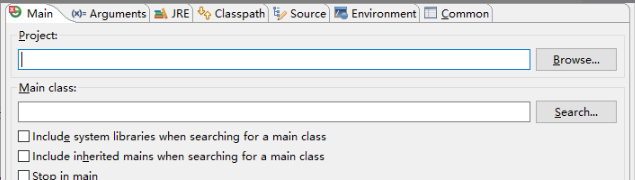
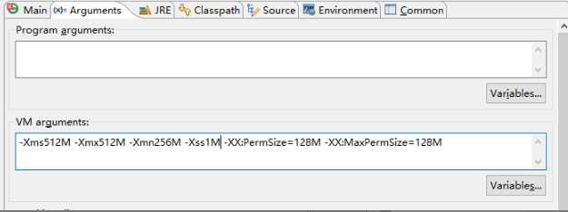

### 跟JVM内存相关的几个核心参数图解

在JVM内存分配中，有几个参数是比较核心的，如下图所示。

- -Xms：Java堆内存的大小
- -Xmx：Java堆内存的最大大小
- -Xmn：Java堆内存的新生代大小，扣除新生代剩下的就是老年代的内存大小了
- -XX:PermSize：永久代大小
- -XX:MaxPermSize：永久代最大大小
- -Xss：每个线程的栈内存大小

下面我们对上诉参数来进行一一说明。

-Xms和-Xmx，分别用于设置Java堆内存的刚开始的大小，以及允许扩张到的最大大小。

对于这对参数，通常来说，都会设置为完全一样的大小。这里先不用太过于纠结这里的细节，真的强的太多了，不能一下子全部都搞定，要随着后续的实战例子，层层铺展开来。

但是至少我们需要清楚，这两个参数，是用来**限定Java堆内存的总大小的**，如下图。

-Xmn，这个参数也是很常见的，它用来设置Java堆内存中的新生代的大小，然后扣除新生代大小之后的剩余内存就是给老年代的内存大小，如下图所示：

-XX:PermSize和-XX:MaxPermSize，分别限定了**永久代大小和永久代的最大大小**

通常这两个数值也是设置为一样的，至于原因，请看后面结合案例的文章分析。

如果是JDK1.8以后的版本，那么这连参数被替换为了-XX:MetaspaceSize和-XX:MaxMetaspaceSize,	但是大家至少得知道，这两个参数限定了永久代得大小，如下图所示：

-Xss，这个参数**限定了每个线程得栈内存大小**

大家都很清楚，每个线程都有一个自己得虚拟机栈，然后每次执行一个方法，就会将方法得栈帧压入线程的栈里，方法执行完毕，那么栈帧就会从线程的栈里出栈，如下图：

### 如何在启动系统的时候设置JVM参数？

那么现在大家结合图示都知道了JVM内存各个区域的大小该使用什么参数来设置，那么到底怎么设置呢？

你要在Eclipse/Intellij IDEA里开发的话，如果要在这种开发IDE里启动一个程序，然后设置JVM参数，那么久需要对按照下面的步骤来设置：

首先右击你写好的一个带main()方法的类，他有一个菜单栏，里面有一个 "Debug as" 选项，鼠标移动进入，会看到一个 "Debug Configuration" 选项，接着会看到下面的面板。

这个面板里有一个“**Arguments**”的选项，点击他，会看到下面的图。然后在“VM arguments”中输入你的JVM参数即可

比如你可以按照下面的示例来设置，-Xms之类的参数直接后面跟上你要设置的内存大小，多少M即可。

但是-XX:PermSize这种格式的参数，需要跟一个“=”符号，跟上你要设置的内存大小即可。

那么如果实在**线上部署系统应该如何设置JVM参数呢**？

其实都很简单，比如说采用 "java -jar" 的方式启动一个jar包里的系统，那么可以采用类似下面的格式：

java -Xms512M -Xmx512M -Xmn256M -Xss1M -XX:PermSize=128M -XX:MaxPermSize=128M -jar App.jar

如果是现在非常流行的那种启动Spring Boot开发的系统呢？

其实都是类似的，大家自行翻阅一下Spring Boot的文档即可。