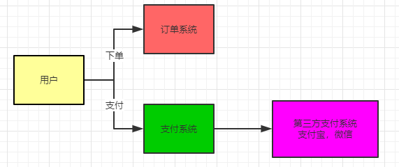
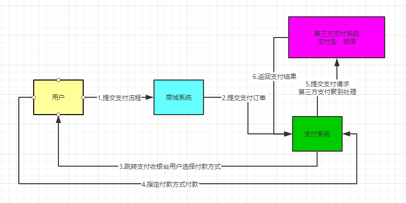
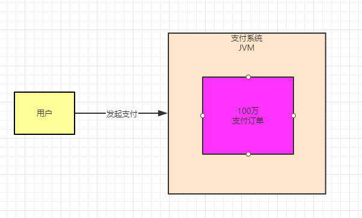
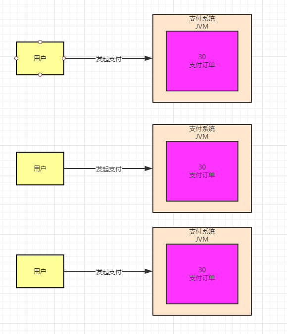
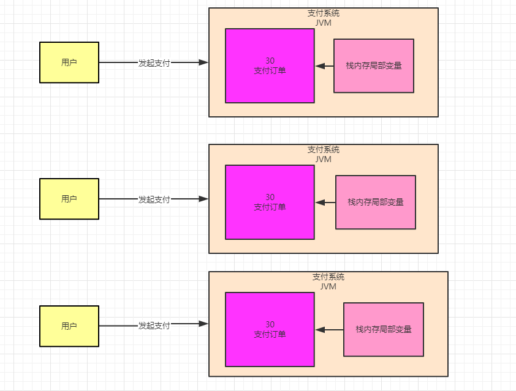

### 支付系统背景引入

先看看，如果在一个电商系统里，一个支付系统大概应该是一个什么样的结构，如下图：



其实我们大家只要网购过，大概的流程都会比较清楚，假设我们在一个APP或者一个网站里买东西，大体上都是对一些商品加到购物车里，然后下个订单，接着订单进行支付，钱从我们的账户划拨到人家网站的账户里去，大致基本如此。

上面的图就很清晰的展示了这个过程，所谓的支付系统，是一个网站或者APP后台系统中非常核心的一个环节，负责管理公司的资金流

它负责对接用户的支付请求，然后根据用户的付款方式，跟第三方的支付渠道对接起来，比如微信，支付宝，等等。

比如用户通过微信付款88元，那么他的钱在微信钱包里，需要划拨88块钱到电商公司的账户里去，那么此时支付系统就得跟微信支付聚到对接，自资金从微信划拨出来，大概得流程就是这个意思。

### 支付得核心也业务流程

接着我们来看一下支付得核心业务流程：



通过上图标号序号的步骤，我们可以清晰的知道这个流程了

首先用户在我们的商城系统提交支付一个订单的请求，接着商城系统把这个请求提交给支付系统，支付系统就会生成一个支付订单，此时订单状态可能是 "待支付" 的状态。

然后支付系统指引用户跳转到付款页面，选择一个付款方式

然后用户发起实际支付请求，支付系统把实际支付请求转交给第三方支付聚道，比如微信或者支付宝，他们会去处理支付的请求进行资金转移。

如果微信或者支付宝处理完支付之后，就会返回支付结果给支付系统，支付系统可以更新自己本地的支付订单状态变成 "已完成"。

当然，其实一个完整的支付系统还包含很多东西。

比如还要负责对账以及跟合作商户之间的资金清算，支付系统得包含应用管理，账户管理，聚道管理，支付交易，对账管理，清算管理，结算管理，等各种功能模块，但是我们这里就关注最核心得支付流程即可。

### 每日百万交易得支付系统得压力在哪里

接着我们来考虑一下，一个每日百万交易得支付系统得压力到底集中在哪里?

比如上面得那个核心支付流程，我们的这套系统每日要发生百万次交易。

一般达到百万交易，要不然是国内最大的互联网公司，要不就是一个通用型第三方支付平台，对接各种APP的支付交易。

其实我们通过上图都能明显看到，上诉业务流程中，最核心的环节，就是在用户发起支付请求的时候，会生成一个支付订单

这个支付订单需要记录清楚比如谁发起支付？对哪个商品支付？通过哪个渠道支付？还有发起支付事件？等等，诸如此类的消息。

如果每日百万交易，那么我们可以想象一下，在我们的JVM的角度来看，就是**每天会在JVM中创建上百万个支付订单对象** 

如下图：



所以我们的支付系统，其实他的压力有很多方面，包括高并发访问，高性能处理请求，大量的支付订单数据需要存储，等等技术难点。

但是抛开这些系统架构层面的东西，单单是在JVM层面，我们的支付系统最大的压力，就是**每天JVM内存里会频繁的创建和销毁100万个支付订单**，所以这里就牵扯到一个核心的问题。

（1）我们的支付系统需要部署多少台机器？

（2）每台机器需要多大的内存空间?

（3）每台机器上启动的JVM需要分配多大的堆内存空间？

（4）给JVM多大的内存空间才能保证可以支撑这么多的支付订单在内存里的创建，而不会导致内存不够直接崩溃？

这就是我们需要考虑的核心问题。

### 支付系统每秒钟需要处理多少笔支付订单

要解决线上系统最核心的一个参数，也就是**JVM堆内存的大小的合理设置，我们首先第一个要计算的**，就是每秒钟我们的系统要处理多少笔订单。

假设每天100万个支付订单，那么一般用户交易行为都会发生在每天的高峰期，比如中午或者晚上。

假设每天高峰期大概是几个小时，用100万平均分配到几个小时里，那么大概没秒100笔订单左右，咱们就以每秒100笔订单来计算一下好了。

假设我们的支付系统部署了3台机器，每台机器实际上每秒大概处理30笔订单。

我们看下面的图，这个图可以反映出来支付系统每秒钟的订单处理压力。



### 每个支付订单大概需要多大的内存空间

接着我们来计算一下，**每个支付订单对象大概需要多大的内存空间？**

之前说过怎么计算，其实不用考虑别的，我们就直接根据支付订单类钟的实例变量的类型来计算就可以了。

比如说支付订单类如下所示，我们只要记住一个Integer类型的变量数据是4个字节，Long类型的变量数据是8个字节，还有别的类型的变量数据占据多少字节。

百度一下可以查到，然后就可以计算出每个支付订单对象大致占据多少字节。

```
public class PayOrder {
    private Integer userId;
    private Long orderTime;
    private Integer orderId;
}
```

一般来说，比如支付订单这种核心类，你就按20个实例变量来计算，然后一般大概一个对象也就在几百字节的样子

我们算他大一点好了，就算一个支付订单对象占据500字节的内存空间，不到1kB。

### 每秒发起的支付请求对内存的占用

之前提到提到过，假设有3台机器，每秒钟处理30笔支付订单的请求，那么在这1秒内，我们都知道，肯定是有方法里的局部变量在引用这些支付订单的，如图所示：



那么30个支付订单，大概占据的内存空间是30*500=15000字节，大概其实也就**15kb**而已。其实是非常非常小的。

### 让支付系统运行起来分析一下

现在我们已经把整个系统运行的关键环节的数据都分析清楚了，我们可以大致思考一下，每秒30个支付请求，创建30个支付订单对象，也就占据kb级别的内存空间而已。

然后接着1秒过后，这30个对象就没有人引用了，就成了新生代里的垃圾了。

下一秒请求过来，我们的系统持续的创建了支付订单对象，不停在新生代里放入30个支付订单，然后新生代的对象会持续的累积和增加。

直到有一刻，发现可能新生代里都有几十万个对象了，此时占据了几百MB的空间了，可能新生代空间就快满了。

然后就会触发Minor GC，就把新生代里的垃圾对象都给回收掉了，腾出内存空间，然后继续来在内存里分配新的对象。这就是这个业务系统的运行模型。

### 对完整的支付系统内存占用需要进行评估

之前的分析，全部都是迹于一个核心业务流程中的一个支付订单对象来分析的，其实那只是一小部分而已。

真实的支付系统线上运行，肯定**每秒会创建大量其他的对象**，但是我们结合这个访问压力以及核心对象的内存占据，大致可以来估算一下整个支付系统每秒钟大致会占据多少内存空间。

其实如果我们要估算的话，可以把之前的计算结果扩大10倍~20倍。也就是说，每秒钟除了在内存里创建支付订单对象，还会创建其他数十种对象。

那么每秒钟创建出来的被栈内存的局部变量引用的对象大致占据的内存空间就在**几百KB~1MB**之间。

然后下一秒继续来新的请求创建大概1MB得对象放在新生代里，接着变成垃圾，在来下一秒。

循环多次之后，新生代里得垃圾太多，就会触发Minor GC回收掉这些垃圾。这就是一个完整系统得大致JVM层面得内存使用模型。

### 支付系统得JVM堆内存应该怎么设置？

其实结合支付系统得核心业务流程分析清楚了之后，大家就完全知道这么一个线上系统，每个机器上部署上线得时候，JVM得堆内存应该如何设置了。

其实一般来说这种线上业务系统，常见的机器配置是**2核4G**，或者**4核8G**.

如果我们用2核4G的机器来部署，那么还是有点紧凑的，因为机器有4G内存，但是机器本身也要用一些内存空间，最后你的JVM进程最多就是2G内存。

然后这2G还得分配给方法去，栈内存，堆内存几块区域，那么堆内存可能最多就是1G多的内存空间。

然后堆内存还分为新生代和老年代，你的老年代总需要防止系统的一些长期存活的对象把，怎么也得给几百MB的内存空间，那么新生代可能也就几百MB的内存了。

这样的话，我们可以看到，我们上述的核心业务流程，只不过仅仅是针对一个支付订单对象来分析的，但是实际上如果扩大10倍~20倍换成对完整的系统预估之后，我们可以看到，大致每秒会占用1MB左右的内存空间。

那么如果你的新生代就几百MB的内存空间，**是不是导致运行几百秒之后，新生代内存空间就满了，此时是不是得触发Minor GC了?**

其实如果这么频繁得触发Minor GC，会影响线上得系统得性能稳定性，具体原因后续在讨论。

我们只需要明白一点，就是频繁触发GC一定不是什么好事儿。

因此我们可以考虑采用4核8G的机器来部署支付系统，那么你的JVM进程至少可以给4G以上内存，新生代在里面至少可以分配到2G内存空间。

这样子就可以做到可能新生代每秒多1MB左右的内存，但是需要将近半小时到1小时才会让新生代触发Minor GC，这就大大降低了GC的频率。

举个例子：机器采用4核8G，然后**-Xms和-Xmx设置为3G，给这个堆内存3G内存空间，-Xmn设置为2G，给新生代2G内存空间**

而且假设你的业务量如果更大，你可以考虑不只部署3台机器，可以横向扩展部署5台机器，或者10台机器，这样每台机器处理的请求更少，对JVM的压力更小。

### 发散思考

SpringBoot和Tomcat部署系统怎么设置JVM参数

SpringBoot其实就是启动的时候可以加上JVM参数，Tomcat就是在bin目录下的catalina.sh中可以加入JVM参数。