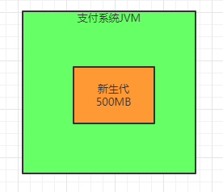
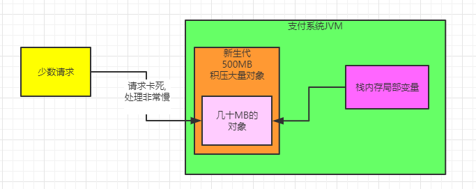
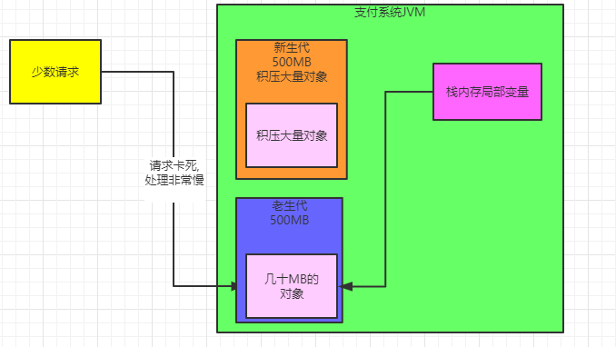

### 基于案列，说说不合理得内存反面示例

上次说得是一个正面例子，即如何合理设置内存大小。

今天来说一个反面的不合理设置内存大小导致的问题，也是我们之前线上生产系统真实经历过的一次故障。

我们还是以支付系统作为案例来说明好了，其实思路都是一样的。

比如现在我们假设一个前提，就是支付系统因为没有经过合理的内存预估，所以直接选用了1台2核4G的虚拟机来部署了线上系统，而且就只用了一台机器

然后线上JVM给的堆内存大小，仅仅就只有1G，扣除老年代之后，新生代其实就几百MB的内存空间，看下图：

好了，接着我们还是用昨天的那个业务压力，就是每天100万交易，高峰期每秒大概100笔支付交易，对应核心的支付订单对象有100个创建出来，每个支付订单对象占据500左右的字节大小，总共就是50kb左右。

然后一笔交易要1秒来处理，所以这100个对象在新生代中存在1秒的期间会被人引用，是无法被回收的。

而且我们之前说过一个全局预估的思路，从核心的支付订单对象扩展开来，拓展到系统里其他的对象中去，起码可以把内存占用扩大了10倍~20倍

比如我们就扩大个20倍好了，那么说明1秒之内，总共会创建出来大概1MB左右的对象，无法被回收。

### 大促期间，瞬时访问量增加十倍

其实按照估算出来的内存压力，你这么小的新生代在系统运行正常的情况下，其实还不算什么大问题。

因为每秒新增1MB对象，然后几百秒过后，新生代快满了，自然就会触发Minor GC，回收掉里面99%的垃圾对象。

你要是内存那么小，最多就是发现系统每隔几分钟略微卡顿一下，因为这个时候在进行垃圾回收，会影响系统性能，至于为什么影响系统性能，后面的垃圾回收的主题里会分析。

但现在我们可以假设，**如果你的电商系统搞大促活动呢**

一般搞大促活动，很可能导致你的压力瞬间增大10倍，因为平时不来你网站的人，今天都来了。

此时可能会发现，每秒钟你的支付系统不是100笔订单了，可能是每秒钟上千笔订单。

这个时候你的系统压力本身就会很大了，不光是内存，尤其是线程资源，CPU资源，都会几乎打满，内存就更是岌岌可危了。

### 少数请求需要几十秒处理，导致老年代内存占用变大

我们就针对内存来分析一下。

现在假设你每秒1000笔交易，那么每秒钟系统对内存的占用增加到10MB以上

我们甚至可以在大胆一点，预估每秒对内存占用达到几十MB，甚至上百MB也可以，因为毕竟大促时流量激增，就一切围绕这来预估。

而且最可怕的一点是，可能你每秒过来的1000笔交易，不再是1秒就可以处理完毕了，因为压力剧增，会导致你的系统性能下降，可能偶尔会出现每个请求处理完毕需要几秒钟，甚至几十秒的时间。

此时我们看下图可能出现什么问腿，假设你的新生代里已经积压了很多的数据，都快满了。

然后呢，此时内存里有比如几十MB的对象都被人引用着，因为少数请求突然处理的特别慢。

为什么会处理特别慢？因为压力太大，导致系统性能太差了，如下图：

  

这个时候，如果你要再次在新生代里分配对象，那么是不是会导致一次Minor GC去回收新生代？

没错，但是可能回收掉大量的对象之后，那少数几十MB的对象还在，因为少数请求特别的慢。

然后很快新生代继续被填满，再次触发Minor GC，然后少数几十MB的对象还在，此时多次之后，就会转移到老年代去，如下图：

 

### 老年代对象越来越多导致频繁垃圾回收

那么我们思考一下，上述流程如果反复来多次，就是时不时有少数请求特别慢，创建的对象在新生代反复多次没法被回收，然后就会被弄到老年代去。

然后后续处理完之后，老年代里的对象就没人引用了，成为了垃圾对象。

经常重复这个流程，老年代里的垃圾对象，是不是就会越来越多？

一旦老年代的垃圾对象越来越多，迟早会满，然后就会触发老年代的垃圾回收，而且这个老年代被占满的频率还很快，可能就**会频繁触发老年代的垃圾回收。**

大家要知道，老年代的垃圾回收速度是很满的，这个为什么慢，后文讨论。

但是在上诉场景下，我们基本可以分析出来。如果你不合理的设置内存，就会导致新生代内存不充足，然后导致很多对象不停的迁移到老年代去，最后导致老年代也要不停的进行垃圾回收。

最后这频繁的垃圾回收，就会极大的影响系统的性能。

### 反面案列总结

我们通过一个支付系统内存的设置过小，然后突发巨大流量压力，突发的性能抖动，最后导致很多对象长期在新生代被人引用，无法被回收，最后持续进入老年代，最后触发老年代内存的频繁占满，然后老年代都频繁被垃圾回收。就会极大的影响系统的性能。

### 如何合理设置永久代大小

