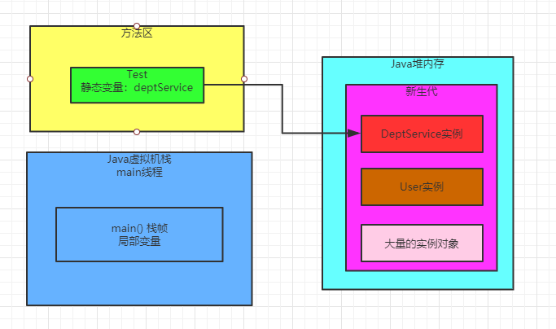
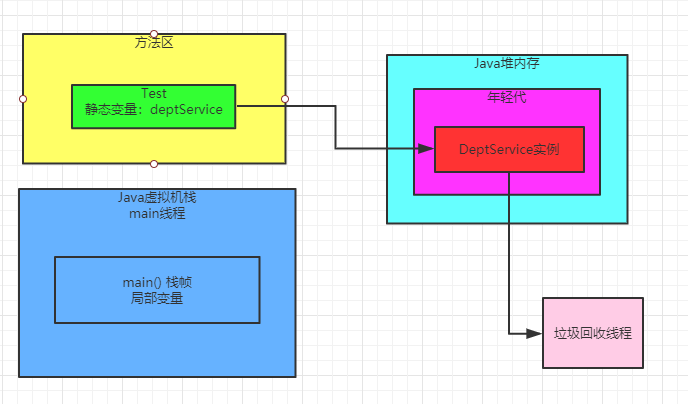
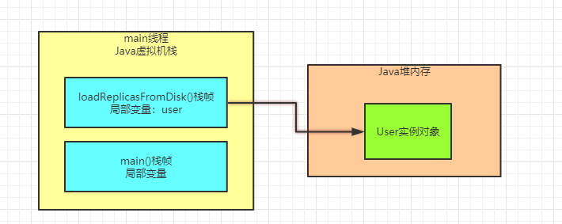
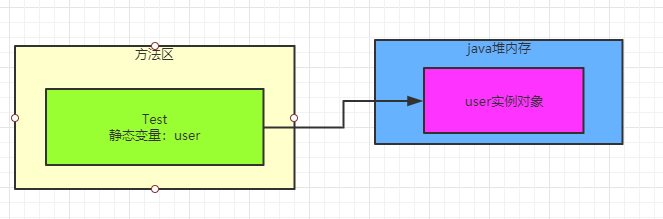

### 什么时候会触发垃圾回收

通过之前的文章，相信我们大家都知道一点，平时我们系统运行创建的对象都是优先分配在新生代里，如下图所示：



然后如果新生代里的对象越多越多，都快满了，此时就会触发垃圾回收，把新生代没有人引用的对象给回收掉，释放内存空间。

这就是新生代一个核心的垃圾回收触发时机，如下图：



我们本文久针对这个过程，在再次梳理其中的一些细节，看看触发垃圾回收的时候，到底是按照一个什么样的规则来回收垃圾对象的。

### 被哪些变量引用的对象是不能回收的

首先第一个问题，一旦新生代快满了，那么垃圾回收的时候，**到底哪些对象是能回收的，哪些对象是不能回收的呢？**

这个问题非常好解释，JVM中使用了一种**可达性分析算法**来判定哪些对象是可以被回收的，哪些对象是不可以被回收的。

这个算法的意思，就是说对每个对象，都分析一下有谁在引用他，然后一层一层往上判断，看是否有一个**GC Roots**。

这句话相当的抽象，是不是？

没关系，慢慢分析它的步骤。

比如最常见的，就是下面一种情况。

```java
public class Test {
   public static void main(String[] args) {
        loadReplicasFromDisk();
   }
   public static void loadReplicasFromDisk() {
       User user = new User();
   }
}
```

上面的代码基本就是在方法中创建了一个对象，然后有一个局部变量引用了这个对象，这种情况最常见的。

此时如下图所示，"main()" 方法的栈帧入栈，然后调用 "loadReplicasFromDisk()" 方法，栈帧入栈，接着让局部变量 "user" 引用堆内存里的 "User" 实例对象。



假设现在上图中 "User" 对象被局部变量给引用了，那么此时一旦新生代快满了，发生垃圾回收，会去分析这个 "User" 对象的可达性

这时，发现他是不能被回收的，因为他被人引用了，而且是被局部变量 "user" 引用的。

在JVM规范中，**局部变量就是可以作为GC Roots的**

只要一个对象被局部变量引用了，那么就说明他有一个GC Roots，此时就不能被回收了。

另外一个比较常见的情况，其实就是类似下面的代码。

```java
public class Test {
   public static User user = new User();
}
```

我们可以分析一下上面的代码，如下图所示：



我们按照上图思考一下，此时垃圾回收的时候一分析，发现这个 "User" 对象被Test类的一个静态变量 "user" 给引用了

此时在JVM的规范里，静态变量也可以看做是一种GC Roots，此时只要一个对象被GC Roots引用了，就不会去回收他。

所以说，**一句话总结：** 只要你的对象被**方法的局部变量、类的静态变量**给引用了，就不会回收他们。

### Java中对象不同的引用类型

关于引用和垃圾回收的关系，大家在这里务必脑子里要引入一个新的概念，那就是Java里有不同的引用类型。

分别是**强引用，软引用，弱引用，虚引用**。下面分别用代码示范一下。

强引用，就是类似下面的代码：

```java
public class Test {
   public static User user = new User();
}
```

这个就是最普通的代码，一个变量引用一个对象，**只要是强引用的类型，那么垃圾回收的时候绝对不回去回收这个对象的。**

接着是软引用，类似下面的代码。

```java
public class Test {
    public static SoftReference<User> user = new SoftReference<User>(new User());
}
```

就是把 "User" 实例对象用一个 "SoftReference" 软引用类型的对象给包裹起来了，此时这个 "user" 变量对 "User" 对象的引用就是软引用。

 正常情况下垃圾回收是不会回收软引用对象的，但是如果你进行垃圾回收之后，发现内存空间还是不够存放新的对象，内存都溢出了

此时就会把这些软引用对象给回收掉，哪怕他被变量引用了，但是因为他是软引用，所以还是要回收。

接着是弱引用，类似下面的代码。

```java
public class Test {
    public static WeakReference<User> user = new WeakReference<User>(new User());
}
```

这个其实非常好解释，你这个弱引用就跟没引用是类似的，如果发生垃圾回收，就会把这个对象回收掉。

虚引用，这个大家其实暂时忽略他也行，因为很少用。

其实这里比较常用的，就是强引用和软引用，强引用就是代表绝对不能回收的对象。软引用就是说有的对象可有可无，如果内存实在不够了，可以回收他。

### finalize()方法的作用

现在我们理解完了GC Roots和引用类型的概念，基本都知道了，哪些对象可以回收，哪些对象不能回收。

有GC Roots引用的对象不能回收，没有GC Roots引用的对象可以回收，如果有GC Roots引用，但是如果是软引用或者弱引用，也有可能被回收掉。

接着就是到**回收的环节了，假设没有GC Roots引用的对象，是一定立马被回收吗？**

其实不是的，这里有一个finalize()方法可以拯救他自己，看下面的代码。

```java
public class ReplicaManager {
    public static ReplicaManager instance;
    @Override
    protected void finalize() throws Throwable {
        ReplicaManager.instance = this;
    }
}
```

假设有一个ReplicaManager 对象要被垃圾回收了，那么假如这个对象重写了Object类中的finialize()方法

此时会先尝试调用一下他的finalize()方法，看是否把自己这个实例对象给了某个GC Roots变量，比如说代码中就给了ReplicaManager类的静态变量。

如果重新让某个GC Roots变量引用了自己，那么就不用被垃圾回收了。

不过说实话，这个东西没必要过多分析，因为平时用的很少。

